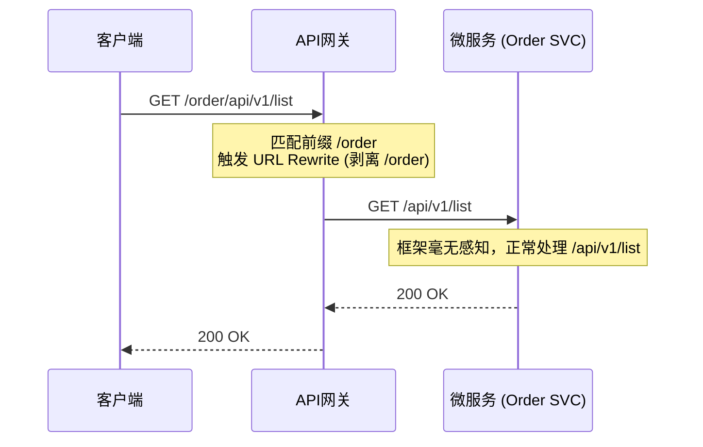
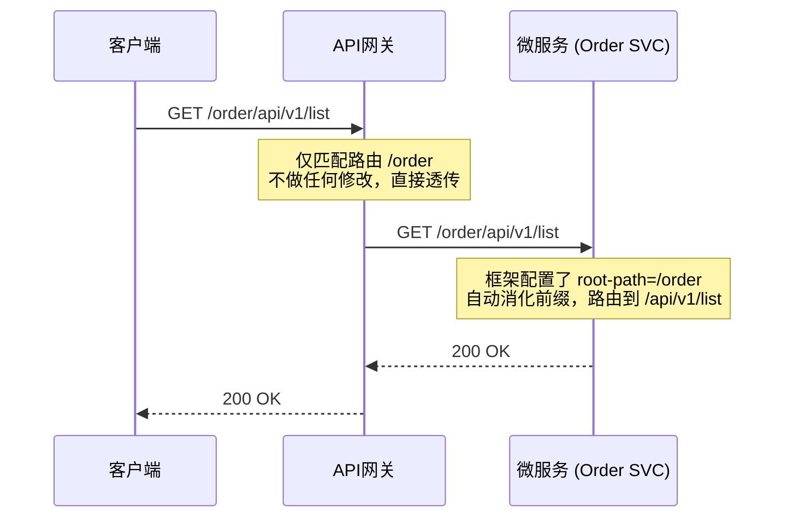

# API网关路径路由的架构抉择：URL重写 vs 后端Root Path

在微服务架构中，API网关作为流量的统一入口，最核心的职责之一就是**基于路径的路由（Path-based Routing）**。当客户端请求 `https://api.example.com/order/v1/create` 时，网关需要将请求精准分发到后端的订单微服务。

在这个看似简单的分发过程中，其实隐藏着一个极具争议的架构抉择：**流量分发后，那个用来做路由区分的前缀（比如 `/order`），到底该由网关剥离，还是由后端微服务自行消化？**

本文将深入对比这两种常见的落地架构方案，并结合 K8s Gateway API 与微服务框架（如 Quarkus/Spring Boot）给出具体的代码示例。

---

## 方案一：网关剥离前缀（URL Rewrite / Strip Path）

在这种架构下，网关承担了所有的“脏活累活”。它对外暴露带有特定前缀的 URL，但在将请求转发给后端微服务之前，会将这个前缀“无情剥离”。后端微服务完全处于黑盒状态，认为自己独占了整个域名，接口直接挂载在根路径 `/` 下。

### 1.1 Mermaid 流量时序图



### 1.2 典型的网关配置示例 (Kong Ingress)

在老旧的 Ingress 规范中，通常通过注解来实现剥离：

```yaml
apiVersion: networking.k8s.io/v1
kind: Ingress
metadata:
  name: order-svc-ingress
  annotations:
    konghq.com/strip-path: "true" # 核心：通知 Kong 剥离前缀
spec:
  rules:
  - http:
      paths:
      - path: /order
        pathType: Prefix
        backend:
          service:
            name: order-svc
            port: 
              number: 8080
```

后端的代码（如 Spring Boot）非常纯粹：
```java
@RestController
@RequestMapping("/api/v1") // 不需要知道 /order 的存在
public class OrderController {
    @GetMapping("/list")
    public List<Order> listOrders() { ... }
}
```

### 1.3 优缺点分析
* **优点**：后端代码极致纯粹，路由逻辑与业务逻辑完全解耦。未来无论网关层的对外路径怎么变（比如改成 `/v2/order`），后端代码一行都不用改。
* **致命缺点（瞎子问题）**：一旦剥离路径，后端框架就成了“瞎子”。微服务自动生成的 OpenAPI/Swagger 文档中的测试路径会全部失效（Swagger UI 会让你去请求 `/api/v1/list`，但实际上外部调用必须加 `/order`）；代码中如果需要生成绝对路径链接（HATEOAS），也会丢失前缀。

---

## 方案二：后端配置 Root Path（网关透传）

这种方案反其道而行之。网关只做纯粹的流量分发，**不修改任何 URL 路径**，将带有前缀的原始请求原封不动地透传给后端。后端微服务则在框架层面配置全局的 Root Path（或 Context Path），主动去“认领”并消化掉这个前缀。

### 2.1 Mermaid 流量时序图



### 2.2 配置示例 (K8s Gateway API + Quarkus)

在现代的 K8s Gateway API 中，我们不再强制使用重写，直接定义匹配规则即可：

```yaml
apiVersion: gateway.networking.k8s.io/v1
kind: HTTPRoute
metadata:
  name: order-route
spec:
  parentRefs:
  - name: main-gateway
  rules:
  - matches:
    - path:
        type: PathPrefix
        value: /order
    # 注意：这里没有任何 filters去执行 URLRewrite
    backendRefs:
    - name: order-svc
      port: 8080
```

对应的，在后端的微服务配置文件中，我们需要显式声明这个上下文路径（以 Quarkus 为例）：

```properties
# src/main/resources/application.properties
quarkus.http.root-path=/order
```

```java
@Path("/api/v1") // 配合全局 root-path，实际暴露为 /order/api/v1
public class OrderResource {
    @GET
    @Path("/list")
    public Response listOrders() { ... }
}
```

### 2.3 优缺点分析
* **优点**：所见即所得。完美解决了 Swagger 迷路和绝对路径生成的问题。微服务清晰地知道自己在整个架构中的真实位置。
* **缺点**：后端的“环境感知”变强了。如果运维团队决定调整对外的 API 前缀，研发必须配合修改代码配置并重新部署，打破了纯粹的职责边界。

---

## 三、 现实工程中的妥协与抉择

理论上，方案一是微服务纯粹主义者的最爱，方案二则是务实主义者的首选。但在真实的工程实践中，我们往往会因为底层基础设施的限制而“被迫”做出选择。

以开源版 Kong Ingress Controller (KIC) 为例，在集成 K8s Gateway API 规范时，由于 KIC 默认采用 `Traditional Router`（传统路由引擎），它在解析 Gateway API 高级的正则 `URLRewrite` 过滤器时，会直接抛出 `KongConfigurationTranslationFailed` 的翻译崩溃错误。

如果为了追求方案一的解耦，强行在生产环境开启 Kong 尚未完全成熟的 `Expression Router`，无疑是给整个集群埋下一颗定时炸弹。因此，在我们的工程实践中，为了稳妥起见，我们主动放弃了网关层的 URL 重写，选择了**方案二（后端配置 Root Path）**。

这看似是架构上的退让，实则是工程实践中为追求系统最高可用性而做出的明智权衡。理解每一种方案背后的利弊与基础设施的边界，才是架构设计的核心魅力所在。
