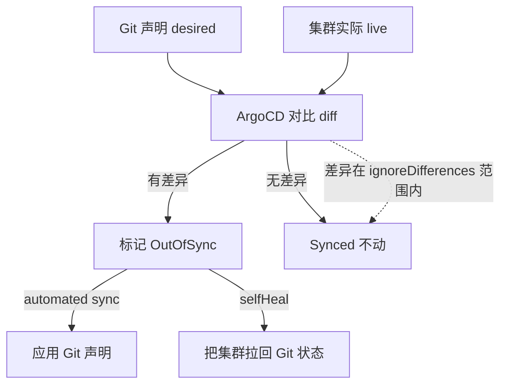
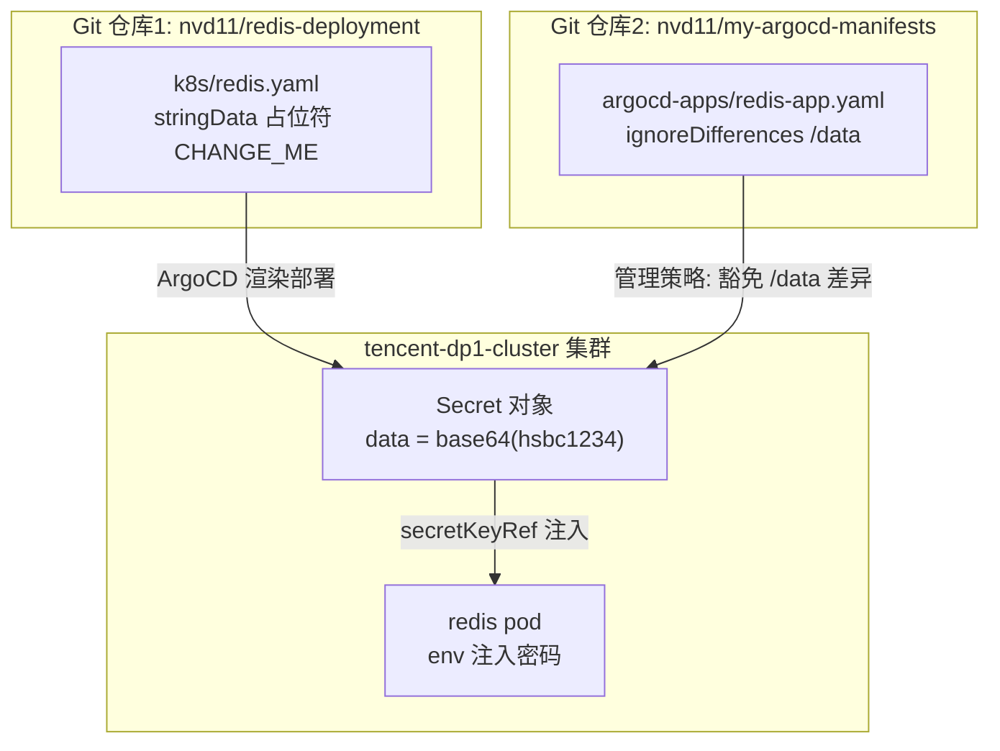

# ArgoCD ignoreDifferences 详解：用 Redis 密码管理讲透 GitOps 差异豁免

## 背景：GitOps 的经典矛盾

用 ArgoCD 管 Redis 之后，遇到一个绕不开的问题：**密码放哪？**

GitOps 的核心是"Git 是唯一真理之源，集群状态永远收敛到 Git 声明"。但密码这种敏感信息如果写进 Git 仓库的 manifest，就等于把钥匙挂在门口。我的 Redis 有密码（`requirepass`），manifest 里必须定义 Secret，那密码到底怎么处理？

试过几种思路：

- **明文写 Git**：最简单，但密码进了 Git 历史，删都删不干净
- **Sealed Secrets / Vault**：安全，但要为一个密码装一个 controller，杀鸡用牛刀
- **占位符 + 集群注入**：Git 里写 `CHANGE_ME`，部署后 kubectl 改成真密码——**但 ArgoCD 的 selfHeal 会把手动改的密码拉回占位符！**

第三条路的问题就是这篇博客的主角：`ignoreDifferences`。它让"Git 占位符 + 集群真密码"这个模式能活下来。

## 一、ignoreDifferences 是什么

一句话：**告诉 ArgoCD "对比 Git 声明和集群实际时，哪些字段的差异别当回事"**。

要理解它，先看 ArgoCD 的日常工作循环：



**ignoreDifferences 只影响"对比"这一步**——让 ArgoCD 对指定字段睁一只眼闭一只眼：

```
差异在豁免清单内 → 视为一致 → 不标记 OutOfSync → selfHeal 不干预
差异在豁免清单外 → 正常 OutOfSync → sync/selfHeal 照常工作
```

## 二、配置长什么样：逐字段拆解

我们的配置（在 redis 这个 Application 的 spec 里）：

```yaml
spec:
  project: default
  ignoreDifferences:
    - group: ""
      kind: Secret
      jsonPointers:
        - /data
```

| 字段 | 值 | 含义 |
|------|-----|------|
| `group` | `""` | K8s API 组，空字符串 = core 核心组（v1 的 Secret/Service/Pod 都在） |
| `kind` | `Secret` | 资源类型，只对 Secret 生效 |
| `jsonPointers` | `["/data"]` | 用 JSON Pointer 定位要忽略的字段 |

组合语义：**对 core 组的 Secret 资源，比较时跳过 `data` 字段的差异**。

### JSON Pointer 是什么

RFC 6901 的路径语法，用 `/` 表示层级。以 Secret 对象为例：

```json
{
    "data": {                          ← /data
        "redis-password": "aHNiYzEyMzQ="  ← /data/redis-password
    },
    "metadata": { ... },
    "type": "Opaque"
}
```

```
/data                  → 整个 data 对象
/data/redis-password   → 只忽略密码这一项
```

配 `/data` 是"整块忽略"——data 里以后加别的 key 也自动豁免；配 `/data/redis-password` 更精确，其他 data 变化仍会告警。

## 三、前置知识：stringData vs data（不看这个会懵）

配置里 ignore 的是 `/data`，但我们的 manifest 里写的是 `stringData`——**为什么对不上？** 因为这是同一个字段的两种形态：

```
GitHub 里:   stringData: {redis-password: CHANGE_ME}    ← 明文，方便人写
                  │ ArgoCD apply 到集群
API server:  把 stringData 合并编码进 data（base64）    ← 转换
                  │ 存储
etcd 里:     data: {redis-password: base64(CHANGE_ME)}  ← 只有 data
                  │ kubectl get
你看到:      data: {redis-password: "..."}              ← 永远没有 stringData
```

**关键事实**：

1. `stringData` 是 **write-only 字段**——只在提交请求里能用，API server 不存储它
2. API server 收到 stringData 后 base64 编码合并进 `data`，只存 data
3. 所以 `kubectl get secret` 永远看不到 stringData

**ArgoCD 对比的是 data**——它把 Git 声明的 stringData 规范化成 data 形态再和集群实际比：

```
Git 规范化后:  data.redis-password = base64(CHANGE_ME)   ← 假值
集群实际:      data.redis-password = base64(hsbc1234)    ← 真值
差异发生在:    /data/redis-password
```

这就是为什么 GitHub 里写 `stringData`、ignore 里写 `/data`——**写入形态 vs 存储形态，API server 在中间做了转换**。

## 四、配置代码分布：三个地方各管各的

这套密码管理的配置分散在三个地方，职责完全不同：



| 位置 | 配置 | 角色 |
|------|------|------|
| `redis-deployment/k8s/redis.yaml` | `stringData: redis-password: CHANGE_ME` | 声明 Secret 结构（key + 占位符） |
| `my-argocd-manifests/argocd-apps/redis-app.yaml` | `ignoreDifferences: /data` | 告诉 ArgoCD 别管 data 差异 |
| 集群 etcd | `data: base64(hsbc1234)` | 真实密码（kubectl patch 注入） |

三个地方缺一不可：

- **没有 manifest 的 stringData**：Secret 结构没人定义，ArgoCD 部署不了
- **没有 ignoreDifferences**：改完密码被 selfHeal 拉回占位符，前功尽弃
- **没有集群注入**：密码永远是 CHANGE_ME，等于没密码

## 五、完整流程：从部署到换密码

### 首次部署

```
1. Git 里 k8s/redis.yaml 定义 stringData: CHANGE_ME
2. ArgoCD 同步 → API server 转成 data: base64(CHANGE_ME) → Secret 创建
3. redis pod 启动，env 从 Secret 注入密码（此时是占位符）
```

### 注入真密码

```
kubectl -n redis patch secret redis-secret --type merge \
  -p '{"data":{"redis-password":"$(echo -n 真密码 | base64)"}}'
```

**必须滚动重启 pod**——K8s 的 env 注入只在 pod 创建时生效，改了 Secret 运行中的 pod 不会热更新：

```
kubectl -n redis rollout restart deploy/redis
```

不重启的话，Secret 里已经是新密码，但 pod 用的还是旧的（踩过这个坑）。

### 为什么 selfHeal 不拉回

```
改完密码后 ArgoCD 下一轮对比:
  Git 声明:   data.redis-password = base64(CHANGE_ME)
  集群实际:   data.redis-password = base64(hsbc1234)
  → 差异在 /data → ignoreDifferences 豁免 → 视为一致 → selfHeal 不动
```

没有 ignoreDifferences 的话，这里就是 OutOfSync + selfHeal 把密码拉回 CHANGE_ME。

### 换密码流程（以后）

```
1. kubectl patch secret 改成新密码
2. kubectl rollout restart deploy/redis
（Git 完全不用动）
```

## 六、ignoreDifferences 的其他用法

我们的场景只用到了最基础的形式，它还能做更多：

### 1. 忽略特定字段，用 jq 表达式

```yaml
ignoreDifferences:
  - group: apps
    kind: Deployment
    jqPathExpressions:
      - .spec.template.spec.containers[0].image   # 忽略镜像 tag 差异
```

`jqPathExpressions` 支持 jq 语法，能做通配和复杂匹配（比如忽略所有容器的 image），jsonPointers 简单够用时不用上它。

### 2. 全局配置（argocd-cm）

不想在每个 Application 里重复配，可以写到 ArgoCD 的 ConfigMap：

```yaml
# argocd-cm
resource.customizations:
  v1/Secret:
    ignoreDifferences: |
      jsonPointers:
        - /data
```

### 3. 忽略系统字段

ArgoCD 默认已经忽略 `managedFields`、`creationTimestamp` 这类系统字段——所以对比时不会因为 k8s 自己加的元数据而误报 OutOfSync。

### 边界和注意

- **只影响比较，不影响同步**：手动 `kubectl apply` 覆盖字段，ArgoCD 不会因为 ignoreDifferences 主动去恢复，也不会主动改——它只是"不对比"
- **范围外的差异仍会触发**：比如有人改了 Secret 的 `type` 或 `metadata.annotations`，照样 OutOfSync
- **豁免不等于不管**：它只豁免你列出的字段，其他字段的 GitOps 一致性依然由 ArgoCD 保证

## 七、经验总结

1. **ignoreDifferences 是"比较豁免清单"，不是"放弃管理"**——它只让你选中的字段脱离对比，其他字段照常受 GitOps 约束
2. **Secret 的 stringData 和 data 是同一个 kv 的两种形态**——写入时用明文 stringData，存储后只有 base64 的 data，ArgoCD 对比的是后者，所以 ignore 路径要写 /data
3. **env 注入不热更新**——改了 Secret 必须 rollout restart pod，这是 K8s 的行为，和 ArgoCD 无关
4. **占位符 + ignoreDifferences 是轻量密码管理方案**——不装 Sealed Secrets 也能让密码不进 Git，适合"一个密码"这种小场景；密码多了再上 Sealed Secrets / Vault
5. **配置分布的三层模型**——manifest（结构）、Application（管理策略）、集群（真实值），改密码只动第三层，改豁免策略只动第二层，互不干扰
