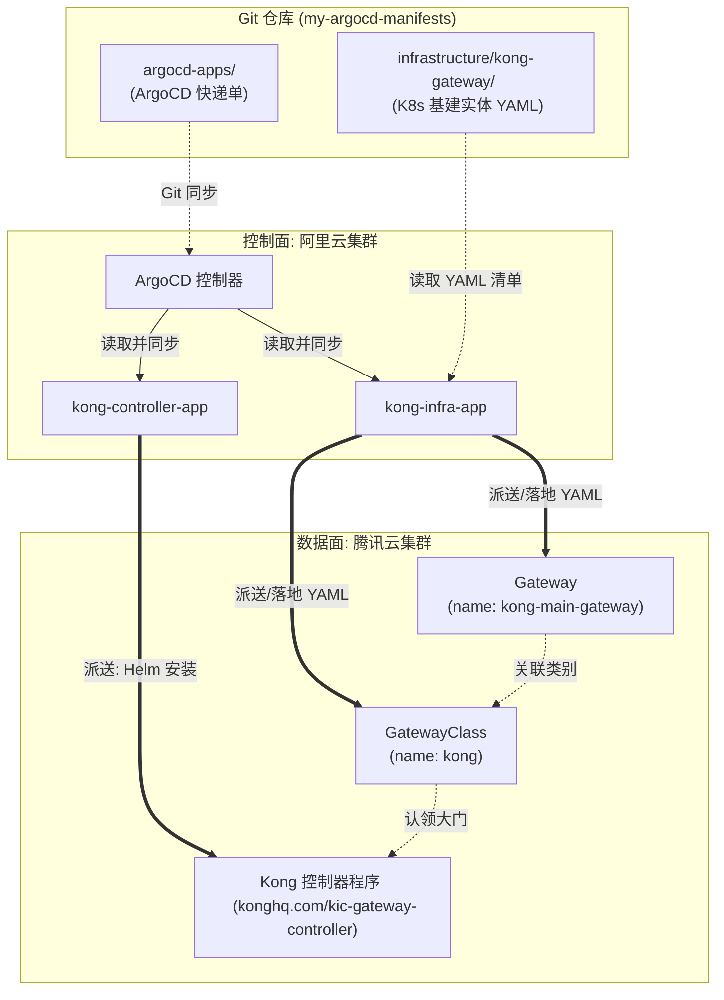

# 基于 ArgoCD 优雅落地 K8s Gateway API 与 Kong 控制器

在现代云原生微服务架构中，Kubernetes Gateway API 正在逐步取代传统的 Ingress 成为新一代的标准流量入口。如何通过 GitOps（ArgoCD）优雅、解耦地安装和管理 Gateway API 的底层资源、Kong 控制器以及网关基础设施？本文将以真实的工程实践为例，详细拆解整个配置过程。

## 一、 架构设计思路：控制面与数据面配置解耦

在我们的配置仓库中，采用了纯正的 **App of Apps** 模式，并将配置文件严格划分为两个不同的目录，实现了调度层与基建实体的解耦：

1. **`argocd-apps/`（调度指挥部）**：存放所有的 `kind: Application` 文件。这些文件相当于“快递单”，它们负责告诉 ArgoCD 去哪里拉取配置（比如远端 Helm 仓库或其他 Git 目录），并空投到哪个目标集群。
2. **`infrastructure/kong-gateway/`（基建实体）**：存放目标集群真正需要落地的纯 K8s 资源清单（比如 `GatewayClass`、`Gateway`）。

### 1.1 全景架构图



## 二、 核心部署流程解析

部署整个网关体系存在严格的先后依赖关系：必须先有 CRD（字典），才能启动控制器（解析程序），最后才能创建网关实体。我们通过 ArgoCD 的 **Sync Waves（同步波次）** 完美解决了这个问题。

### 步骤 1：安装 Gateway API CRD (Wave 1)

首先，我们需要在集群中注册 Gateway API 的官方 CRD（如 `GatewayClass`, `Gateway`, `HTTPRoute` 等）。

创建 `argocd-apps/gateway-api-crds-app.yaml`：

```yaml
apiVersion: argoproj.io/v1alpha1
kind: Application
metadata:
  name: gateway-api-crds
  namespace: argocd
  annotations:
    argocd.argoproj.io/sync-wave: "1" # 🎯 波次 1：最底层的基础设施字典
spec:
  project: default
  source:
    repoURL: 'https://github.com/kubernetes-sigs/gateway-api.git'
    targetRevision: v1.1.0
    path: config/crd/standard
  destination:
    name: 'tencent-dp1-cluster'
    namespace: default
  syncPolicy:
    automated:
      prune: true
      selfHeal: true
    syncOptions:
      - ServerSideApply=true # CRD 往往很大，必须使用 ServerSideApply 避免报错
```

### 步骤 2：安装 Kong Ingress Controller (KIC) (Wave 2)

CRD 就绪后，接下来安装 Kong 的控制器程序（KIC）。我们直接引用 Kong 官方的 Helm Chart。

创建 `argocd-apps/kong-controller-app.yaml`：

```yaml
apiVersion: argoproj.io/v1alpha1
kind: Application
metadata:
  name: kong-ingress-controller
  namespace: argocd
  annotations:
    argocd.argoproj.io/sync-wave: "2" # 🎯 波次 2：等 CRD 装好后再安装控制器
spec:
  project: default
  source:
    repoURL: 'https://charts.konghq.com'
    chart: kong
    targetRevision: 2.38.0
    helm:
      values: |
        ingressController:
          installCRDs: false # 防止模板重复安装 CRD，产生冲突
        env:
          database: "off"
        gateway:
          enabled: true      # 核心：开启 Kong 对 Gateway API 的监听能力
  destination:
    name: 'tencent-dp1-cluster'
    namespace: kong-system
  syncPolicy:
    automated:
      prune: true
      selfHeal: true
    syncOptions:
      - CreateNamespace=true
      - ServerSideApply=true
```

> **避坑指南**：我们在这里设置了 `ingressController.installCRDs: false`，目的是阻止 Helm 在模板渲染阶段重复处理 CRD（容易导致 ArgoCD sync 失败）。至于 Kong 自身的 CRD（如 `KongPlugin`），由于 Helm 自身的机制，会在第一次部署时通过 chart 内的 `crds/` 目录自动安装。

### 步骤 3：定义网关基础设施 (GatewayClass & Gateway)

有了控制器后，我们需要在集群中真正开辟一扇“大门”。这些属于基础设施层的实体资源，存放在 `infrastructure/kong-gateway/` 目录下。

**1. 定义 GatewayClass** (`infrastructure/kong-gateway/GatewayClass.yaml`)：
这相当于在集群中注册一个网关类别，并与刚才安装的 KIC 进行“暗号配对”。

```yaml
apiVersion: gateway.networking.k8s.io/v1
kind: GatewayClass
metadata:
  name: kong
  annotations:
    konghq.com/gatewayclass-unmanaged: "true" # 告诉 Kong 这是一个 Unmanaged 模式
spec:
  # 这是一句关键的配对声明：所有 kong 类别的大门，都交给这个名字的控制器处理。
  # Kong KIC 程序内部硬编码了自己就叫这个名字。
  controllerName: konghq.com/kic-gateway-controller 
```

**2. 定义 Gateway** (`infrastructure/kong-gateway/Gateway.yaml`)：
真正承接流量的入口。

```yaml
apiVersion: gateway.networking.k8s.io/v1
kind: Gateway
metadata:
  name: kong-main-gateway
  namespace: default
spec:
  gatewayClassName: kong # 引用上方的 GatewayClass
  listeners:
  - name: http
    port: 80
    protocol: HTTP
    allowedRoutes:
      namespaces:
        from: Same # 允许同命名空间下的业务应用创建 HTTPRoute 来绑定
```

**3. 基础设施的 ArgoCD 调度器** (`argocd-apps/kong-infra-app.yaml`)：
最后，通过一个 Application 将上述基础设施资源空投到目标集群。

```yaml
apiVersion: argoproj.io/v1alpha1
kind: Application
metadata:
  name: kong-gateway-infra
  namespace: argocd
spec:
  project: default
  source:
    repoURL: 'https://github.com/nvd11/my-argocd-manifests.git'
    targetRevision: HEAD
    path: infrastructure/kong-gateway
  destination:
    name: 'tencent-dp1-cluster'
    namespace: default
  syncPolicy:
    automated:
      prune: true
      selfHeal: true
```

## 三、 总结

通过以上配置，我们实现了一个极度优雅的 GitOps 闭环：
1. **职责单一**：`argocd-apps` 只负责派发指令，`infrastructure` 只负责落地实体。
2. **时序可控**：Sync Waves 确保了 `CRD -> 控制器 -> 自定义资源` 的正确启动顺序。
3. **架构解耦**：利用标准的 Gateway API 和 `GatewayClass` 机制，业务应用（创建 `HTTPRoute` 时）只需认准 `kong-main-gateway`，完全不需要关心底层跑的是 Kong、Envoy 还是 Nginx。

---

## 四、 常见问题 (Q&A)

**Q: 为什么 `kong-controller-app` 会执行 Helm 安装，而 `kong-infra-app` 只是单纯地投递 YAML？ArgoCD 是如何区分这两者的？**

**A:** 其实这两个应用最终的**目的地都是一致的**（都会部署到目标 Kubernetes 集群），区别在于 ArgoCD 的**“加工方式”**不同。ArgoCD 极其智能，它会根据 `Application` 中 `source` 块的定义来自动选择渲染引擎：

- **触发 Helm 渲染模式**（如 `kong-controller-app.yaml`）：
  当 ArgoCD 看到配置中包含了 `chart: kong` 和 `helm:` 关键字，并且 `repoURL` 指向的是一个 Helm 仓库（如 `https://charts.konghq.com`）时，它会意识到这是一个 Helm 包。ArgoCD 会先在控制面调用 Helm 引擎，将 `values` 里的参数注入并渲染出完整的 K8s YAML 清单，然后再应用到目标集群。
  
- **纯 YAML 直投模式**（如 `kong-infra-app.yaml`）：
  当配置中的 `repoURL` 是一个普通的 Git 仓库，且仅指定了 `path` 目录，而**没有**看到 `chart` 等关键字时。ArgoCD 会直接去拉取该 Git 目录下的纯文本 YAML 文件，不经过任何二次渲染，原封不动地 `kubectl apply` 到目标集群。

通过这种“看菜下饭”的机制，我们在同一个 ArgoCD 实例下，既能管理复杂的第三方 Helm 控制器，也能精细化控制纯手工编写的基建 YAML，实现了极大的灵活性。

**Q: 所谓的 CRD（字典）在这个架构中究竟包含了哪些具体的资源？**

**A:** 在这个部署架构中，实际上引入了**两套截然不同**的 CRD（Custom Resource Definition），它们让 K8s 能够识别不同类型的自定义资源：

1. **Gateway API 官方 CRD**（由 `gateway-api-crds-app.yaml` 在波次 1 显式安装）：
   这套字典属于 K8s 官方标准规范，包含了所有网关接口类型的定义。核心包含：
   - `gatewayclasses.gateway.networking.k8s.io` (让 K8s 认识 `kind: GatewayClass`)
   - `gateways.gateway.networking.k8s.io` (让 K8s 认识 `kind: Gateway`)
   - `httproutes.gateway.networking.k8s.io` (让 K8s 认识 `kind: HTTPRoute`)
   - 其他如 `grpcroutes`, `referencegrants` 等

2. **Kong 私有 CRD**（由 Kong Helm Chart 自动隐式安装）：
   当我们通过 `kong-controller-app.yaml` 安装 KIC 时，即便我们设置了 `installCRDs: false`（这是为了防止 Helm 模板渲染阶段产生冗余），Helm 的底层机制依然会在首次安装时，读取 Chart 包里的特权目录 `crds/`，将 Kong 专属的字典一并装入集群。它们包含：
   - `kongplugins.configuration.konghq.com` (让 K8s 认识 `kind: KongPlugin`，可用于添加限流、安全、请求重写等插件)
   - `kongconsumers.configuration.konghq.com` (让 K8s 认识 `kind: KongConsumer`)
   - `kongingresses.configuration.konghq.com` (让 K8s 认识 `kind: KongIngress`)
   - 其他诸如 `tcpingresses`, `udpingresses` 等

**总结**：您能够在集群中编写解耦的 `kind: Gateway` 实体，是因为装了第一套官方的 CRD；而如果未来要利用 Kong 的生态（比如定义 `kind: KongPlugin`），底气则来源于第二套随控制器一起附带的私有 CRD。
