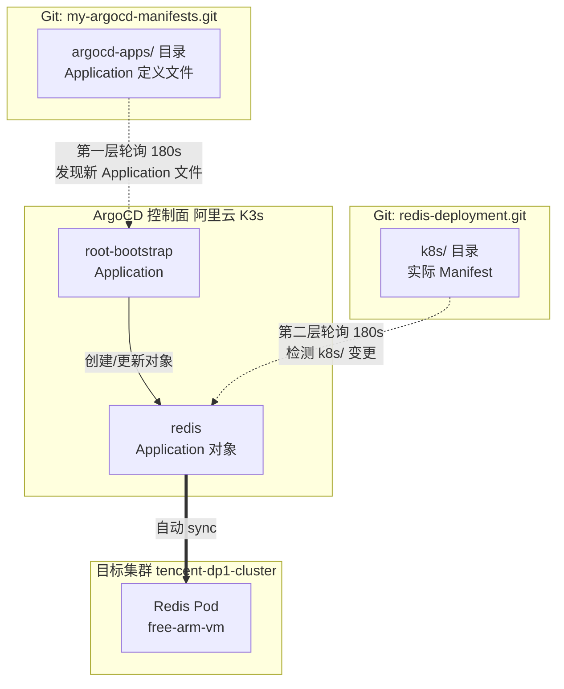
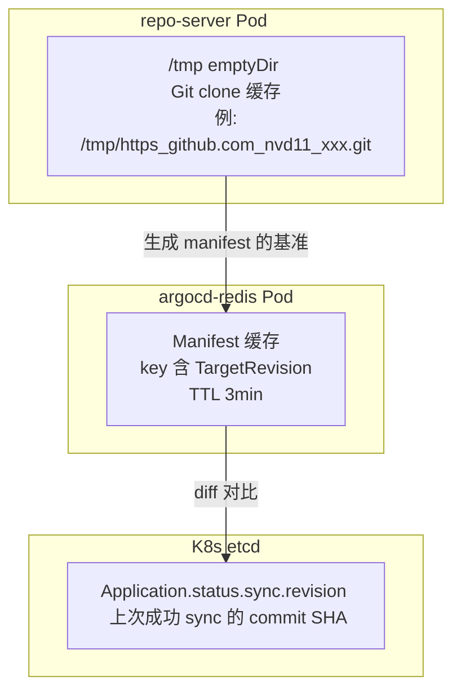
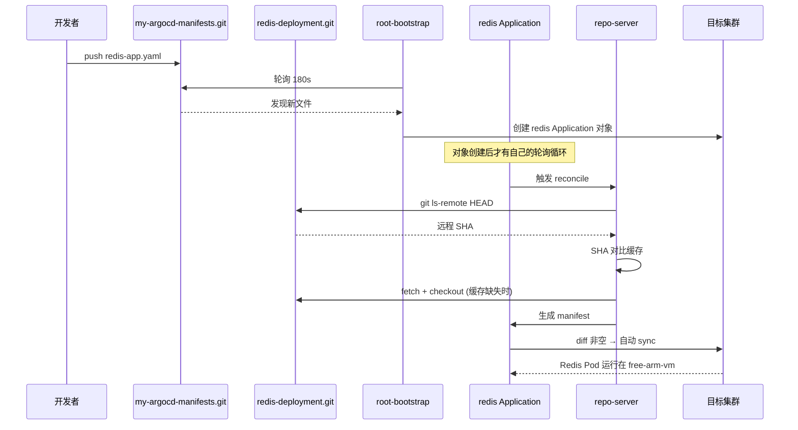

# ArgoCD 双层轮询深入拆解：从 redis-app.yaml 注册到缓存重建的完整链路

在给 Redis 部署做 GitOps 规范化的时候，我把 `redis-deployment` 仓库推上去之后，突然意识到一个问题：ArgoCD 到底是怎么知道这个仓库有改动的？我的第一反应是"ArgoCD 轮询 Git 仓库，比对 hash"，但仔细一想又不对——我明明有两个仓库在参与这件事：`my-argocd-manifests`（管 Application 定义）和 `redis-deployment`（管实际 Manifest）。那 ArgoCD 到底轮询哪一个？

这篇文章把我从怀疑到查源码、再到上集群实证的完整过程记录下来。结论可能会颠覆你对 ArgoCD 的直觉：**ArgoCD 不是轮询一个仓库，而是两层各自独立的轮询循环；它也不是靠"保存 hash 对比"来检测改动，Git 实时生成才是真相。**

---

## 一、 背景：我的 ArgoCD 到底长什么样

先交代我的实际环境，后面所有例子都是真实资源：

- **ArgoCD 控制面**：阿里云 K3s 集群，App-of-Apps 模式，`root-bootstrap` Application 管着 `my-argocd-manifests.git` 的 `argocd-apps/` 目录
- **目标集群**：`tencent-dp1-cluster`，横跨腾讯云（`vm-0-2-debian` 控制面）、OCI ARM（`free-arm-vm`）、本地 NUC 三个节点
- **子应用**：fastapi-svc、quarkus-svc、kong-gateway-infra、kong-ingress-controller、gateway-api-crds，共 5 个
- **待接入**：`redis-deployment.git`（`k8s/redis.yaml`），打算把 Redis 部署到 free-arm-vm，经 Kong Gateway 6379 Stream 对外

我当时给 README 写"ArgoCD 轮询的是每个 Application 自己的 source.repoURL，不是统一仓库"这句话时，被自己问住了：那 `root-bootstrap` 轮询 `my-argocd-manifests` 又算什么？两个仓库都会被轮询吗？还是有一个是"假的"？

---

## 二、 双层轮询：发现层与同步层，各干各的

答案是：**两个仓库都会被轮询，但轮询的主体不同，职责完全不同**。这是 ArgoCD App-of-Apps 模式最核心、也最容易搞混的机制。

### 第一层：root-bootstrap（发现层）—— 轮询 my-argocd-manifests

```yaml
# argocd-apps/root-bootstrap-app.yaml
spec:
  source:
    repoURL: 'https://github.com/nvd11/my-argocd-manifests.git'
    targetRevision: HEAD
    path: argocd-apps
```

它的职责只有一件事：**盯住 `argocd-apps/` 目录，看里面有没有新的 Application 文件**。我往里加一个 `redis-app.yaml`，root-bootstrap 下一轮轮询发现新文件，就在集群里创建一个 `redis` 的 Application 对象。

注意：这一层**不解析、不连接、不验证 redis-deployment.git**。repoURL 对它来说只是 Application 对象里的一个字段，它照抄进对象里就完事。

### 第二层：子 Application（同步层）—— 轮询各自 source.repoURL

```yaml
# 我 README 里规划的 redis-app.yaml（示意）
spec:
  source:
    repoURL: 'https://github.com/nvd11/redis-deployment.git'
    path: k8s
```

一旦 `redis` Application 对象被创建，application-controller 就为它**单独开一个轮询循环**，去轮询 redis-deployment.git 的 `k8s/` 目录，把 Deployment/PVC/Service/TCPIngress 同步到目标集群。

我现有的 `fastapi-svc-app.yaml` 就是活证据——它的 `source.repoURL` 指向 `my-shared-helm-charts.git`，而不是 `my-argocd-manifests`。如果 ArgoCD 只轮询 my-argocd-manifests，fastapi 的镜像永远不可能被同步。



### 两个关键结论

1. **两个循环完全解耦**，不是"父级扫完通知子级"的串行。父级只管 Application 对象的增删改，子级只管资源同步。改 `redis-app.yaml` 的 syncPolicy → 父级发现；改 `k8s/redis.yaml` 的镜像 → 父级完全无感，是子级自己的事。
2. **首次部署 Redis 最坏要等两个 3 分钟**：父级 3 分钟捡到新文件创建对象，子级对象从创建那一刻才开始自己的轮询，又是最多 3 分钟。所以第一次部署，从 push 到 Redis 起来，最坏 ~6 分钟。

---

## 三、 子级轮询怎么知道 repo 改了？—— 先 ls-remote，再决定要不要重新生成

这是我最开始搞混的地方。我一直以为 ArgoCD 把 repo 的 hash 存下来，每次轮询比对 hash 变了没。查了源码之后发现，机制比这精细，而且"hash 对比"不是你想的那回事。

### 第一步：`git ls-remote` 轻量探测远程 HEAD

每次轮询（默认 180s），repo-server 对远程仓库执行 `git ls-remote HEAD`。注意这不是 clone，是只读一次远程 ref，开销 KB 级。源码 `util/git/git.go`：

```go
_, err = client.LsRemote("HEAD")
```

### 第二步：拿远程 SHA 对比缓存

repo-server 的 manifest 缓存（Redis）key 里带着 `TargetRevision`，TTL 默认 3 分钟（`ARGOCD_RECONCILIATION_TIMEOUT`）。比对逻辑：

```
远程 HEAD SHA == 缓存里的 SHA ?
├─ 相同 → 直接用缓存的 manifest，不重新生成（省 CPU/网络）
└─ 不同 → fetch + 重新生成 manifest → 更新缓存
```

### 第三步：Application 对象持久记录 revision

hash 不只活在缓存里，每次 sync 之后还会写进 Application 对象状态：

```bash
kubectl get app redis -o jsonpath='{.status.sync.revision}'
```

这是 UI 上 "Synced to xxxx" 的数据来源，也相当于"上次同步到哪个 commit"的锚点。

### 但真相是：轮询本身是无条件的

我差点被自己的提问带偏——**ArgoCD 不是"发现 hash 变了才去处理"，而是每 180s 无条件触发一次 reconcile 流程**，ls-remote 只是流程里的第一步。hash 对比的作用是决定"要不要重新生成 manifest"，而不是决定"要不要轮询"。

```
每 180s → ls-remote 拿远程 SHA → 对比缓存 SHA
  ├─ 相同 → 复用缓存 manifest → 和集群 live state 对比
  └─ 不同 → fetch + 重新生成 manifest → 和集群 live state 对比
最终: diff 非空 + automated → 触发 sync → 更新 .status.sync.revision
```

这顺便解释了为什么**改 README 不触发部署**：SHA 变了（有提交），重新生成 manifest，但 diff 为空（README 不影响 k8s/ 产物），所以不 sync。逻辑闭环。

---

## 四、 缓存到底存在哪？—— 三层，物理位置各不相同

继续往下挖，问题变成"缓存在哪"。答案不是一个地方，是三层：

### 1. Git 仓库本地 clone —— repo-server 容器 /tmp

这是最关键的一层，也是"检测 diff"的真正基准。每个被引用的 repo 在 repo-server 容器里有一份 clone，路径由 URL 消毒而来：

```go
// util/git/client.go
root := filepath.Join(os.TempDir(), r.ReplaceAllString(normalizedGitURL, "_"))
// 例: /tmp/https_github.com_nvd11_redis-deployment.git
```

我上集群实证过（后面会详细讲 repo-server 在哪），它的 `/tmp` 挂的是 **emptyDir**：

```yaml
volumes:
  - name: tmp
    emptyDir: {}
volumeMounts:
  - name: tmp
    mountPath: /tmp
```

### 2. Manifest 生成缓存 —— Redis

"revision → manifest 生成结果"缓存在 ArgoCD 自带的 Redis 里，TTL 3 分钟。

### 3. revision 锚点 —— K8s etcd

`.status.sync.revision` 存在 Application 对象里，底层是 etcd，跨重启持久。



---

## 五、 缓存丢了怎么办？—— 自动重建，检测零损失

这是我问自己的第二个问题：缓存要是丢了，是不是就 detect 不了 diff 了？

结论很干脆：**不会。缓存是性能优化，不是正确性依赖。Git 是唯一事实源。**

源码 `util/git/client.go` 的 `Init()` 写得很直白：

```go
func (m *nativeGitClient) Init() error {
    _, err := git.PlainOpen(m.root)
    if err == nil { return nil }              // clone 在 → 直接用
    if !errors.Is(err, git.ErrRepositoryNotExists) { return err }
    log.Infof("Initializing %s to %s", m.repoURL, m.root)
    err = os.RemoveAll(m.root)                // 残留清掉
    err = os.MkdirAll(m.root, 0o755)          // 重建目录
    repo, err := git.PlainInit(m.root, false) // 重新 git init
    ...
}
```

加上 `checkoutRevision` 的完整链路（`reposerver/repository/repository.go`）：

```
轮询触发 → gitClient.Init()
  ├─ clone 在 → 直接复用
  └─ clone 丢 → PlainInit 重建空仓库
       → IsRevisionPresent(revision)? 否
       → gitClient.Fetch("")          ← 从远程重新拉
       → gitClient.Checkout(revision) ← checkout 目标 revision
       → CommitSHA() 拿当前 commit hash
```

| 缓存层 | 丢了会怎样 | 恢复方式 |
|---|---|---|
| Git 本地 clone `/tmp` | 不影响，自动重建 | `Init()` → `Fetch()` → `Checkout()` |
| Redis manifest 缓存 | 不影响，重新生成 | 每次 reconcile 实时生成 |
| `.status.sync.revision` | 不影响检测，只影响 UI 显示 | 下次 sync 自动更新 |

**就算把 repo-server 的 /tmp 和 Redis 全清了，它顶多慢几秒重新 clone，检测照样精确。** Git 永远可以被重新拉取，这就是 GitOps "Git 为源 + 缓存可弃" 的可靠性根基。

---

## 六、 repo-server 到底在哪？—— 它是独立 Pod，不在"ArgoCD 主节点"上

这个问题我也踩了认知坑。我一直默认 repo-server 跟 ArgoCD 控制器在一起，直到 SSH 上阿里云 master 查了一下：

```bash
$ kubectl get pods -n argocd -o wide
NAME                                               READY   NODE
argocd-application-controller-0                    1/1     free-amd-vm
argocd-repo-server-797fc85c8f-x6csk                1/1     aws-moon-proxy    ← 在这！
argocd-redis-9dbc65c5c-lcb28                       1/1     aws-moon-proxy
argocd-server-58d6c7fbb9-sg9xt                     1/1     free-amd-vm2
```

**ArgoCD 是一组微服务，不是单个进程。** repo-server 是独立 Deployment，负责所有 Git 操作（clone/fetch/生成 manifest），通过 gRPC 被 application-controller 调用。它可以调度到任何节点——我集群里它就跑在 `aws-moon-proxy`（AWS 节点）上。

而且它彻底无状态：`/tmp` 挂 emptyDir，Pod 重建 = clone 全清 = 自动重建。官方部署不挂 PV，就是因为缓存不值得持久化。

---

## 七、 从推代码到 Redis 起来：完整时序

把前面所有机制串起来，一次完整的 GitOps 部署是这样的（以 redis-deployment 为例）：



---

## 八、 总结：这套机制给工程实践带来的三条启示

1. **App-of-Apps 的"两层"别搞混**：父级管"应用是否存在"（App 定义层），子级管"资源是否一致"（Manifest 层）。repoURL 是父子之间的桥梁字段，但两者各自独立轮询、互不阻塞。加文件 = 加应用，删文件 = prune 删应用，不需要任何 UI 注册。

2. **轮询与缓存是两回事**：轮询是每 180s 无条件触发的 reconcile，ls-remote 只是第一步；缓存（/tmp clone、Redis、etcd revision）只决定"要不要重新生成 manifest"，不影响"要不要检测"。所以缓存丢了，检测能力零损失。

3. **Git 是唯一事实源，其他都可弃**：repo-server 无状态、emptyDir、自动重建，这套设计让 ArgoCD 在任何节点故障/缓存清空后都能自愈。这也是为什么 GitOps 敢把部署交给一个"会忘事的进程"——它忘了没关系，Git 记得一切。

---

*题外话：本文从"ArgoCD 到底轮询哪个 repo"这个看似简单的问题出发，最后查到了 `util/git/client.go` 的 `Init()` 源码。这种"问题 → 怀疑 → 查源码 → 上集群实证"的路径，比直接看文档收获大得多。文档只告诉你"它会自动同步"，源码才告诉你"它凭什么敢自动同步"。*
