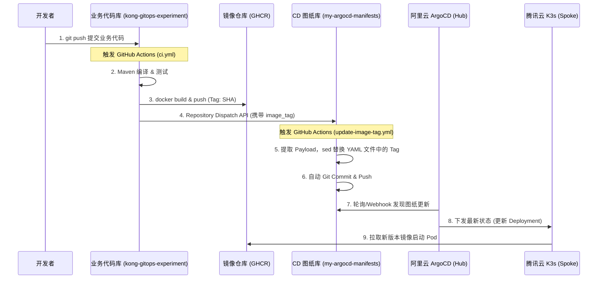

# 跨仓库联邦 GitOps 架构演进与实践记录：基于 GitHub Actions + ArgoCD 的终极解耦

在微服务云原生架构的演进中，CI（持续集成）与 CD（持续部署）的边界划分往往是团队争论的焦点。传统的 CI/CD 流水线习惯于在构建出 Docker 镜像后，顺手执行一条 `kubectl apply` 或者 `helm upgrade`。这种“一把梭”的模式在单集群、小团队下固然痛快，但随着多集群（跨云联邦）、基础设施即代码（IaC）的推行，它的弊端暴露无遗：CI 脚本被迫掌握了生产环境的高权限凭证，业务代码仓库被塞满了部署脚本，回滚完全依赖重新跑流水线。

本文记录了我们将一个 Quarkus 微服务（Data Plane 位于腾讯云 K3s，Control Plane 位于阿里云 ArgoCD）彻底向**纯粹的事件驱动 GitOps 架构**重构的全过程。

## 一、 架构全景：基于 Repository Dispatch 的事件驱动模型

我们放弃了在同一个仓库里既写代码又写部署图纸的方案，也放弃了让 CI 脚本跨仓库强行提交代码的半吊子解耦。最终落地的是**跨仓库事件驱动（Webhook）架构**。

### 1.1 核心设计理念
* **CI 仓库（业务研发）**：只负责代码编译、单元测试、打出镜像推送到 Registry。在结束前，朝 CD 仓库大吼一声（发送 Webhook）：“新版本造好了，Tag 是 XXX！”
* **CD 仓库（运维大本营）**：存放所有的 ArgoCD Application 和 K8s YAML 图纸。它作为一个“接线员”，监听 CI 发来的信号，自动修改自己仓库里的镜像版本并提交。
* **ArgoCD（部署大脑）**：只认 CD 仓库里的图纸，图纸怎么画，它就把腾讯云的集群变成什么样。

### 1.2 Mermaid 架构流转图



## 二、 核心实现代码

为了实现这种松耦合，我们在两个 GitHub 仓库中分别布置了流水线。

### 2.1 业务侧：只负责打包和“发信号” (`ci.yml`)

在业务仓库中，流水线的核心逻辑在最后一步发生了根本转变。我们不再去 checkout 配置仓库，而是使用 `peter-evans/repository-dispatch` 触发远端的 API。

```yaml
# kong-gitops-experiment/.github/workflows/ci.yml
name: Quarkus API CI Build

on:
  push:
    branches: [ main ]
    paths: [ 'apps/quarkus-svc/**', '.github/workflows/ci.yml' ]

permissions:
  contents: read
  packages: write

jobs:
  build-and-push:
    runs-on: ubuntu-latest
    steps:
      - name: Checkout Code
        uses: actions/checkout@v3

      # ... 省略 JDK 安装、Maven 编译和 GHCR docker push 步骤 ...

      - name: Trigger CD Repo (Repository Dispatch)
        uses: peter-evans/repository-dispatch@v2
        with:
          token: ${{ secrets.CD_GIT_PAT }}
          repository: nvd11/my-argocd-manifests
          event-type: update-image-tag
          # 将当前微服务名称和最新的 Commit SHA 作为负载发送出去
          client-payload: '{"image_tag": "${{ github.sha }}", "svc_name": "quarkus-svc"}'
```

### 2.2 CD 侧：全自动的“配置接线员” (`update-image-tag.yml`)

CD 仓库中的 Action 不受任何 Push 事件触发，只监听 `repository_dispatch`。它提取传递过来的参数，精确定位到对应的图纸文件进行修改。

```yaml
# my-argocd-manifests/.github/workflows/update-image-tag.yml
name: CD Configuration Update

on:
  repository_dispatch:
    types: [update-image-tag]

permissions:
  contents: write

jobs:
  update-tag:
    runs-on: ubuntu-latest
    steps:
      - name: Checkout Code
        uses: actions/checkout@v3

      - name: Update Image Tag in ArgoCD App Manifest
        run: |
          TAG=${{ github.event.client_payload.image_tag }}
          SVC_NAME=${{ github.event.client_payload.svc_name }}
          
          echo "Updating image tag for $SVC_NAME to $TAG"
          
          MANIFEST_FILE="argocd-apps/${SVC_NAME}-app.yaml"
          
          # 使用 sed 精准替换 ArgoCD Application 清单中的 tag
          sed -i -E "s/tag: [a-f0-9]+(.*)/tag: ${TAG}\1/g" "$MANIFEST_FILE"
          
          git config --global user.name "github-actions[bot]"
          git config --global user.email "41898282+github-actions[bot]@users.noreply.github.com"
          
          git add "$MANIFEST_FILE"
          git commit -m "ci: auto-update $SVC_NAME image tag to ${TAG} [skip ci]"
          git push
```

## 三、 实践中的深坑与工程化破局

在整套架构贯通的过程中，并非一帆风顺，底层网络、K8s 网关标准以及身份验证等问题接踵而至。以下是极具价值的避坑记录：

### 3.1 跨仓库调用的权限壁垒 (GITHUB_TOKEN vs PAT)
**现象**：最初在 CI 脚本中调用跨仓库 API 时，系统报 `Input required and not supplied: token` 或 403 Forbidden。
**破局**：GitHub Actions 默认注入的 `${{ secrets.GITHUB_TOKEN }}` 权限被严格圈禁在“当前运行的仓库”内。为了调用 `my-argocd-manifests` 的 Dispatch API，必须生成一个带有 `repo` 权限的个人访问令牌 (PAT)，并以 `CD_GIT_PAT` 的名字存入业务仓库的 Secrets 中。

### 3.2 自动化脚本中的 sudo 提权封锁
**现象**：在通过 SSH 自动化管控节点并尝试静默输入密码提权时，被底层安全框架直接拦截，判定为风险。
**破局**：在真正的自动化运维（GitOps/Ansible）中，绝不应在管道中明文传递密码。规范的做法是为执行自动化任务的账号（如 `gateman`）在 `/etc/sudoers` 中配置 `NOPASSWD`，彻底打通系统级管控通道。

### 3.3 Kong KIC 引擎与 Gateway API 的“翻译崩溃”
**现象**：为了在网关层剥离路径，我们在 Gateway API 的 `HTTPRoute` 中使用了 `URLRewrite` 过滤器，结果 Kong 报错 `KongConfigurationTranslationFailed`。
**破局**：经过排查，开源版 Kong (KIC) 默认使用的是 `Traditional Router`（传统路由引擎），它根本无法解析 K8s Gateway API 中高级的正则路径重写语法。强行开启未完全成熟的 `Expression Router` 风险极高。
最终我们选择退回最稳定的注解方式 `konghq.com/strip-path: "true"`，但这又引入了微服务后端“路径迷失”的新问题。

### 3.4 ArgoCD 部署降级 (Degraded) 与探针改造
**现象**：为了解决网关路径剥离导致的微服务内部上下文混乱，我们在 Quarkus 中配置了 `quarkus.http.root-path=/svc1`。结果 ArgoCD 部署后状态变为 `Degraded`，旧 Pod 迟迟不肯下线。
**破局**：配置全局 Context 后，原本的健康检查探针 `/svc1` 返回了 404，导致 K8s 判定新容器启动失败。
为了保持 CD 图纸的通用性（不把健康探针硬编码绑定到特定的业务路径 `/svc1/hello` 上），我们在 Quarkus 代码中设计了一个专用的根路径探针接口，完美迎合 K8s 的检查机制：

```java
@Path("/")
public class GreetingResource {

    // 专供 K8s Readiness/Liveness 探针使用，实际访问路径为 /svc1
    @GET
    public String health() {
        return "ok";
    }

    // 实际业务接口，真实访问路径为 /svc1/hello
    @GET
    @Path("/hello")
    @Produces(MediaType.APPLICATION_JSON)
    public Map<String, String> hello(@Context HttpServerRequest request) {
        // ... 业务逻辑
    }
}
```

### 3.5 GitHub Actions 的底层实现哲学：为何是 Node.js？
在执行 CI 时，即使是纯 Java/Maven 构建环境，日志中也会频繁抛出 `Node 20 is being deprecated` 的警告。
**溯源**：GitHub Actions 的底层 Runner 环境和绝大部分插件生态（包括官方的 checkout、setup-java，以及我们用的 repository-dispatch）全部基于 JavaScript/TypeScript 编写。相比于需要考虑跨平台编译（交叉编译各架构二进制文件）的 Go 语言，或者启动极慢的 Java，Node.js 配合预装的 V8 引擎提供了极致的冷启动速度和一次编写、全平台（Linux/Mac/Win 及 ARM/x86）运行的沙盒能力。理解这一点，对于未来自研企业内部的 Action 插件至关重要。

## 四、 结语

从强耦合的单一 YAML，到跨仓库的 `sed` 强推，再到基于 Webhook Payload 动态渲染文件路径的 `Repository Dispatch`。我们最终建立了一个“只关注产出，不关注如何部署”的 CI 研发侧，和一个“只接收信号，不动业务代码”的 CD 运维侧。

这正是云原生架构中最迷人的一面：通过精巧的接口与事件边界，让庞大的系统像齿轮般严丝合缝地自动运转。
