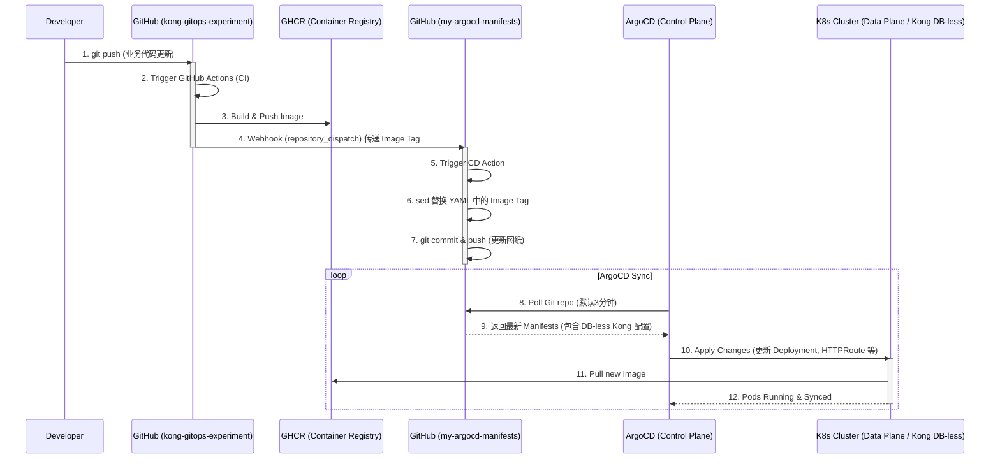
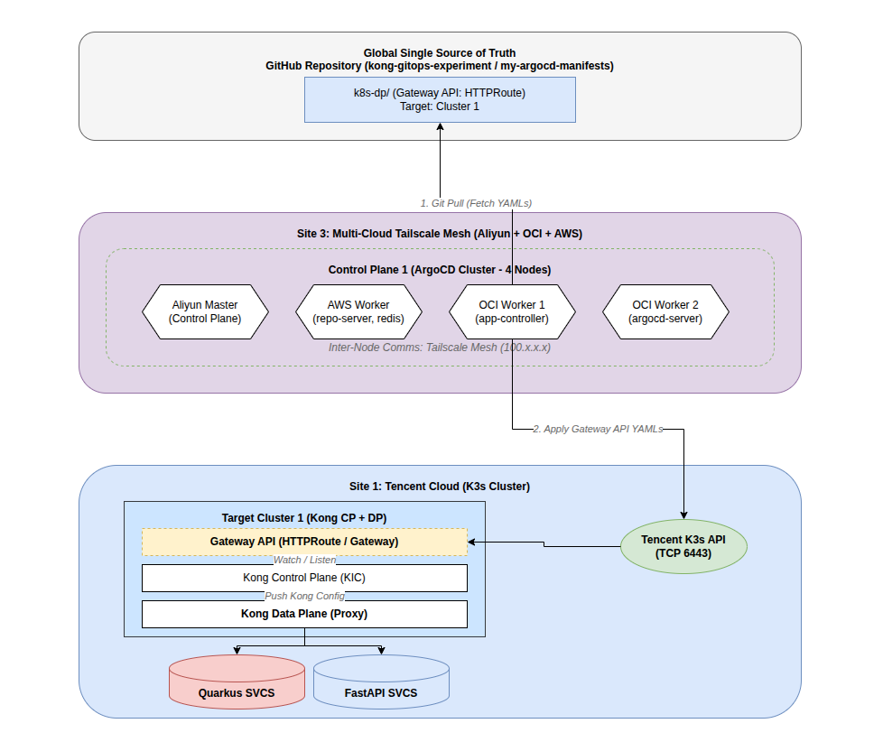

# 基于 GitOps 与 Gateway API 的现代微服务架构实践：从流量路由到自动化交付

## 1. 背景与架构愿景 (Introduction & Architecture Vision)

### 1.1 痛点分析
在传统的微服务交付模式中，开发与运维的边界往往模糊不清。对于多语言、多框架的异构微服务体系（例如同时并存的 Java Quarkus 和 Python FastAPI 服务），手动打包、人工修改 Kubernetes 部署图纸、手工 `kubectl apply` 触发部署不仅效率低下，且极易引入人为错误。此外，如何在这种混合架构下提供一个统一的流量入口，实现一致的路由策略和安全控制，同样是基础设施面临的一大挑战。传统的集中式网关配置往往导致网关团队成为瓶颈，阻碍了业务的敏捷迭代。

### 1.2 Kong Gateway 实验初衷与控制面/数据面分离 (DB-less & CP/DP)
我们开展 Kong Gateway 实验的最核心初衷，是**摒弃传统的数据库依赖，全面拥抱 DB-less（无数据库）模式**。
在传统的 Kong 架构中，路由规则和插件配置存储在 PostgreSQL 数据库中，配置的变更缺乏版本控制和审计。
在本实验中，我们将 Kong 所有的配置（包括 GatewayClass、Gateway 以及各业务服务的 HTTPRoute）全部转换为声明式的 YAML 文件，托管在 GitHub 仓库中，由 GitOps（ArgoCD）来统一纳管配置的变更和分发（Apply）。

这种设计天然契合了 **CP（控制面）与 DP（数据面）分离** 的微服务基础设施架构：
- **控制面 (Control Plane, CP)**：在这个架构中，**ArgoCD 和 Git 仓库共同充当了控制面**。Git 仓库是全局配置的单一事实来源 (Single Source of Truth)；ArgoCD 部署在管理集群中，负责实时监听 Git 仓库的变更，并将配置指令下发到目标环境。
- **数据面 (Data Plane, DP)**：部署在业务集群（如腾讯云 K3s）中的 **Kong Ingress Controller (KIC)** 及底层的 Nginx 引擎充当数据面。它们没有自己的状态（DB-less），完全听从控制面下发的 Kubernetes 资源清单（Gateway API 规则），专注于高性能的请求转发和流量路由。

### 1.3 目标愿景
为了彻底摆脱“人肉运维”的泥沼，我们的核心愿景是构建一套 **100% 自动化、安全合规、高度解耦** 的云原生交付流水线。当开发者完成业务代码并执行 `git push` 的那一刻起，后续的打包构建、镜像推送、图纸更新以及目标集群的热部署、流量路由接管，都必须由系统无缝自动流转，实现真正的“代码即基础设施 (IaC)”。

同时，在网关路由层面，我们推崇 **“去中心化路由管理”**，即每个微服务在其独立的 Helm Chart 或 K8s 图纸中维护自身的路由规则 (`HTTPRoute`)，网关只负责基于 Gateway API 提供大门入口。这种模式将路由决策权下放给业务团队，实现了真正的自治。

### 1.4 核心技术栈选型
为了将上述愿景落地，我们组合了当前云原生领域的领先技术：
- **网关层 (Traffic Routing)**：采用 **Kong KIC** (Kubernetes Ingress Controller) 结合新一代标准的 **K8s Gateway API**。它不仅提供了比传统 Ingress 更强大的表达能力，还实现了基础设施提供者与应用开发者的角色分离。
- **发布层 (Continuous Deployment)**：引入 **ArgoCD** 作为 CD 大脑，践行 GitOps 理念。它持续监听 Git 仓库，确保集群运行状态与 Git 声明式图纸保持绝对一致。
- **交付层 (Continuous Integration)**：利用 **GitHub Actions** 构建轻量级的 CI 流水线，产出 OCI 标准镜像并托管至 **GHCR** (GitHub Container Registry)。

### 1.5 架构解耦：CI 与 CD 的物理隔离
本套架构的一大亮点在于**严格解耦 CI（应用代码库）与 CD（部署图纸库）**。
我们将业务代码（`kong-gitops-experiment`）与 Kubernetes 部署清单（`my-argocd-manifests`）拆分到两个物理隔离的 Git 仓库中。应用研发人员只关注业务逻辑；而所有的环境拓扑、路由规则和版本 Tag 均由 CD 仓库纳管。这种隔离彻底切断了“图纸修改误触发代码构建”的反模式，并为环境变更提供了不可篡改的审计追踪能力。

### 1.6 整体流水线架构图
下面是我们设计的完整流水线架构流程图：



## 2. 核心基建：ArgoCD 预装应用矩阵与 App of Apps

在业务微服务上线之前，必须通过 ArgoCD 预先部署基础设施基石，并严格保证依赖顺序。我们采用了 ArgoCD 经典的 **App of Apps** 模式。

### 2.1 root-bootstrap (万物之源)
- **源码链接**：[root-bootstrap-app.yaml](https://github.com/nvd11/my-argocd-manifests/blob/main/argocd-apps/root-bootstrap-app.yaml)
- **说明**：作为管理其他所有 ArgoCD App 的“母应用”。只需要在集群中手动创建这一个 App，它就会自动去 Git 仓库拉取并创建其他的子应用，实现纯粹的声明式集群引导。

### 2.2 gateway-api-crds
- **源码链接**：[gateway-api-crds-app.yaml](https://github.com/nvd11/my-argocd-manifests/blob/main/argocd-apps/gateway-api-crds-app.yaml)
- **作用**：注入 K8s 标准的 Gateway API 自定义资源定义（如 `GatewayClass`, `Gateway`, `HTTPRoute`）。
- **意义**：必须在网关控制器启动前安装，否则集群无法识别这些新时代的路由对象。

### 2.3 kong-ingress-controller
- **源码链接**：[kong-controller-app.yaml](https://github.com/nvd11/my-argocd-manifests/blob/main/argocd-apps/kong-controller-app.yaml)
- **作用**：真正的流量引擎和大脑（Kong KIC）。
- **意义**：监听 K8s 集群中的 Gateway API 资源变化，并将其翻译为 Kong 的底层 Nginx/Lua 路由规则。

### 2.4 kong-gateway-infra
- **源码链接**：[kong-infra-app.yaml](https://github.com/nvd11/my-argocd-manifests/blob/main/argocd-apps/kong-infra-app.yaml)
- **作用**：基础设施级配置应用。
- **意义**：实例化具体的 `GatewayClass` 和 `Gateway` 资源（例如声明一个监听 80 端口的 `kong-main-gateway`），为后续业务微服务的 `HTTPRoute` 提供挂载锚点。

## 3. 跨云架构与多集群部署 (Multi-Cloud Architecture)

为了实现高可用和灵活调度，我们的架构物理部署跨越了多个云厂商（阿里云、Oracle Cloud、AWS、腾讯云），通过 Tailscale Mesh 网络实现内网互联。

### 3.1 控制面 (Control Plane: ArgoCD Cluster)
- **部署位置**：分布在 Aliyun (Master), AWS (Worker), OCI (Worker) 组成的高可用 K3s 集群中。
- **通信机制**：节点间通过 Tailscale Mesh (100.x.x.x) 进行内网通信。ArgoCD 的各个组件（`repo-server`, `app-controller`, `redis` 等）分布在这些节点上。
- **职责**：`app-controller` 负责从 GitHub 拉取声明式 YAML，并通过公网（或 Tailscale）将指令下发到目标业务集群的 Kubernetes API Server。

### 3.2 数据面 (Data Plane: Target Cluster)
- **部署位置**：本实验的 Target Cluster 1 部署在腾讯云 (Tencent Cloud K3s Cluster)。
- **职责**：接收来自 ArgoCD 控制面的 Gateway API (HTTPRoute/Gateway) 图纸。Kong KIC 监听这些变化，并将配置推送到 Kong Proxy 数据面，最终将外部流量路由到后端的 Quarkus 或 FastAPI 服务。

我们利用 Draw.io 绘制了该跨云架构图，源文件已存入代码库，可通过 Draw.io 随时编辑更新：

> **架构图文件位置**: `drawio/kong-multi-cloud-architecture.drawio`




## 4. 极客解耦：CI 与 CD 仓库的物理分离机制

在传统的单体仓库中，业务代码和 Kubernetes 图纸往往混杂在一起。这不仅会导致权限管理困难（开发人员可能无意中修改了生产环境的路由规则），还会引发“死亡循环”——图纸的修改触发了不必要的代码构建。

为此，我们将架构严格物理拆分为 CI 和 CD 两个独立的仓库。

### 4.1 CI 仓库的职责 (`kong-gitops-experiment`)
CI 仓库是纯粹的应用代码大本营。在我们的实验中，这里不仅存放了 Java Quarkus 服务，还存放了 Python FastAPI 服务，是一个典型的 Monorepo。

**核心设计**：
- **精准触发打包**：利用 GitHub Actions 的 `paths` 过滤器，我们将单体流水线拆分成了 `quarkus-ci.yml` 和 `fastapi-ci.yml`。只有当 `apps/fastapi-svc/**` 目录下的代码发生变更时，才会触发 FastAPI 服务的打包流程，极大地节省了算力和时间。
- **标准化交付物**：CI 的最终产物是一个标准的 OCI 镜像，并被推送到公共的 GitHub Container Registry (GHCR)。

### 4.2 跨库通信机制：从 CI 呼叫 CD (repository_dispatch)
当 CI 完成打包并推送镜像后，它必须通知 CD 仓库：“我有新版本了，请更新图纸！” 
由于跨越了仓库物理边界，GitHub Actions 默认注入的 `${{ secrets.GITHUB_TOKEN }}` 权限不够，因为它被严格圈禁在当前仓库内。

**破局方案**：
1. **注入 PAT**：生成一个带有 `repo` 权限的 Personal Access Token (PAT)，并以 `CD_GIT_PAT` 的名字存入 CI 仓库的 Secrets 中。
2. **发射 Webhook**：在 CI 流水线的最后一步，使用该 PAT 调用 GitHub API，发送 `repository_dispatch` 类型的 Webhook 信号。
3. **传递新 Tag**：在 Webhook 的 payload 中，携带新鲜出炉的 Git Commit Hash 作为参数，传递给远端的 CD 仓库。

这种机制彻底解耦了代码的“构建”与“部署”生命周期。


## 5. 自动化大脑：CD 仓库的镜像管理与并发控制

如果说 CI 是流水线的引擎，那么 CD 仓库（`my-argocd-manifests`）就是这场自动化的调度大脑。这里存放着纯净的 Kubernetes 图纸（YAML）。

当 CD 仓库收到来自 CI 发射的 `repository_dispatch` 信号后，其内部的 GitHub Actions 将接管后续流程。

### 5.1 动态镜像 Tag 注入 (sed 正则黑科技)
在收到 Webhook payload 后，CD 脚本需要将图纸中旧的镜像 Tag 替换为新的 Git Commit Hash。

**实现细节与防坑指南**：
我们使用 Linux 经典的 `sed` 命令结合正则表达式进行替换：
```bash
sed -i -E "s|(ghcr.io/nvd11/${{ github.event.client_payload.service_name }}:)[a-f0-9]+|\1${{ github.event.client_payload.image_tag }}|" \
    argocd-apps/${{ github.event.client_payload.service_name }}-app.yaml
```
*⚠️ 避坑预警：*
由于我们设定的正则表达式 `[a-f0-9]+` 严格要求匹配纯十六进制的 Git Commit Hash。如果我们在初始创建 YAML 文件时，习惯性地将 Tag 写成 `v1` 或是 `latest`，`sed` 将无法匹配并导致静默失败。最终，流水线会提示 `No changes to commit` 并且提早退出。
**解决方案**：必须在图纸初始化时，为其赋予一个“假的”全十六进制占位符（例如 40 位的 `0000000000...`），才能完美触发初次及后续的 CD 自动化替换。

### 5.2 并发锁机制 (Concurrency Control)
由于多个微服务同属一个 CD 仓库，如果发生“多服务同时发布”的极端场景，就会出现两个 Action 进程同时尝试执行 `git push` 修改 YAML 文件，导致 Git 严重冲突并双双报错。

**解决方案：强制排队**
我们在 CD 流水线（`update-image-tag.yml`）中引入了 GitHub Actions 的并发控制原语 `concurrency`：
```yaml
concurrency:
  group: gitops-cd-update
  cancel-in-progress: false
```
通过指定统一的 `group`，所有的 CD 触发任务都必须乖乖排队，单线程串行执行修改图纸并 `push` 的动作。这彻底根除了 Git 并发写入的冲突危机。


## 6. 流量大门：Kong KIC 与 Gateway API 的碰撞 (Traffic Routing)

在网关路由层面，我们选择了 Kubernetes 新一代标准的 Gateway API (`GatewayClass`, `Gateway`, `HTTPRoute`)，取代了历史包袱沉重的 `Ingress`。这让我们拥有了更强悍的 HTTP 报文匹配和改写能力，同时也将网关拥有者与业务开发者的职责清晰划界。

### 6.1 Quarkus 服务的标准路由 (`/svc1`)
对于基于 Java Quarkus 构建的常规微服务，它通常拥有良好的框架内聚性。我们只需编写一个简单的 `HTTPRoute` 规则，将前缀为 `/svc1` 的请求无缝路由至对应的 K8s Service 即可。流量从 Kong 进来，到达服务，一切顺理成章。

### 6.2 FastAPI 服务的路由挑战与破局 (`/svc2`)
但在接入基于 Python FastAPI 构建的第二个微服务（`/svc2`）时，我们遭遇了架构挑战。

**踩坑记录**：
我们试图利用 Gateway API 的 `URLRewrite` 规范，在 Kong 层面将 `/svc2` 前缀剥离（类似 Nginx 的 `rewrite`），然后再将干净的 `/` 路径请求发送给后端的 FastAPI。然而，**由于 Kong KIC 当前的传统底层引擎限制，它并没有完全支持 Gateway API 中标准的 URLRewrite 路径剥离过滤器。**

**破局方案：后端消化**
既然网关不肯“脱外套”，我们就让后端“穿上外套”。
我们放弃了在 Kong 层面做 URI 重写，转而利用 FastAPI 自身强大的 ASGI 机制解决问题。
在 FastAPI 的入口文件 `main.py` 中，我们巧妙地注入了 `root_path="/svc2"`：

```python
from fastapi import FastAPI

app = FastAPI(root_path="/svc2")

@app.get("/hello")
def read_root():
    return {"message": "Hello from FastAPI service (svc2) via Kong!"}
```
**原理解析**：当带有 `/svc2/hello` 的请求直接由网关透传到达 FastAPI 时，FastAPI 会自动识别并剥离匹配到的 `root_path` 前缀，随后精确命中内部定义的 `@app.get("/hello")` 业务路由。这种“后端自治、自行消化”的思路，完美规避了网关层的特性短板，增强了系统的鲁棒性。

## 7. 可复用性：打造通用的 Helm 模具 (Reusable Helm Charts)

随着微服务数量的暴增（`svc3`, `svc4`...），如果每个服务都复制粘贴一套 Deployment、Service、HTTPRoute 的长篇 YAML，不但违背了 DRY (Don't Repeat Yourself) 原则，后期的维护也将是一场灾难。

为此，我们在跨仓库引用的基础上，抽象了一套通用的 **`generic-web-service` Helm Chart**。

**极简传参上线**：
在 ArgoCD 的 Application 资源定义中，我们只需要指定少量的 `helm.values`，即可极速拉起一个全新的业务微服务：

```yaml
    helm:
      values: |
        replicaCount: 1
        containerPort: 8080
        image:
          repository: ghcr.io/nvd11/my-quarkus-svc
          tag: <git-commit-hash>
        route:
          enabled: true
          parentGateway: kong-main-gateway
          path: /svc1
```
ArgoCD 负责将这些精简的参数翻译为庞大且规范的底层 K8s 资源清单，彻底解放了开发者的生产力。

## 8. 排障复盘与总结 (Troubleshooting & Conclusion)

### 8.1 经典排障：ArgoCD 的“善意谎言”与 GHCR 权限墙
在全自动化流水线的最后一步，ArgoCD 界面虽然显示了绿色的 `Synced`，但 Pod 的状态却陷入无尽的 `Progressing` 和 `ContainerCreating`。

**复盘分析**：
- **`Synced`** 仅仅代表 Git 图纸与 K8s 内核的声明状态已经同步完成（大脑觉得搞定了）。
- 但实际物理节点拉取新镜像时，由于 GitHub Action 首次推送到 GHCR 的镜像默认为 **Private**，腾讯云 K3s 节点拉取时遭遇了鉴权拒绝（或陷入死循环的网络龟速下载）。
- 最终，我们将 GHCR 镜像库手动调整为 **Public** 后（或通过配置 `ImagePullSecret` 凭证），Pod 瞬间拉起。

### 8.2 全文总结
本次 GitOps + Kong Gateway API 实验，我们成功构建了一套涵盖多云互联、声明式网关、代码/图纸分离、并发冲突防御、自动化发布的 **现代化微服务交付架构**。

在未来，我们将进一步探索：
1. 集成全链路追踪 (Tracing) 系统，解决服务间调用的黑盒问题。
2. 引入 Kong 的丰富插件体系（如 Auth, Rate-limiting），在网关层构筑更坚固的安全防线。

至此，我们的 GitOps 云原生之旅已经具备了企业级落地的雏形，感谢阅读！
