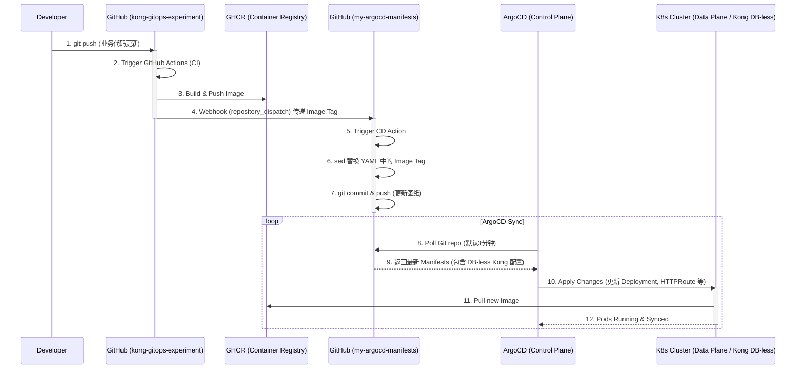

# 基于 GitOps 与 Gateway API 的现代微服务架构实践：从流量路由到自动化交付

## 1. 背景与架构愿景 (Introduction & Architecture Vision)

### 1.1 痛点分析
在传统的微服务交付模式中，开发与运维的边界往往模糊不清。对于多语言、多框架的异构微服务体系（例如同时并存的 Java Quarkus 和 Python FastAPI 服务），手动打包、人工修改 Kubernetes 部署图纸、手工 `kubectl apply` 触发部署不仅效率低下，且极易引入人为错误。此外，如何在这种混合架构下提供一个统一的流量入口，实现一致的路由策略和安全控制，同样是基础设施面临的一大挑战。传统的集中式网关配置往往导致网关团队成为瓶颈，阻碍了业务的敏捷迭代。

### 1.2 Kong Gateway 实验初衷与控制面/数据面分离 (DB-less & CP/DP)
我们开展 Kong Gateway 实验的最核心初衷，是**摒弃传统的数据库依赖，全面拥抱 DB-less（无数据库）模式**。
在传统的 Kong 架构中，路由规则和插件配置存储在 PostgreSQL 数据库中，配置的变更缺乏版本控制和审计。
在本实验中，我们将 Kong 所有的配置（包括 GatewayClass、Gateway 以及各业务服务的 HTTPRoute）全部转换为声明式的 YAML 文件，托管在 GitHub 仓库中，由 GitOps（ArgoCD）来统一纳管配置的变更和分发（Apply）。

这种设计天然契合了 **CP（控制面）与 DP（数据面）分离** 的微服务基础设施架构：
- **控制面 (Control Plane, CP)**：在这个架构中，**ArgoCD 和 Git 仓库共同充当了控制面**。Git 仓库是全局配置的单一事实来源 (Single Source of Truth)；ArgoCD 部署在管理集群中，负责实时监听 Git 仓库的变更，并将配置指令下发到目标环境。
- **数据面 (Data Plane, DP)**：部署在业务集群（如腾讯云 K3s）中的 **Kong Ingress Controller (KIC)** 及底层的 Nginx 引擎充当数据面。它们没有自己的状态（DB-less），完全听从控制面下发的 Kubernetes 资源清单（Gateway API 规则），专注于高性能的请求转发和流量路由。

### 1.3 目标愿景
为了彻底摆脱“人肉运维”的泥沼，我们的核心愿景是构建一套 **100% 自动化、安全合规、高度解耦** 的云原生交付流水线。当开发者完成业务代码并执行 `git push` 的那一刻起，后续的打包构建、镜像推送、图纸更新以及目标集群的热部署、流量路由接管，都必须由系统无缝自动流转，实现真正的“代码即基础设施 (IaC)”。

同时，在网关路由层面，我们推崇 **“去中心化路由管理”**，即每个微服务在其独立的 Helm Chart 或 K8s 图纸中维护自身的路由规则 (`HTTPRoute`)，网关只负责基于 Gateway API 提供大门入口。这种模式将路由决策权下放给业务团队，实现了真正的自治。

### 1.4 核心技术栈选型
为了将上述愿景落地，我们组合了当前云原生领域的领先技术：
- **网关层 (Traffic Routing)**：采用 **Kong KIC** (Kubernetes Ingress Controller) 结合新一代标准的 **K8s Gateway API**。它不仅提供了比传统 Ingress 更强大的表达能力，还实现了基础设施提供者与应用开发者的角色分离。
- **发布层 (Continuous Deployment)**：引入 **ArgoCD** 作为 CD 大脑，践行 GitOps 理念。它持续监听 Git 仓库，确保集群运行状态与 Git 声明式图纸保持绝对一致。
- **交付层 (Continuous Integration)**：利用 **GitHub Actions** 构建轻量级的 CI 流水线，产出 OCI 标准镜像并托管至 **GHCR** (GitHub Container Registry)。

### 1.5 架构解耦：CI 与 CD 的物理隔离
本套架构的一大亮点在于**严格解耦 CI（应用代码库）与 CD（部署图纸库）**。
我们将业务代码（`kong-gitops-experiment`）与 Kubernetes 部署清单（`my-argocd-manifests`）拆分到两个物理隔离的 Git 仓库中。应用研发人员只关注业务逻辑；而所有的环境拓扑、路由规则和版本 Tag 均由 CD 仓库纳管。这种隔离彻底切断了“图纸修改误触发代码构建”的反模式，并为环境变更提供了不可篡改的审计追踪能力。

### 1.6 整体流水线架构图
下面是我们设计的完整流水线架构流程图：

