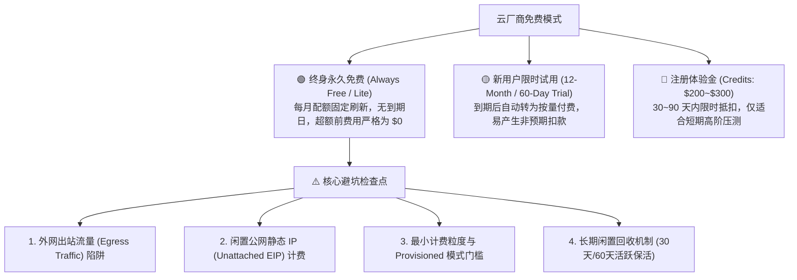
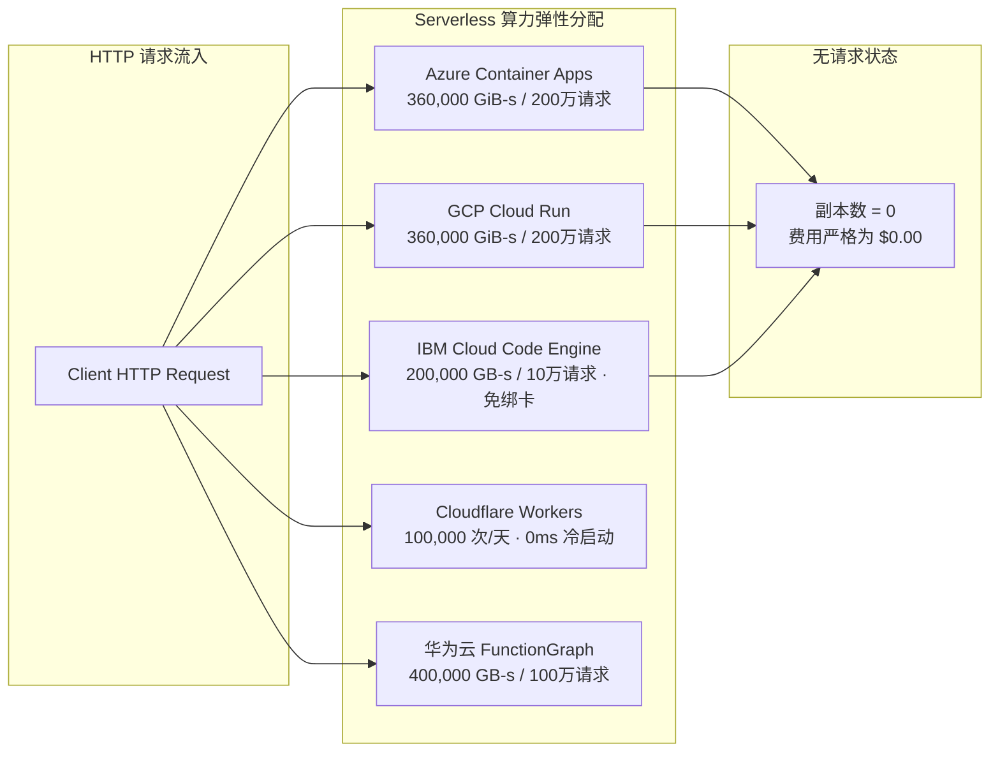
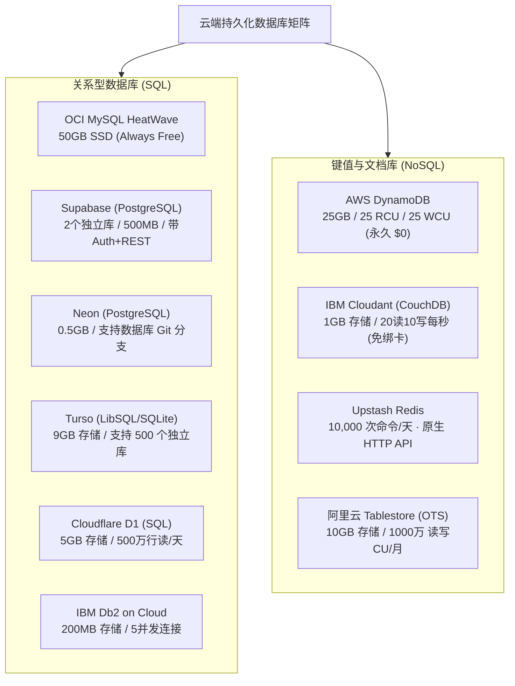
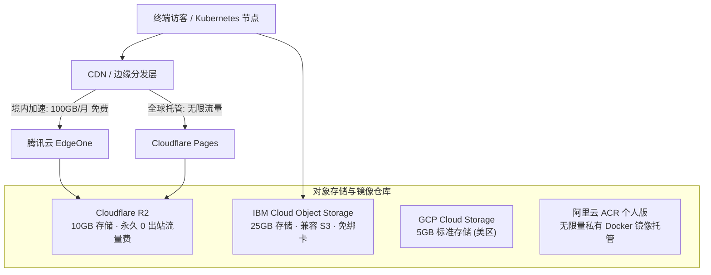
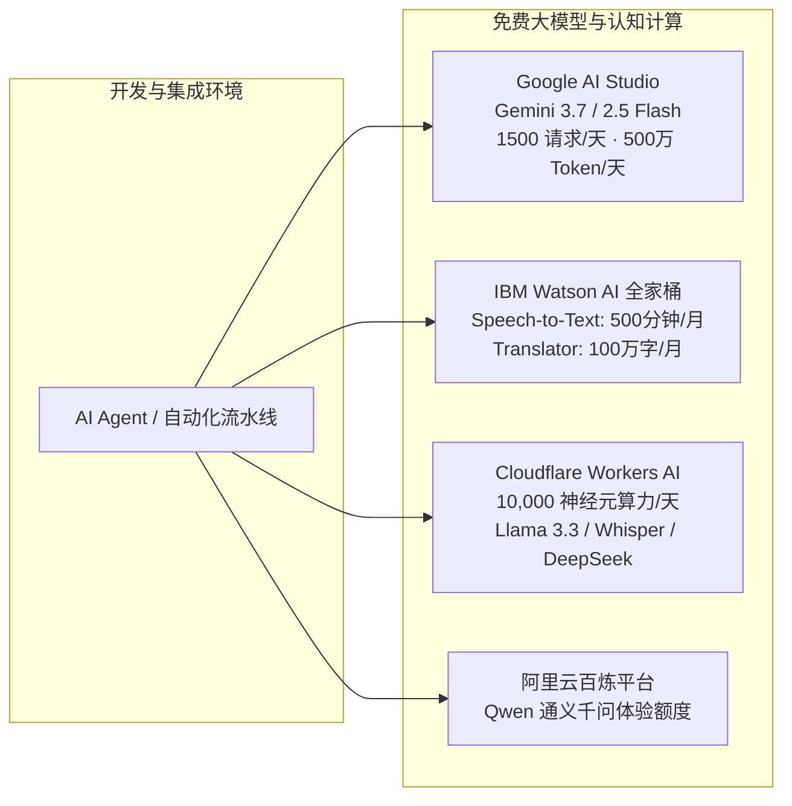
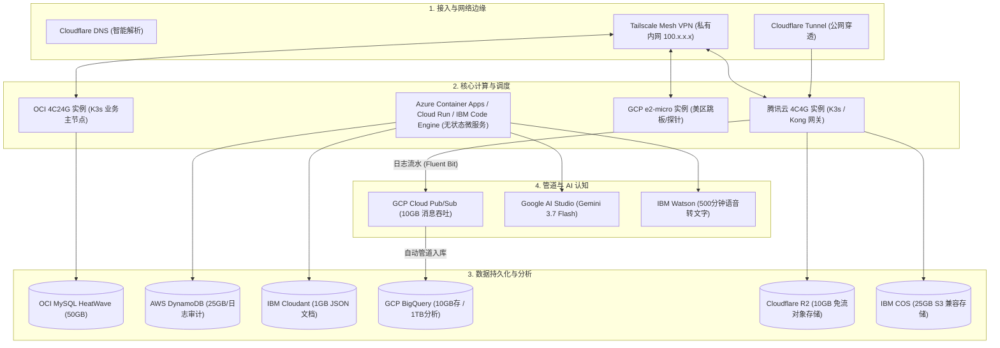

# 全球公有云“终身免费（Always Free）”基础设施全景架构与选型实战指南

在云计算与基础架构演进的过程中，各大云厂商为了争夺开发者生态，推出了一系列免费资源。然而，许多工程师在实际选型与搭建个人实验室（Homelab）、独立项目或企业 PoC 架构时，常常掉入“限时免费（Trial）到期反向扣费”、“出站流量（Egress）天价账单”以及“虚假永久免费”的陷阱中。

真正具备高可用价值的云端资源，必须满足两个核心指标：
1. **严格具备“终身永久免费（Always Free）”属性**，而非 30~90 天后自动按原价扣费的体验期产品；
2. **底层具备真实生产级算力与可靠性**，能够通过标准网络协议（TCP/HTTP/WireGuard）融入统一的多云架构。

本文基于实测网络拓扑与生产环境配置，将全球主流云厂商（AWS、GCP、Azure、Oracle Cloud、IBM Cloud、Cloudflare、阿里云、腾讯云、华为云及头部云原生独立服务商）的免费资源按计算、无服务器容器、数据库、消息流、存储与网络分门别类深度剖析，并提供无缝避坑与架构组合方案。

---

## 1. 全球公有云免费策略的分类逻辑与三大陷阱

在审视具体资源之前，必须清晰界定云厂商的三种免费模式与常见计费风险：

### 1.1 核心避坑检查点
1. **外网出站流量（Egress）**：大多数传统巨头（AWS、GCP、Azure、阿里、腾讯）对公网出站流量有严格配额或直接收费。构建跨云数据同步时，必须优先利用内网穿透（Tailscale WireGuard）或零出站流量费网关（Cloudflare R2/Workers）。
2. **闲置静态 IP 计费**：GCP 与 AWS 均对申请后未绑定活跃实例的公网静态 IP 按每小时计费，若销毁机器未释放 IP 将持续扣款。
3. **预置容量（Provisioned）与按需（On-Demand）的选型反差**：如 AWS DynamoDB 仅在 `PROVISIONED` 模式下触发 25 RCU/WCU 终身免费，按需模式在试用期过后直接计费。
4. **零绑卡安全模式（No Credit Card Required）**：如 **IBM Cloud Lite** 计划无需绑定信用卡即可使用 Code Engine、COS 与 Watson，彻底隔绝意外反向扣费风险。

---

## 2. 虚拟机与计算实例（VM & VPS）

能够 7x24 小时常驻运行的云主机是构建分布式集群控制面与边缘网关的基石。

| 云厂商 | 实例规格 / 硬件配置 | 存储与网络配额 | 关键限制与避坑规则 |
| :--- | :--- | :--- | :--- |
| **🟢 Oracle Cloud (OCI)** | **4 vCPU / 24 GB RAM** (Ampere Altra ARM 架构) | 共享 200 GB 引导/块存储 每月 10 TB 出站流量 | 终身免费算力天花板。单账号可划分为 1~4 台 VM（推荐单台 4C24G 跑 K3s/重型任务）。若长期 CPU 利用率 < 10% 可能会被标记为闲置回收，需保持基础守护进程。 |
| **🟢 Oracle Cloud (OCI)** | **2 台 1 vCPU / 1 GB RAM** (AMD x86_64 架构) | 共享上述 200 GB 存储空间 | 适合作为纯轻量跳板机（Bastion）、WireGuard 节点或静态 DNS 解析服务器。 |
| **🟢 Google Cloud (GCP)** | **1 台 e2-micro 实例** (2 共享 vCPU / 1 GB RAM) | 30 GB 标准持久磁盘 (Standard PD) 每月 1 GB 全球出站流量 | 区域必须严格限制在美区三大机房：`us-central1`、`us-east1`、`us-west1`。磁盘必须选标准磁盘，若选 SSD 磁盘将产生计费。 |
| **🟡 Azure (首年)** | **1 台 B1s Linux + 1 台 B1s Win** (1 vCPU / 1 GB RAM) | 64 GB OS 磁盘 / 750小时/月 | 仅限注册后前 12 个月免费，第 13 个月起恢复按量计费，需设置日历提醒停机。 |
| **🟡 AWS (首年)** | **1 台 t2.micro 或 t3.micro** (1 vCPU / 1 GB RAM) | 30 GB EBS 卷 / 750小时/月 | 仅限前 12 个月，超出或升级实例规格即刻扣除绑卡资金。 |

---

## 3. 现代容器应用与无服务器执行（Containers & Serverless）

无服务器容器（Serverless Containers）具备“缩容到 0（Scale to Zero）”特性，是部署 Web API、轻量网关与自动化脚本最经济的模型。

### 3.1 容器与函数终身免费配额精算

#### 1. Azure Container Apps (ACA)
* **算力配额**：每月免费 **`180,000 vCPU-秒` + `360,000 GiB-秒`** + **前 200 万次 HTTP 请求**。
* **换算实效**：配置 `0.25 vCPU + 0.5 GiB RAM` 的 Python FastAPI 容器，每月可支撑 **200 小时** 活跃计算时间。
* **底层能力**：原生基于 AKS + Envoy + KEDA，支持 Docker 镜像直推与私有微服务发现。

#### 2. GCP Cloud Run
* **算力配额**：每月免费 **`180,000 vCPU-秒` + `360,000 GiB-秒`** + **200 万次请求** + 1 GB 出站流量。
* **架构特性**：业界最成熟的 Knative 托管实现，冷启动延迟通常在 1~2 秒以内，自带合法公网 HTTPS 二级域名。

#### 3. IBM Cloud Code Engine（免绑卡无服务器容器 🌟）
* **算力配额**：每月免费 **`100,000 vCPU-秒` + `200,000 GB-秒`** + **100,000 次 HTTP 请求**。
* **技术特性**：完全不需要绑定信用卡即可创建。底层基于 Kubernetes + Knative，支持从容器镜像（Docker Hub/ICR）直接运行 Web 应用、批处理 Job（Batch Jobs）以及定时 Cron 任务，支持自动缩容到 0。

#### 4. Cloudflare Workers
* **算力配额**：每天免费 **`100,000 次`** 请求（每月 300 万次），单实例限制 **`128 MB RAM`** 与 10ms 纯 CPU 耗时（网络等待时间不计入）。
* **核心优势**：基于 Google V8 Isolate 切片，冷启动 < 5ms，全球 330+ 边缘节点 Anycast 自动就近运行，且**出站流量 100% 永久免流量费**。

#### 5. 华为云 FunctionGraph & 阿里云 FC & IBM Functions
* **华为云 FunctionGraph**：每月 **400,000 GB-秒** 运行时 + **100 万次调用**。配置 128MB 内存时，可连续运行 888 小时，完全覆盖 7x24h 定时轻量任务。
* **IBM Cloud Functions**：每月提供 **400,000 GB-秒** 运行时 + **前 500 万次调用**（基于 Apache OpenWhisk）。
* **阿里云函数计算 FC**：每月 **50 万 vCPU-秒 + 100 万 GB-秒** + **100 万次调用**。

---

## 4. 数据库服务（SQL、NoSQL、时序与搜索）

数据库是架构持久化的核心。传统托管 RDS 通常极昂贵且无永久免费层，必须利用 Serverless 存算分离或开源自建。

### 4.1 关系型数据库 (SQL) 深度选型
* **Oracle Cloud MySQL HeatWave**：提供 50 GB 专用存储与企业级 MySQL 8.x 实例，终身免费，仅分配 VCN 私网 IP，需通过堡垒机或 Tailscale 访问。
* **Supabase**：免费提供 2 个独立的 PostgreSQL 实例，单个库 500 MB 存储。内置 PostgREST 自动生成数据接口，集成 GoTrue 鉴权与 WebSocket 实时监听。
* **Neon**：Serverless Postgres 代表，提供 0.5 GB 存储。核心特性为 **Database Branching**，可秒级克隆生产环境数据用于自动化流水线测试。
* **Turso**：基于 Rust 重写的分布式 LibSQL（SQLite 兼容版），免费计划提供 9 GB 存储空间，支持单个账号创建多达 500 个微型数据库。
* **Cloudflare D1**：边缘原生 SQL 数据库，单库提供 5 GB 免费存储，适合配合 Workers 构建完全无后端的静态站点动态化改造。
* **IBM Db2 on Cloud (Lite Tier)**：提供 200 MB 免费数据存储与 5 个并发连接，支持标准 SQL 与 IBM 商业数据库语法验证。

### 4.2 高并发 NoSQL 与缓存方案
* **AWS DynamoDB (Always Free)**：
  - 核心参数：**25 GB 存储容量** + **25 预置读容量单位 (RCU)** + **25 预置写容量单位 (WCU)**。
  - 架构避坑：创建表时必须选择 `PROVISIONED`（预置容量模式）并将读写配置为 `<= 25`，若误选 `On-Demand`（按需模式）将导致试用期过后产生调用扣费。
* **IBM Cloudant (Apache CouchDB 托管版 🌟)**：
  - 核心参数：终身免费提供 **1 GB 存储空间**，配额为 **每秒 20 次读取、10 次写入与 5 次全局查询（20 Reads/s, 10 Writes/s）**。
  - 适用场景：纯 JSON 文档存储，支持 MapReduce 聚合与全文检索，免绑卡开箱即用。
* **Upstash Serverless Redis**：
  - 每天赠送 **10,000 次请求**，支持原生 RESP TCP 协议与 HTTPS REST API 两种访问模式，解决 Serverless 函数无法长期维持连接池的痛点。
* **阿里云 Tablestore (表格存储 OTS)**：
  - 每月固定免费提供 **10 GB 存储空间** + **1000 万次读 CU** + **1000 万次写 CU** + 10 GB 公网出站流量。

---

## 5. 消息队列与流处理流水线（MQ & Streaming）

在日志汇聚、解耦微服务与构建事件驱动系统时，消息队列的吞吐配额直接决定了系统的架构承载力。

| 消息组件 | 官方免费配额 | 核心技术优势 | 架构推荐场景 |
| :--- | :--- | :--- | :--- |
| **🟢 GCP Cloud Pub/Sub** | **每月 10 GB 消息吞吐量** (折合净日志传输量 5 GB) | 纯 Serverless 架构，支持毫秒级吞吐；原生直通 BigQuery 订阅，零代码入库。 | 适合 Kubernetes / K3s 集群日志收集（Fluent Bit 推送）、跨多云异步解耦事件总线。 |
| **🟢 AWS SQS & SNS** | **每月 1,000,000 次调用** (标准队列与推送) | 经典企业级分布式消息队列与发布订阅通知系统。 | 适合轻量告警推送、任务分发与系统异步任务调度。 |
| **🟢 IBM Event Streams** | **Lite 计划：1 个 Kafka Topic** (1 个 Partition，10MB/天吞吐) | 托管 Apache Kafka 实例，兼容标准 Kafka 生产者与消费者客户端。 | 适合轻量 Kafka 协议兼容性调试与微服务原型验证。 |
| **🟢 Upstash Serverless Kafka** | **每天 10,000 条消息** (保留时间 1 天，最大 256MB 存储) | 100% 兼容 Kafka API，支持 HTTP 消息发送与消费。 | 仅适合低频 Webhook 中转，不宜用于高吞吐系统日志。 |

---

## 6. 对象存储、容器镜像与 CDN 分发（Storage & Registry）

### 6.1 对象存储 (Object Storage)
* **Cloudflare R2**：提供 **10 GB** 免费存储空间，每月 **100 万次 A 类操作（写入）** + **1000 万次 B 类操作（读取）**。**核心卖点：全球范围完全免收任何外网出站流量费（Zero Egress Fee）**，彻底取代 AWS S3 与传统 OSS 作为图床和文件分发源站。
* **IBM Cloud Object Storage (COS · 免绑卡超大容量 🌟🌟)**：
  - 免费配额：每月免费赠送高达 **`25 GB` 存储空间**（是 AWS/GCP 免费额度的 **5 倍**！）；
  - 读写配额：每月 2,000 次写入 + 20,000 次读取 + 5 GB 出站流量；
  - 协议标准：100% 兼容 AWS S3 API，直接使用标准 S3 客户端（Boto3/rclone）即可无缝对接。
* **Google Cloud Storage (GCS)**：每月赠送 **5 GB** 标准存储（需限定在美区机房），5000 次写入与 50,000 次读取。

### 6.2 容器镜像与 CDN 基础设施
* **阿里云 ACR（个人版）**：**终身免费无限容量**。提供最多 3 个命名空间与 300 个镜像仓库，支持绑定 GitHub 自动化进行多架构（x86/ARM64）云端构建与内网高速拉取。
* **腾讯云 EdgeOne（边缘安全加速平台）**：个人基础版永久免费。每月提供 **100 GB 全球 CDN 加速流量**，集成免费基础 DDoS 防护、WAF 规则与自定义边缘规则引擎。

---

## 7. 大模型（LLM）与 AI 认知服务

现代工程架构中，调用大模型提取结构化数据或进行语义搜索已成为标配基础设施。

1. **Google AI Studio (Gemini 免费 API 🌟🌟🌟)**：
   - 免费调用 `gemini-3.7-flash` 与 `gemini-2.5-flash`；
   - 额度高达 **1,500 次请求/天（15 RPM，每天上限 500 万 Token）**，做自动化 CI 审查或后台数据结构化处理完全免费。
2. **IBM Watson / watsonx 认知服务全家桶（大厂少见的超大额度 🌟🌟）**：
   - **Watson Speech to Text（语音转文字）**：每月免费提供高达 **`500 分钟（8.3 小时）`** 的音频精准转录，适合做会议纪要自动化与音视频字幕生成；
   - **Watson Language Translator（机器翻译）**：每月免费翻译高达 **`1,000,000 字符（100 万字）`** 的多语言文本；
   - **Watson Text to Speech（文字转语音）**：每月免费合成 **10,000 字符** 神经语音；
   - **Watson Assistant（对话机器人）**：每月支持 **1,000 名活跃用户（MAU）**。
3. **Cloudflare Workers AI**：
   - 每天提供 **10,000 神经元计算配额（Neurons/day）**；
   - 边缘直接免部署调用开源顶尖模型：`Llama 3.3 70B`、`DeepSeek R1/V3`、`Whisper`（语音转文字）、`BGE-M3`（向量化处理）。

---

## 8. 网络穿透、DNS、域名与安全证书

| 领域 | 推荐服务 | 免费机制与核心功能 |
| :--- | :--- | :--- |
| **私有网络组网 (Mesh VPN)** | **🟢 Tailscale** | 基于 WireGuard 协议，免费计划支持 **100 台设备** P2P 互联，自带 MagicDNS、ACL 访问策略与端到端高强度加密。 |
| **公网应用穿透 (Edge Ingress)** | **🟢 Cloudflare Tunnel** | 无需公网 IP 与路由器端口映射，本地运行 `cloudflared` 守护进程即可将内网 HTTP 服务安全暴露至公网域名，自带 Zero Trust 访问门禁。 |
| **智能 DNS 解析** | **🟢 Cloudflare DNS / 腾讯云 DNSPod** | 支持秒级生效的智能解析、分线路分发，提供完善的 REST API 用于编写动态域名解析（DDNS）脚本。 |
| **SSL 证书自动管理** | **🟢 Let's Encrypt / ACME.sh** | 配合 DNS API（Cloudflare/阿里云/腾讯云）全自动申请与无感续签通配符（Wildcard）证书。 |

---

## 9. 多云终身免费资产生产级组合架构拓扑

将上述零成本组件有机整合，可构建出一套具备高容灾、自动化弹性且月度开销严格为 **$0.00** 的生产级混合云平台：

### 9.1 架构运行规范
1. **控制面与高算力任务**：放置在 **OCI 4C24G 免费 ARM 实例**，支撑 Docker/K3s 容器化微服务。
2. **边缘网关与流量分发**：利用 **Cloudflare Tunnel + 腾讯云节点**，对外提供高防 HTTPS 接口，对内通过 **Tailscale** 实现数据库私网穿透。
3. **日志与审计流**：K3s 节点通过 Fluent Bit 将日志打入 **GCP Pub/Sub（10GB 免费）**，经由原生订阅直接入库 **BigQuery 沙盒（每月 1TB 免费查询）**，实现免运维大数据分析。
4. **状态与存储**：高并发写入走 **AWS DynamoDB（25 RCU/WCU 终身免费）** 与 **IBM Cloudant**，关系型业务数据沉淀至 **OCI MySQL HeatWave（50GB 免费）**，静态资产托管于 **Cloudflare R2（零出站流量费）** 与 **IBM COS（25GB 免费空间）**。

---

## 10. 总结与最佳运维实践

免费云资源并非玩具，只要边界清晰、策略严密，完全能够支撑起极具工业质感的现代化基础设施：

* **防御性预算策略**：在所有已绑定信用卡的云控制台（GCP、AWS、Azure），务必在第一天配置 **`$0.01` 预算告警（Budgets & Alerts）**，将非预期消费遏制在萌芽状态。
* **闲置保活与健康心跳机制**：对于具有连续闲置休眠策略的服务（如 IBM Cloud Lite 30 天无流量休眠、OCI CPU 利用率 < 10% 闲置标记），可通过 Cron 定时心跳脚本（如轻量健康检查 Ping）保持常驻活跃。
* **去供应商锁定（No Vendor Lock-in）**：核心配置一律沉淀为基础设施即代码（IaC）与标准 Kubernetes YAML，配合跨云 GitOps 实现节点的秒级销毁与快速重建。
* **数据主权隔离**：业务敏感数据始终通过对称加密存储于受信任的跨云加密空间（如 OCI Vault / AWS SSM Parameter Store），确保无论底层计算节点如何漂移，核心资产与拓扑始终坚不可摧。
