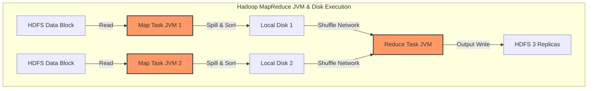
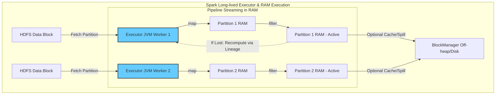

# 从 MapReduce 磁盘落盘到 Spark RDD 内存流式处理：分布式计算的底层演进与架构权衡

在高并发与海量数据的场景下，如何高效、稳定地在分布式集群中调度与计算 TB 甚至 PB 级的数据，是现代数据平台架构设计的核心命题。

分布式计算的演进史，本质上是一部**“如何在物理限制（内存成本、网络带宽、磁盘 I/O）下做权衡与妥协”**的历史。本文将从底层架构视角，深度剖析 **Hadoop MapReduce** 与 **Spark RDD** 的基本概念、核心差异、容错哲学以及它们在内存管理上的物理底座。

---

## 1. Hadoop MapReduce：磁盘时代的物理防御者

### 1.1 核心概念
Hadoop MapReduce 是分布式计算的开山鼻祖，其核心思想是 **"Shared-Nothing"** 的无共享分布式架构，主要由两个静态计算阶段组成：
*   **Map 阶段**：将大任务拆分成多个独立的局部 Task，并行读取 HDFS 数据并进行过滤与转换。
*   **Reduce 阶段**：通过 Shuffle 将相同 Key 的中间数据汇聚到对应的节点上，进行最终的聚合计算。

### 1.2 物理设计硬伤：强制落盘与短生命周期进程
在 2004 年 MapReduce 诞生之初，商用服务器的内存容量极其有限（通常仅为 2GB - 4GB），这直接决定了其容错与共享模型必须是**高度依赖磁盘**的：

1.  **进程短生命周期（Short-lived JVM）**：Hadoop YARN 调度器为每个 Map Task 和 Reduce Task 分配独立的 Container（JVM 进程）。任务执行完毕后，JVM 进程即告退出，内存被系统收回。
2.  **数据交互的唯一媒介——本地磁盘**：因为 Map 进程在算完后就死掉了，内存数据无法保留，所以 Map 阶段输出的中间临时数据**必须强制写入本地磁盘（Local Disk）**。Reduce 进程启动后，再通过网络拉取（Shuffle）这些磁盘文件。
3.  **基于物理副本的容错（Physical Isolation）**：由于缺乏全局动态调度图，MapReduce 无法预测后续步骤的故障。为了防止单点故障导致整个计算重来，它必须在每个 Job 边界设置“物理防火墙”——将结果强行持久化到 HDFS（默认 3 副本落盘）。

---

## 2. Spark RDD：内存时代的逻辑重建者

### 2.1 核心概念
**RDD（Resilient Distributed Dataset，弹性分布式数据集）** 是 Spark 的核心抽象，代表一个只读的、可分区的、可以在集群节点上并行操作的数据集合。

与 MapReduce 的静态两阶段不同，Spark 将整个任务生命周期编译为一张 **DAG（有向无环图）**，并拆分为多个物理 Stage。

### 2.2 核心机制：常驻守护进程与逻辑血统（Lineage）
Spark 站在了内存硬件普及（2012 年后，GB 级内存成本暴降）的肩膀上，用全新的思维重构了分布式计算：

1.  **常驻守护进程（Long-lived Executor JVM）**：Spark 在集群 Worker 节点上启动长生命周期的守护进程 Executor。整个 Application 运行期间，Executor JVM 一直温热存活，其内部的 `BlockManager` 充当了内存数据的持久载体，数据块（Partitions）可以直接在内存中跨 Stage 共享。
2.  **流式过水（Pipeline Streaming）**：RDD 本质上是一个逻辑配方。除非显式调用 `.cache()`，否则 RDD 并不物理占用内存。数据从数据源拉入内存后，会像流水线一样流经一连串的 `map -> filter -> flatMap` 算子，算完直接输出。任何时刻，内存中只驻留当前正在被 CPU 算子处理的极小 Partition 数据片，算完立即被 GC（垃圾回收），从而在物理上实现了用极小内存吞吐 TB 级数据。
3.  **基于 Lineage（血统）的逻辑容错**：这是 Spark 摆脱磁盘束缚的关键。RDD 是只读且不可变的，Spark 会在 DAG 中记录下它的每一个转换步骤。
    *   **容错公式**：如果 Executor 宕机，丢失了 RDD $C$ 的 Partiton 3，Spark 不需要去读磁盘备份，而是直接查看 Lineage：`RDD A -> map -> RDD B -> filter -> RDD C`。
    *   **局部重算**：调度器只需在存活的机器上启动一个 Task，把 RDD A 的 Partition 3 重新读出来，顺着配方跑一遍 `map -> filter`，即可在内存中现场复原。

---

## 3. 核心奥义：TB 级数据内存管理的“空间”与“时间”双重维度

普通开发者往往会产生技术误区，认为“Spark 把数据常驻内存就一定会导致 TB 级数据撑爆 JVM”。其实，从系统底层设计来看，Spark 能够平稳调度海量内存，本质上只依靠了最纯粹的两个核心维度：

### 3.1 空间维度（化整为零）：分布式数据切片（Partitioning）
*   **物理本质**：1 TB 的数据集绝对不会在单台机器的物理内存里进行全量“硬载入”。
*   **空间解耦**：数据集在物理上被切分成成千上万个 **分区（Partition）**，均匀分散在整个集群上百个 Worker 节点的常驻 Executor 进程中。单机内存实际上只需要承载几 GB 的局部分片。通过在空间上进行“化整为零”的分布式调度，Spark 彻底摆脱了单机物理内存容量限制的死结。

### 3.2 时间维度（流式过水）：运行时流式处理（Streaming Pipeline）
*   **运行本质**：**“在内存中计算”并不等同于“将全量数据常驻在内存中”**。
*   **时间解耦**：RDD 仅代表逻辑 DAG 算子链，它本身是不存储物理数据的“空壳”。只有当遇到 Action 算子触发时，数据才会以 Partition 为单位，像“漏斗里的水”一样流经内存中的算子管道（Map -> Filter -> Project）。
*   **批处理的流式重塑**：从这个维度来看，Spark 的批处理底层其实是一个极致优雅的 **Streaming（流式）处理机制**。每一个数据切片被拉入内存、经过 CPU 算子链计算后，会立即被输出并从内存中释放（GC），内存中在任意时刻只保留当前正在流动的极小活动数据。
*   **智能缓存降级**：即使由于显式调用 `.cache()` 导致内存不足，Spark 也会自动启动 LRU 淘汰并根据 **Lineage（关系链）** 进行局部重算，或者降级写磁盘（Spill to Disk），从而在时间轴上形成了极具弹性的吞吐机制。

---

## 4. Hadoop MapReduce vs. Spark RDD 核心维度对比

| 对比维度 | Hadoop MapReduce | Spark RDD |
| :--- | :--- | :--- |
| **执行介质** | 强依赖本地磁盘与 HDFS，中间临时结果强制写盘。 | 默认驻留内存（RAM），仅在内存不足或 Shuffle 时溢写磁盘。 |
| **容器/进程生命周期** | 短生命周期，每个 Task 动态创建并销毁 JVM 容器（YARN Container）。 | 长生命周期，常驻 Executor JVM 进程，生命周期贯穿整个 Application。 |
| **容错哲学** | **物理防御**：依靠数据物理副本（Data Replication）或频繁落盘快照来防灾。 | **逻辑重建**：利用 RDD 不可变性，通过 Lineage（关系链）局部重算数据。 |
| **计算模型表达力** | 仅支持单一的 Map 与 Reduce 操作，多阶段计算需拆解为多个 Job 串联。 | 支持丰富的算子（map, filter, join, reduceByKey 等），编译为 DAG 一体化执行。 |
| **迭代计算（如ML）** | **极差**。每次迭代迭代必须完成“读盘-计算-写盘”过程，吞吐极低。 | **极佳**。利用 `rdd.cache()` 将数据常驻内存，后续迭代直接从 RAM 读取。 |

---

## 5. Spark 支撑海量（TB/PB级）内存管理的技术底座

为了在物理内存中平稳调度海量数据而不发生 OOM，Spark 引入了以下底层硬核技术：

1.  **堆外内存（Off-Heap Memory）管理**：
    传统的 Java 对象在 JVM 堆内存中存在极大的开销，且频繁的垃圾回收（GC）会导致严重的系统停顿（Stop-the-World）。Spark 引入了 **Project Tungsten（钨丝计划）**，直接利用 C 语言风格的底层指针，在堆外（Off-Heap）空间分配与管理连续的物理内存页（Memory Pages），完全绕过了 JVM GC 的干扰。
2.  **紧凑的 Kryo 二进制序列化**：
    为了极致压榨空间，Spark 不在内存中直接存储原始的重量级 Java 对象，而是利用高效的 Kryo 框架将其压缩为**紧凑的二进制字节数组（Byte Array）**，内存占用相比原生 JVM 对象可暴降 2-5 倍。
3.  **智能淘汰与存储级别（Storage Levels）**：
    当用户对 RDD 进行缓存，但物理内存不够时，Spark 的 `MemoryManager` 会根据 **LRU（最近最少使用）算法** 自动释放老旧数据块。若设置了 `MEMORY_AND_DISK` 存储级别，溢出的数据会自动序列化并写到本地磁盘，保证计算任务永远不崩溃。
