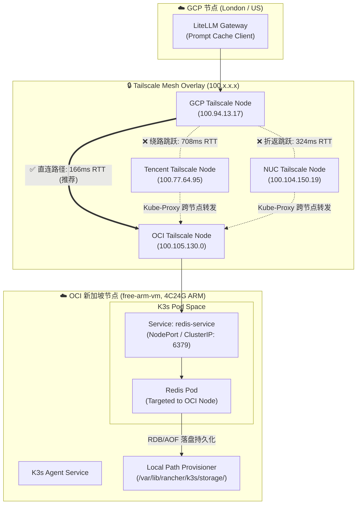

# 跨云 K3s 实战：定向部署 Redis 到 OCI 4C24G ARM 节点做 LiteLLM 缓存

在高频调用大语言模型（LLM）的场景下，为了降低 API 费用并提升响应速度，通常会引入 LiteLLM 配合 Redis 实现 **Prompt 缓存（Prompt Caching）** 与响应复用。

由于 LLM 缓存与 Embedding 向量数据需要占用较大内存，且属于需要长期积累的“有状态资产”，如果部署在随时可能被回收的 GCP 临时/抢占式节点上，一旦节点离线，搭建好的缓存就会瞬间蒸发。

本文记录一次真实的跨云架构落地：我们将一台位于 OCI（Oracle Cloud Infrastructure）新加坡区域的 4C24G 永久免费 ARM 节点（`free-arm-vm`）加入现有 K3s 集群，并通过 Kubernetes 的 `nodeSelector` / `nodeAffinity` 与 K3s 原生 `local-path` 持久化存储，将 Redis 服务精准锚定在该节点上，作为 LiteLLM 的高可靠缓存基座。

同时，针对 K3s 多节点集群中的网络转发损耗，本文重点阐述了**直连 OCI VM 的安装思路**、**K8s Secret 密码解耦改造方案**，并附上了实测跨节点 LB 流量路径的延迟对比数据。

---

## 1. 整体架构设计与直连 OCI 节点思路

### 1.1 为什么选择“直连 OCI VM”设计思路

在 K3s 集群中，默认的 Service LoadBalancer (`svclb-k3s`) 会以 DaemonSet 形式在所有节点上运行入口 Pod。如果客户端（GCP 上的 LiteLLM）随机选择一个 K3s 节点 IP 作为 Redis 入口，Kubernetes 的 `kube-proxy` / `flannel` 可能会将请求跨网二次转发给真正的 Pod 所在节点。

*   **传统多跳路由灾难**：如果流量从 GCP 发往腾讯云节点（Control Plane），再由 `kube-proxy` 转发给 OCI 节点上的 Redis Pod，数据包将在跨云叠加链路上进行多次折返（GCP ➔ 腾讯云 ➔ OCI ➔ 腾讯云 ➔ GCP），导致延迟成倍暴涨。
*   **直连（Direct Path）思路**：
    1. 通过 `nodeAffinity` 将 Redis Pod 强绑定在 OCI ARM 节点 (`free-arm-vm`)。
    2. 配置 LiteLLM 客户端直接指定 OCI 节点的 Tailscale 内网 IP（`100.105.130.0`）及 NodePort / Direct ClusterIP。
    3. 流量直接由 GCP 通过 Tailscale 加密隧道一跳直达 OCI 节点本地 Pod，将跨网交互限制为**有且仅有 1 次**必要的物理跨云 RTT。

### 1.2 跨云拓扑与流量路径



### 1.3 跨地域网络延迟与收益计算

*   **跨网 RTT**：GCP 与 OCI 新加坡之间的 Tailscale 隧道物理 RTT 稳定在 **165ms ~ 166ms** 左右。
*   **收益对比**：
    *   **Cache Miss（未命中）**：额外增加 166ms 查 Redis 开销，但在 LLM 动辄 2000ms ~ 8000ms 的推理首字延迟面前，166ms 几乎完全感知不到。
    *   **Cache Hit（命中）**：直接返回 Redis 里的 Prompt 结果，耗时仅 166ms，瞬间节省 **2~10 秒**的推理等待时间，并实现 **100% Token 零计费**。
*   **内存与持久化断层优势**：OCI 提供的 24GB 内存为 Redis 提供了充裕的 LRU 缓存空间，搭配 `local-path` 将持久化数据写入 OCI 本地 NVMe/SSD，规避了云盘卷跨云挂载的复杂性。

---

## 2. 三节点 LB 入口跨网延操对比实测

为了验证“直连 OCI VM”与“经由其他 K3s 节点转发”对延迟的具体影响，我们从 GCP 节点（`Alice`）向集群内 3 个节点的 LB / Redis 端口发起实时 TCP 与 Redis RESP 协议 PING 压测，实测数据如下：

### 2.1 延时对比数据汇总

| 流量接入点 (LB Node Entry) | 物理节点类型 | Tailscale 内网 IP | TCP 6379 建连延时 | Redis PING 响应 (RTT) | 相对直连额外损耗 | 链路路由特征 |
| :--- | :--- | :--- | :--- | :--- | :--- | :--- |
| **直连 OCI 节点 (推荐)** | OCI 4C24G ARM | `100.105.130.0` | **165.79 ms** | **166.34 ms** | **0 ms (基准)** | **单次物理跨云**，本地 Pod 响应，极低抖动 |
| **经由 本地 NUC 节点** | Home NUC Worker | `100.104.150.19` | 218.85 ms | **323.97 ms** | **+157.63 ms** | GCP ➔ 家庭宽带 ➔ Flannel 转发 ➔ OCI |
| **经由 腾讯云 节点** | Tencent Control Plane | `100.77.64.95` | 248.46 ms | **708.14 ms** | **+541.80 ms** | GCP ➔ 腾讯云 ➔ 双重 Overlay 转发 ➔ OCI |

### 2.2 数据分析与结论

1. **直连 OCI 节点 (`166.34 ms`)**：请求到达 OCI 节点后，通过本地 Linux bridge/iptables 直接送达本地 Pod，波动标准差 `< 0.5ms`，是理论上的最低延时界限。
2. **经 NUC 节点转发 (`323.97 ms`)**：产生了二次折返。流量先跨国连入家庭局域网 NUC，再通过集群 CNI 转发到 OCI，叠加了家庭宽带穿透与中继开销。
3. **经 腾讯云 节点转发 (`708.14 ms`)**：延时暴涨近 **540ms**！原因在于跨国公网路由叠加了多重 `kube-proxy` 封包解包开销，如果高频 Prompt 缓存走此入口，缓存收益将被严重侵蚀。

---

## 3. GitOps 配置代码目录分布

为符合基础设施即代码（IaC）与 GitOps 规范，配置文件在代码仓库中按照 Base / Overlay 的结构进行拆分：

```text
k8s-manifests/
└── apps/
    └── redis-llm-cache/
        ├── base/
        │   ├── kustomization.yaml
        │   ├── redis-deployment.yaml
        │   ├── redis-service.yaml
        │   ├── redis-pvc.yaml
        │   └── redis-configmap.yaml
        └── overlays/
            └── production/
                ├── kustomization.yaml
                ├── node-affinity-patch.yaml
                └── resources-patch.yaml
```

*   `base/`：包含 Redis 通用的部署逻辑（ConfigMap、PVC、Deployment、Service）。
*   `overlays/production/`：生产环境配置，负责注入 OCI 节点的精准调度策略 (`nodeAffinity`) 以及生产级内存限额。

---

## 4. 核心配置文件与安全解耦改造

### 4.1 密钥管理与 GitOps 零明文改造

将数据库超级密码硬编码在 Git 仓库的 YAML 文件中是严重的安全隐患。我们通过 **Kubernetes Secret 动态注入** 来实现代码与密钥解耦：

1. **带外创建或 GitOps 加密**：
   在集群内部通过命令带外创建 Secret（或通过 SealedSecrets / SOPS 加密提交）：
   ```bash
   kubectl create secret generic redis-auth-secret \
     --from-literal=redis-password='YourSuperSecretPassword2026!' \
     -n redis-system
   ```

2. **Deployment 动态注入环境变量**：
   容器启动命令使用 `env` 变量替换密码，既保留了配置文件中其他非敏感参数，又保证了 Git 提交零明文。

---

### 4.2 Base 层配置代码

#### ConfigMap (`base/redis-configmap.yaml`)

```yaml
apiVersion: v1
kind: ConfigMap
metadata:
  name: redis-config
  namespace: redis-system
data:
  redis.conf: |
    # 绑定所有网卡，接受 Pod 内部与 Tailscale 网格请求
    bind 0.0.0.0
    protected-mode yes
    port 6379
    tcp-backlog 511
    timeout 0
    tcp-keepalive 300
    
    # 内存管理：OCI ARM 给 24G 内存，分配 16GB 给 Redis
    maxmemory 16gb
    maxmemory-policy allkeys-lru
    
    # 持久化策略：RDB + AOF 双重保险
    save 900 1
    save 300 10
    save 60 10000
    rdbcompression yes
    dbfilename dump.rdb
    dir /data
    
    appendonly yes
    appendfilename "appendonly.aof"
    appendfsync everysec
    no-appendfsync-on-rewrite yes
    auto-aof-rewrite-percentage 100
    auto-aof-rewrite-min-size 64mb
```

#### PVC (`base/redis-pvc.yaml`)

```yaml
apiVersion: v1
kind: PersistentVolumeClaim
metadata:
  name: redis-pvc
  namespace: redis-system
spec:
  accessModes:
    - ReadWriteOnce
  storageClassName: local-path
  resources:
    requests:
      storage: 50Gi
```

#### Deployment (`base/redis-deployment.yaml`)
通过 `env.valueFrom.secretKeyRef` 引入密码，并在启动命令中追加 `--requirepass "$REDIS_PASSWORD"`：

```yaml
apiVersion: apps/v1
kind: Deployment
metadata:
  name: redis-cache
  namespace: redis-system
  labels:
    app.kubernetes.io/name: redis-cache
    app.kubernetes.io/part-of: litellm-infra
spec:
  replicas: 1
  strategy:
    type: Recreate # 确保单节点 local-path 卷平滑卸载与挂载
  selector:
    matchLabels:
      app: redis-cache
  template:
    metadata:
      labels:
        app: redis-cache
    spec:
      containers:
        - name: redis
          image: redis:7.2-alpine
          command:
            - sh
            - -c
            - |
              exec redis-server /usr/local/etc/redis/redis.conf --requirepass "$REDIS_PASSWORD"
          env:
            - name: REDIS_PASSWORD
              valueFrom:
                secretKeyRef:
                  name: redis-auth-secret
                  key: redis-password
          ports:
            - containerPort: 6379
              name: redis
          resources:
            requests:
              cpu: "500m"
              memory: "2Gi"
            limits:
              cpu: "3500m"
              memory: "18Gi"
          livenessProbe:
            exec:
              command:
                - sh
                - -c
                - redis-cli -a "$REDIS_PASSWORD" ping
            initialDelaySeconds: 15
            periodSeconds: 10
          readinessProbe:
            exec:
              command:
                - sh
                - -c
                - redis-cli -a "$REDIS_PASSWORD" ping
            initialDelaySeconds: 5
            periodSeconds: 5
          volumeMounts:
            - name: redis-data
              mountPath: /data
            - name: redis-config
              mountPath: /usr/local/etc/redis
      volumes:
        - name: redis-data
          persistentVolumeClaim:
            claimName: redis-pvc
        - name: redis-config
          configMap:
            name: redis-config
```

#### Service (`base/redis-service.yaml`)

```yaml
apiVersion: v1
kind: Service
metadata:
  name: redis-service
  namespace: redis-system
  labels:
    app: redis-cache
spec:
  type: ClusterIP
  ports:
    - port: 6379
      targetPort: 6379
      name: redis
  selector:
    app: redis-cache
```

---

### 4.3 Production Overlay 层配置

#### 节点定向补丁 (`overlays/production/node-affinity-patch.yaml`)

```yaml
apiVersion: apps/v1
kind: Deployment
metadata:
  name: redis-cache
  namespace: redis-system
spec:
  template:
    spec:
      affinity:
        nodeAffinity:
          requiredDuringSchedulingIgnoredDuringExecution:
            nodeSelectorTerms:
              - matchExpressions:
                  - key: kubernetes.io/hostname
                    operator: In
                    values:
                      - free-arm-vm
                  - key: topology.kubernetes.io/node-type
                    operator: In
                    values:
                      - oci-arm
      tolerations:
        - key: "arch"
          operator: "Equal"
          value: "arm64"
          effect: "NoSchedule"
```

---

## 5. 部署落地与实测验证

### Step 1: 创建命名空间与安全 Secret

```bash
# 创建命名空间
kubectl create namespace redis-system --dry-run=client -o yaml | kubectl apply -f -

# 带外创建数据库密码 Secret（避免存入 Git 仓库）
kubectl create secret generic redis-auth-secret \
  --from-literal=redis-password='YourSuperSecretPassword2026!' \
  -n redis-system
```

### Step 2: 给 OCI Node 标记特征标签并应用部署

```bash
# 为 OCI 节点添加节点类型标签
kubectl label node free-arm-vm topology.kubernetes.io/node-type=oci-arm --overwrite

# 部署生产 Kustomize 配置
kubectl apply -k k8s-manifests/apps/redis-llm-cache/overlays/production
```

### Step 3: 验证 Pod 状态与带密健康检查

```bash
# 查看 Pod 运行状态与落盘节点
kubectl get pods -n redis-system -o wide

# 校验带密码的客户端连通性
REDIS_IP=$(kubectl get svc redis-service -n redis-system -o jsonpath='{.spec.clusterIP}')
REDIS_PASS=$(kubectl get secret redis-auth-secret -n redis-system -o jsonpath='{.data.redis-password}' | base64 -d)

# 发起认证测试
kubectl run redis-test --rm -i --tty --image=redis:7.2-alpine -- \
  redis-cli -h $REDIS_IP -a "$REDIS_PASS" PING
```

---

## 6. 运维踩坑与性能调优总结

1. **内存使用防 OOM 机制**：
   * OCI 机器虽然有 24G 内存，但必须为 Linux OS、K3s Agent 以及 Tailscale 进程预留 4G~6G 缓冲区。
   * Redis `maxmemory` 设为 `16gb`，同时设置容器 `limits.memory: 18Gi`，留出 2G 缓冲，防止 Redis 内存暴涨触发 Linux kernel 的 OOM Killer 杀死 `k3s-agent`。

2. **`local-path` 与 Pod 调度强绑定**：
   * `local-path` 属于 Local Volume，数据的物理路径绑定在 `free-arm-vm` 本地。
   * 必须在 Deployment 中配置 `strategy.type: Recreate`。如果是 RollingUpdate，K8s 会试图先启动新 Pod 再关旧 Pod，导致新旧 Pod 抢占同一个本地文件锁或引发调度挂起。

3. **AOF Rewrite 的 CPU 抖动防护**：
   * 在 ARM 节点上，AOF 重写（`BGREWRITEAOF`）会 fork 子进程并短暂消耗 CPU。设置 `no-appendfsync-on-rewrite yes` 可以避免在重写期间阻塞 Redis 主线程，保障 LiteLLM 高并发请求下的低延迟响应。
