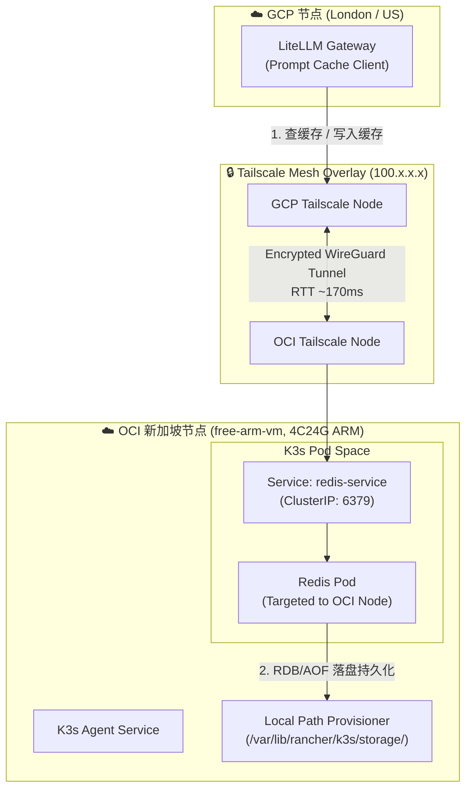

# 跨云 K3s 实战：定向部署 Redis 到 OCI 4C24G ARM 节点做 LiteLLM 缓存

在高频调用大语言模型（LLM）的场景下，为了降低 API 费用并提升响应速度，通常会引入 LiteLLM 配合 Redis 实现 **Prompt 缓存（Prompt Caching）** 与响应复用。

由于 LLM 缓存与 Embedding 向量数据需要占用较大内存，且属于需要长期积累的“有状态资产”，如果部署在随时可能被回收的 GCP 临时/抢占式节点上，一旦节点离线，搭建好的缓存就会瞬间蒸发。

本文记录一次真实的跨云架构落地：我们将一台位于 OCI（Oracle Cloud Infrastructure）新加坡区域的 4C24G 永久免费 ARM 节点（`free-arm-vm`）加入现有 K3s 集群，并通过 Kubernetes 的 `nodeSelector` / `nodeAffinity` 与 K3s 原生 `local-path` 持久化存储，将 Redis 服务精准锚定在该节点上，作为 LiteLLM 的高可靠缓存基座。

---

## 1. 整体架构设计与延迟推演

### 1.1 跨云拓扑与流量路径

LiteLLM 网关跑在 GCP 节点，而 Redis 部署在 OCI 新加坡节点。两端节点通过 **Tailscale Mesh VPN** 打通内网（Overlay Network），跨云 Pod 直接通过 Tailscale IP / ClusterIP 进行通信。



### 1.2 跨地域网络延迟的现实权衡

*   **跨网 RTT**：GCP 与 OCI 新加坡之间的 Tailscale 隧道 RTT 约在 **160ms ~ 170ms** 左右。
*   **收益对比**：
    *   **Cache Miss（未命中）**：额外增加 170ms 查 Redis 开销，但在 LLM 动辄 2000ms ~ 8000ms 的推理首字延迟面前，170ms 几乎完全感知不到。
    *   **Cache Hit（命中）**：直接返回 Redis 里的 Prompt 结果，耗时仅 170ms，瞬间节省 **2~10 秒**的推理等待时间，并实现 **100% Token 零计费**。
*   **内存与持久化断层优势**：OCI 提供的 24GB 内存为 Redis 提供了充裕的 LRU 缓存空间，搭配 `local-path` 将持久化数据写入 OCI 本地 NVMe/SSD，规避了云盘卷跨云挂载的复杂性。

---

## 2. GitOps 配置代码目录分布

为符合基础设施即代码（IaC）与 GitOps 规范，配置文件在代码仓库中按照 Base / Overlay 的结构进行拆分：

```text
k8s-manifests/
└── apps/
    └── redis-llm-cache/
        ├── base/
        │   ├── kustomization.yaml
        │   ├── redis-deployment.yaml
        │   ├── redis-service.yaml
        │   ├── redis-pvc.yaml
        │   └── redis-configmap.yaml
        └── overlays/
            └── production/
                ├── kustomization.yaml
                ├── node-affinity-patch.yaml
                └── resources-patch.yaml
```

*   `base/`：包含 Redis 通用的部署逻辑（ConfigMap、PVC、Deployment、Service）。
*   `overlays/production/`：生产环境配置，负责注入 OCI 节点的精准调度策略 (`nodeAffinity`) 以及生产级内存限额。

---

## 3. 核心配置文件与配置精解

### 3.1 Base 层配置

#### ConfigMap (`base/redis-configmap.yaml`)
为 Redis 定制内存淘汰策略与持久化机制：

```yaml
apiVersion: v1
kind: ConfigMap
metadata:
  name: redis-config
  namespace: redis-system
data:
  redis.conf: |
    # 绑定所有网卡，接受 Pod 内部与 Tailscale 网格请求
    bind 0.0.0.0
    protected-mode no
    port 6379
    tcp-backlog 511
    timeout 0
    tcp-keepalive 300
    
    # 内存管理：OCI ARM 给 24G 内存，分配 16GB 给 Redis
    maxmemory 16gb
    maxmemory-policy allkeys-lru
    
    # 持久化策略：RDB + AOF 双重保险
    save 900 1
    save 300 10
    save 60 10000
    rdbcompression yes
    dbfilename dump.rdb
    dir /data
    
    appendonly yes
    appendfilename "appendonly.aof"
    appendfsync everysec
    no-appendfsync-on-rewrite yes
    auto-aof-rewrite-percentage 100
    auto-aof-rewrite-min-size 64mb
```

#### PVC (`base/redis-pvc.yaml`)
申请使用 K3s 默认的 `local-path` 存储类：

```yaml
apiVersion: v1
kind: PersistentVolumeClaim
metadata:
  name: redis-pvc
  namespace: redis-system
spec:
  accessModes:
    - ReadWriteOnce
  storageClassName: local-path
  resources:
    requests:
      storage: 50Gi
```

#### Deployment (`base/redis-deployment.yaml`)
定义基础 Redis Pod，配置存储挂载与健康检查探针：

```yaml
apiVersion: apps/v1
kind: Deployment
metadata:
  name: redis-cache
  namespace: redis-system
  labels:
    app.kubernetes.io/name: redis-cache
    app.kubernetes.io/part-of: litellm-infra
spec:
  replicas: 1
  strategy:
    type: Recreate # 确保单节点 local-path 卷平滑卸载与挂载
  selector:
    matchLabels:
      app: redis-cache
  template:
    metadata:
      labels:
        app: redis-cache
    spec:
      containers:
        - name: redis
          image: redis:7.2-alpine
          command:
            - redis-server
            - /usr/local/etc/redis/redis.conf
          ports:
            - containerPort: 6379
              name: redis
          resources:
            requests:
              cpu: "500m"
              memory: "2Gi"
            limits:
              cpu: "3500m"
              memory: "18Gi"
          livenessProbe:
            exec:
              command:
                - redis-cli
                - ping
            initialDelaySeconds: 15
            periodSeconds: 10
          readinessProbe:
            exec:
              command:
                - redis-cli
                - ping
            initialDelaySeconds: 5
            periodSeconds: 5
          volumeMounts:
            - name: redis-data
              mountPath: /data
            - name: redis-config
              mountPath: /usr/local/etc/redis
      volumes:
        - name: redis-data
          persistentVolumeClaim:
            claimName: redis-pvc
        - name: redis-config
          configMap:
            name: redis-config
```

#### Service (`base/redis-service.yaml`)

```yaml
apiVersion: v1
kind: Service
metadata:
  name: redis-service
  namespace: redis-system
  labels:
    app: redis-cache
spec:
  type: ClusterIP
  ports:
    - port: 6379
      targetPort: 6379
      name: redis
  selector:
    app: redis-cache
```

---

### 3.2 Production Overlay 层配置

#### 节点定向补丁 (`overlays/production/node-affinity-patch.yaml`)
通过 `nodeAffinity` 结合自定义 Node Label，硬性约束 Redis Pod 只能调度至 OCI 节点 `free-arm-vm`：

```yaml
apiVersion: apps/v1
kind: Deployment
metadata:
  name: redis-cache
  namespace: redis-system
spec:
  template:
    spec:
      # 方案 1：优先使用 nodeAffinity 进行节点约束
      affinity:
        nodeAffinity:
          requiredDuringSchedulingIgnoredDuringExecution:
            nodeSelectorTerms:
              - matchExpressions:
                  - key: kubernetes.io/hostname
                    operator: In
                    values:
                      - free-arm-vm
                  - key: topology.kubernetes.io/node-type
                    operator: In
                    values:
                      - oci-arm
      # 针对 OCI ARM 节点的架构兼容约束
      tolerations:
        - key: "arch"
          operator: "Equal"
          value: "arm64"
          effect: "NoSchedule"
```

#### Overlay Kustomization (`overlays/production/kustomization.yaml`)

```yaml
apiVersion: kustomize.config.k8s.io/v1beta1
kind: Kustomization

namespace: redis-system

resources:
  - ../../base

patches:
  - path: node-affinity-patch.yaml
```

---

## 4. 部署落地与实测验证

### Step 1: 给 OCI Node 标记特征标签

在集群 Control Plane 执行命令，打上标记：

```bash
# 检查现有节点状态
kubectl get nodes -o wide

# 为 OCI 节点添加节点类型标签
kubectl label node free-arm-vm topology.kubernetes.io/node-type=oci-arm --overwrite

# 验证标签应用情况
kubectl get node free-arm-vm --show-labels
```

### Step 2: 应用 Kustomize 配置

```bash
# 创建命名空间
kubectl create namespace redis-system --dry-run=client -o yaml | kubectl apply -f -

# 部署生产配置
kubectl apply -k k8s-manifests/apps/redis-llm-cache/overlays/production
```

### Step 3: 验证 Pod 调度与存储绑定

检查 Pod 是否准确落盘在 OCI 节点，并且 PVC 成功绑定：

```bash
# 查看 Pod 所在节点
kubectl get pods -n redis-system -o wide
# 输出预期包含: NODE: free-arm-vm

# 检查 PV 与 Local-Path 绑定情况
kubectl get pvc -n redis-system
kubectl describe pv -n redis-system
```

在 OCI 节点物理机上直接核实持久化路径：

```bash
# 登录 OCI 节点查看 local-path 创建的物理目录
ssh free-arm-vm "ls -la /var/lib/rancher/k3s/storage/pvc-*"
```

### Step 4: 跨网络读写与性能测试

在 GCP 节点的 LiteLLM 所在环境进行跨节点 Redis 读写测试：

```bash
# 获取 Redis Service ClusterIP 或在网格内直接测试
REDIS_IP=$(kubectl get svc redis-service -n redis-system -o jsonpath='{.spec.clusterIP}')

# 写入大型测试 Key
kubectl run redis-test --rm -i --tty --image=redis:7.2-alpine -- redis-cli -h $REDIS_IP PING

# 模拟 LiteLLM Prompt Cache 写入与读取
kubectl run redis-test --rm -i --tty --image=redis:7.2-alpine -- redis-cli -h $REDIS_IP SET litellm:cache:prompt_hash_001 "response_data_chunk_sample"
kubectl run redis-test --rm -i --tty --image=redis:7.2-alpine -- redis-cli -h $REDIS_IP GET litellm:cache:prompt_hash_001
```

---

## 5. 运维踩坑与性能调优总结

1. **内存使用防 OOM 机制**：
   * OCI 机器虽然有 24G 内存，但必须为 Linux OS、K3s Agent 以及 Tailscale 进程预留 4G~6G 缓冲区。
   * Redis `maxmemory` 设为 `16gb`，同时设置容器 `limits.memory: 18Gi`，留出 2G 缓冲，防止 Redis 内存暴涨触发 Linux kernel 的 OOM Killer 杀死 `k3s-agent`。

2. **`local-path` 与 Pod 调度强绑定**：
   * `local-path` 属于 Local Volume，数据的物理路径绑定在 `free-arm-vm` 本地。
   * 必须在 Deployment 中配置 `strategy.type: Recreate`。如果是 RollingUpdate，K8s 会试图先启动新 Pod 再关旧 Pod，导致新旧 Pod 抢占同一个本地文件锁或引发调度挂起。

3. **AOF Rewrite 的 CPU 抖动防护**：
   * 在 ARM 节点上，AOF 重写（`BGREWRITEAOF`）会 fork 子进程并短暂消耗 CPU。设置 `no-appendfsync-on-rewrite yes` 可以避免在重写期间阻塞 Redis 主线程，保障 LiteLLM 高并发请求下的低延迟响应。
