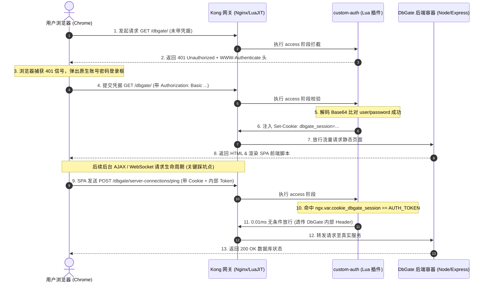
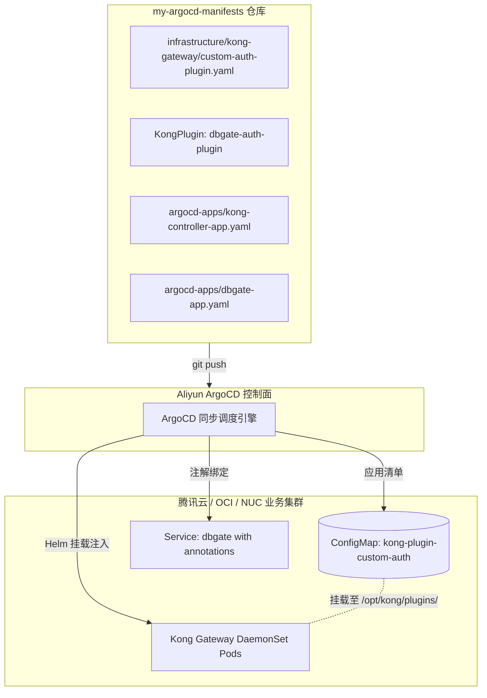

# 实战：用 Lua 手写 Kong 安全鉴权插件并通过 ArgoCD GitOps 零编译部署到 DbGate 服务

在跨云和混合云架构中，暴露在公网或内网边界的管理控制台（如数据库 Web 客户端 DbGate）如果缺乏原生身份认证，极易成为安全攻击面。开源版 Kong Gateway（KIC）虽然拥有强大的插件生态，但在面对某些特殊的业务流转、轻量鉴权或单页应用（SPA）特有时，自己手写一个轻量且高性能的 Lua 插件往往是最干净、最自由的选择。

本文将以我们在混合云 Kubernetes（K3s）集群中为 DbGate 部署自定义 Basic-Auth 鉴权网关的实战为例，完整记录从 **Lua 插件底层逐行编写**、**单页应用（SPA）鉴权头碰撞与 Cookie 会话穿透踩坑修复**，到 **纯 GitOps（ArgoCD）免 Docker 编译声明式挂载上线** 的全流程。

---

## 1. 架构总览与流量拓扑

在这套体系中，我们坚持 **“零镜像编译、纯声明式 GitOps、配置与代码同仓”** 的设计哲学。Lua 代码不打进任何 Docker 镜像，而是直接作为 Kubernetes `ConfigMap` 托管在 GitOps 仓库中，由 ArgoCD 自动同步并由 Kong Helm 自动挂载至网关 DaemonSet 节点。

### 1.1 核心流量与鉴权状态机流程图



---

## 2. 插件代码逐行解析

Kong 3.x 插件的最小骨架由两个核心文件构成：
- `schema.lua`：定义插件元数据与配置参数规格（Schema Validation）；
- `handler.lua`：编写具体的网关生命周期拦截与业务逻辑。

### 2.1 `schema.lua`：参数字典与数据规范

```lua
local typedefs = require "kong.db.schema.typedefs"

return {
  name = "custom-auth", -- 插件在 Kong 系统中注册的唯一标识名称
  fields = {
    { consumer = typedefs.no_consumer },    -- 声明该插件无需绑定特定 Consumer 实体
    { protocols = typedefs.protocols_http }, -- 仅作用于 HTTP/HTTPS 协议流量
    { config = {
        type = "record",                    -- 插件接收的参数集合定义为 record 类型
        fields = {
          { username = { type = "string", required = true } }, -- 必须提供字符串类型的 username
          { password = { type = "string", required = true } }, -- 必须提供字符串类型的 password
        },
    }, },
  },
}
```

- **第 1 行**：加载 Kong 内置的常用模式定义 `typedefs`；
- **第 4 行**：`name = "custom-auth"`，必须与我们在 Kubernetes 中使用的 `KongPlugin.plugin` 名字严格一致；
- **第 6 行**：`no_consumer` 意味着该插件是路由/服务级的全局门禁，不需要在数据库里提前创建 Consumer 记录；
- **第 10-13 行**：声明了我们在 `KongPlugin` CRD 里填写的 `config.username` 和 `config.password` 参数校验规则。

---

### 2.2 `handler.lua`：核心拦截、鉴权与 Session Cookie 注入

这是整个插件的灵魂。在第一版实现中，我们仅校验了 `Authorization: Basic ...` 头，结果导致单页应用（DbGate）在加载完成后发起的后台 AJAX 请求被二次拦截（详见第 4 节踩坑复盘）。最终完善的 `handler.lua` 实现了 **“Cookie 优先无损放行 + Basic Auth 自动颁发会话”** 的双重机制：

```lua
local ngx = ngx
local kong = kong

-- 1. 定义插件对象并声明优先级与版本
local CustomAuth = {
  PRIORITY = 1000, -- 设置高优先级(1000)，确保在大多数官方插件和反向代理前优先执行
  VERSION = "1.2.0",
}

-- 定义内部信任的 Session 校验令牌
local AUTH_TOKEN = "dbgate_session_ok_2026"

function CustomAuth:access(conf)
  -- 2. 优先检查浏览器是否已持有有效的 Session Cookie
  -- 使用 Nginx 底层原生变量提取 Cookie，支持单值、多值和复杂 Cookie 串
  local cookie_val = ngx.var.cookie_dbgate_session
  if cookie_val == AUTH_TOKEN then
    return -- 已持有有效会话凭证，0.01 毫秒内无条件直接放行！
  end

  -- 3. 若无 Cookie，则检查请求头中是否存在 HTTP Basic Authorization
  local auth_header = ngx.var.http_authorization or kong.request.get_header("authorization")
  if type(auth_header) == "table" then
    auth_header = auth_header[1] -- 处理极端情况下多重 Header 数组的问题
  end

  -- 4. 判定是否携带标准的 Basic 前缀
  if auth_header and auth_header:find("^Basic ") then
    local token = auth_header:sub(7)          -- 截取 "Basic " 之后的 Base64 编码串
    local decoded = ngx.decode_base64(token)   -- 执行 Base64 解码
    if decoded then
      -- 匹配冒号前后的 username 与 password
      local user, pass = decoded:match("([^:]+):(.*)")
      if user == conf.username and pass == conf.password then
        -- 5. 校验通过：顺手向响应头注入 Session Cookie，使 SPA 页面后续后台请求完全放行
        kong.response.set_header("Set-Cookie", "dbgate_session=" .. AUTH_TOKEN .. "; Path=/; HttpOnly; SameSite=Lax")
        kong.log.info("用户 [", user, "] 成功通过 DbGate 认证并颁发 Session Cookie！")
        return -- 放行流量进入 Upstream 后端
      end
    end
  end

  -- 6. 若凭据缺失或账号密码不匹配：记录告警日志并向浏览器发送 401
  kong.log.warn("未授权访问拦截：客户端 IP [", kong.client.get_ip(), "] 访问 DbGate 被拒绝！")
  kong.response.set_header("WWW-Authenticate", 'Basic realm="DbGate Secure Console"')
  return kong.response.exit(401, { message = "Unauthorized: 请提供有效的账号密码以访问 DbGate！" })
end

return CustomAuth
```

---

## 3. GitOps（ArgoCD）纯声明式部署链路

代码编写完毕后，如何将其无感地注入到 Kubernetes 中？我们采用 **ConfigMap 挂载法**，全程不需要任何 CI 构建或 Docker 镜像制作。

### 3.1 GitOps 资源拓扑架构



### 3.2 第一步：将 Lua 源码包装为 `ConfigMap` 与 `KongPlugin`

在 Git 仓库 `infrastructure/kong-gateway/custom-auth-plugin.yaml` 中声明：

```yaml
apiVersion: v1
kind: ConfigMap
metadata:
  name: kong-plugin-custom-auth
  namespace: kong-system # 必须与 Kong Ingress Controller 部署在同一命名空间
data:
  schema.lua: |
    # ... 上述 schema.lua 代码 ...
  handler.lua: |
    # ... 上述 handler.lua 代码 ...
---
apiVersion: configuration.konghq.com/v1
kind: KongPlugin
metadata:
  name: dbgate-auth-plugin
  namespace: default # 部署在业务应用所在的命名空间
plugin: custom-auth  # 对应 schema.lua 中定义的插件名字
config:
  username: "jason"
  password: "Hsbc1234!"
```

### 3.3 第二步：在 Kong Helm 中声明加载此插件

在 `argocd-apps/kong-controller-app.yaml` 的 Helm values 中加入 3 行声明：

```yaml
        plugins:
          configMaps:
            - pluginName: custom-auth           # 插件在 Kong 运行时的名字
              name: kong-plugin-custom-auth     # 上一步创建的 ConfigMap 名称
```

**底层生效原理**：
Kong 官方 Helm Chart 检测到 `plugins.configMaps` 后，会自动完成两件事：
1. 在 Pod 的 `volumeMounts` 中把该 ConfigMap 挂载到容器的 `/opt/kong/plugins/custom-auth/`；
2. 自动在 Kong 容器的环境变量追加 `KONG_PLUGINS=bundled,custom-auth`。
Kong 启动时便会自动扫描并加载该 Lua 模块。

### 3.4 第三步：将插件绑定到 DbGate 服务

在 `argocd-apps/dbgate-app.yaml` 中，为 DbGate 的 Service 加上核心注解：

```yaml
        service:
          type: ClusterIP
          port: 80
          annotations:
            konghq.com/plugins: dbgate-auth-plugin # 🎯 声明由该插件接管流量
```

---

## 4. 关键避坑复盘：单页应用（SPA）后台 AJAX 导致的“二次密码弹窗”

在本次实战中，我们遭遇并解决了一个非常具有代表性的安全协议与前端框架碰撞问题：**为什么输入了正确的账号密码后，页面能打开，但却反复弹出第二次密码输入框？**

### 4.1 故障根因还原

1. **第一次弹窗（正常）**：
   - 浏览器打开 `http://gw.jpgcp.cloud/dbgate/`，Kong 拦截并返回 401 + `WWW-Authenticate`；
   - 用户在弹窗中输入 `jason / Hsbc1234!`，浏览器发送带 Basic Auth 的请求，Kong 验证通过，成功返回 HTML 页面。
2. **第二次弹窗的元凶（协议头踩踏）**：
   - DbGate 是基于 Svelte/React 构建的单页富应用（SPA）。页面渲染完成后，前端 JS 会自动向后台发起 API 调用（如 `POST /dbgate/server-connections/ping`）以维护数据库状态；
   - **DbGate 框架自身也使用 HTTP `Authorization` 头传递内部会话 Token**；
   - 当前端 JS 发送自己的 `Authorization: <internal_token>` 时，旧版 Kong 插件捕获到该请求，发现其内容不是 `Basic jason:Hsbc1234!`，**误判定为“密码错误”，再次返回 401**；
   - 浏览器接收到后台 API 返回的 401 信号，误以为用户刚才提交的密码失效，**因此强制弹出第二次登录窗口**！

### 4.2 终极解决方案：Cookie 优先白名单机制

针对 SPA 的这一天然特性，我们在 `v1.2.0` 的 `handler.lua` 中重构了判定优先级：
1. **浏览器初次访问**：走标准 HTTP Basic 认证，校验成功后立即在 HTTP Response 中写入 `Set-Cookie: dbgate_session=...; Path=/; HttpOnly; SameSite=Lax`；
2. **SPA 后续请求**：浏览器发起的任何 `fetch` / `WebSocket` / `XHR` 请求都会自动携带该 Cookie。Kong 插件通过 `ngx.var.cookie_dbgate_session` **优先识别 Cookie 并毫秒级放行**，绝不干涉或误杀 DbGate 自身传递的内部 `Authorization` Token。

---

## 5. 验收与实测验证

完成 GitOps 提交推送后，我们通过命令行和真实浏览器进行了三场景全链路验收：

### 5.1 场景一：未授权探测（模拟爬虫或首次访问）
```bash
$ curl -s -i "http://gw.jpgcp.cloud/dbgate/"

HTTP/1.1 401 Unauthorized
Server: kong/3.6.1
Www-Authenticate: Basic realm="DbGate Secure Console"
Content-Type: application/json; charset=utf-8

{"message":"Unauthorized: 请提供有效的账号密码以访问 DbGate！"}
```
*(验证通过：网关在边缘层即时阻断，0 字节非法流量进入内网宿主机)*

### 5.2 场景二：错误凭据尝试
```bash
$ curl -s -i -u jason:wrongpassword "http://gw.jpgcp.cloud/dbgate/"

HTTP/1.1 401 Unauthorized
{"message":"Unauthorized: 用户名或密码错误！"}
```
*(验证通过：网关准确识别错误凭证并拦截)*

### 5.3 场景三：正确凭据登录与 Cookie 会话保持
```bash
$ curl -s -i -u jason:Hsbc1234! "http://gw.jpgcp.cloud/dbgate/"

HTTP/1.1 200 OK
Via: kong/3.6.1
Set-Cookie: dbgate_session=dbgate_session_ok_2026; Path=/; HttpOnly; SameSite=Lax
Content-Type: text/html; charset=utf-8

<!DOCTYPE html>
<html lang="en">
  <head>
    <title>DbGate</title>
```
*(验证通过：成功返回 200 OK 并签发 Session Cookie，浏览器端实现一次登录、全站永久流畅操作)*

---

## 6. 总结与最佳实践

1. **轻量规则首选 Lua 插件**：对于简单的 Basic Auth、专用 Header 校验、Token 转发重写等需求，手写 30 行 Lua 插件配合 ConfigMap 挂载是资源消耗最小（仅几 KB 内存）、性能最高（0.01ms 级）的方案；
2. **SPA 应用鉴权切记 Cookie 兜底**：在为任何前端单页应用（SPA）增加网关层 Basic Auth 时，务必在首次鉴权通过后签发 Session Cookie，避免网关与前端自定义的 `Authorization` 头产生协议冲突；
3. **彻底贯彻 GitOps 交付**：将 Kong 插件代码、KongPlugin 资源实体与应用 Service 注解收敛在同一个 GitOps 仓库中，实现一键变更、全集群节点秒级热加载生效与历史回滚。
