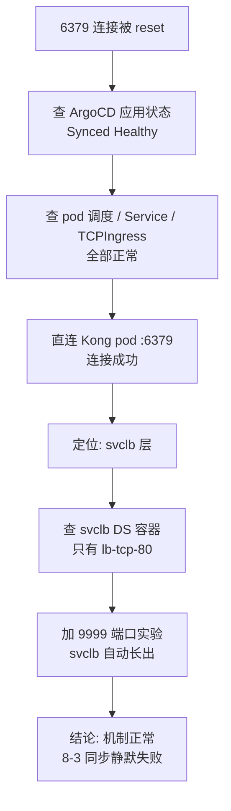

# Redis 经 Kong Gateway 的流量路径与 svclb 端口失同步排障记

## 背景：Redis 部署的最后一公里

我的 Redis 部署方案几经波折，最后定下来的是：**ArgoCD 部署 Redis 到 OCI free-arm-vm，客户端经 Kong Gateway 的 L4 Stream 连接**。

架构一句话描述：Kong 以 DaemonSet 形态跑在 K3s 集群的每个节点上（腾讯云 vm-0-2-debian、本地 nuc、OCI free-arm-vm），Redis 作为独立应用部署到 free-arm-vm，客户端（LiteLLM）连任意节点的 Tailscale IP 的 6379 端口，流量经 Kong 透传到 Redis pod。

部署本身很顺利：`redis-app.yaml` 注册进 ArgoCD，root-bootstrap 自动拉起 redis 应用，pod 精确调度到 free-arm-vm，ClusterIP Service、PVC、Secret、TCPIngress 全部就位，ArgoCD 显示 Synced / Healthy。

但端到端连通性测试一跑就露馅了——**6379 端口连接被 reset**。这才引出后面一长串对 svclb 机制的考古。这篇博客把两件事讲清楚：第一，正常状态下流量到底怎么从客户端流到 Redis pod；第二，这个 bug 是怎么藏了 43 天没被发现的。

## 一、正常状态下的流量路径

先看链路全貌，再逐跳拆解。


### 第一跳：客户端到节点 6379

客户端连的是节点的 Tailscale IP 的 6379 端口，比如 `redis-cli -h 100.77.64.95 -p 6379`。这个 IP 不是某个服务的 IP，就是腾讯云节点自己在 Tailscale 网里的地址。

有意思的是，节点上**没有任何进程监听 6379**——但连接却能通。这第一跳就是 svclb 的地盘。

### 第二跳：svclb 的 iptables 接管

svclb 是 k3s 内置的 LoadBalancer 实现。用户创建一个 `type: LoadBalancer` 的 Service 后，k3s 的 servicelb 控制器就会自动生成一个 DaemonSet，名字叫 `svclb-<svc名>-<svc UID 前8位>`，跑在 kube-system 里。

这个 DaemonSet 不在你的任何 yaml 里，是纯自动生成的。它的 pod 用 hostNetwork，Service 有几个端口就有几个 klipper-lb 容器。我们这次涉及的 svc 有 3 个端口，所以每个节点上的 svclb pod 里有 3 个容器：

```
svclb-kong-ingress-controller-kong-proxy-ef456906 (DaemonSet, kube-system)
├── lb-tcp-80   镜像 rancher/klipper-lb:v0.4.17
├── lb-tcp-443  镜像 rancher/klipper-lb:v0.4.17
└── lb-tcp-6379 镜像 rancher/klipper-lb:v0.4.17
```

klipper-lb 容器启动时干的事，看它的入口脚本 `/usr/bin/entry` 就一清二楚了：往节点内核写 iptables 规则，然后 `mkfifo /pause` 阻塞住保持存活。容器本身不监听任何端口，它不是代理，是"iptables 规则注入器"。

以 6379 为例，容器启动时拿到 env：

```
SRC_PORT=6379
DEST_PORT=30745
DEST_IPS=<本节点 IP>
SRC_RANGES=0.0.0.0/0
```

然后写三条规则：

```
iptables -t nat -I PREROUTING -p tcp --dport 6379 -j DNAT --to <本节点IP>:30745
iptables -t filter -A FORWARD -d <本节点IP>/32 -p tcp --dport 30745 -j DROP
iptables -t nat -I POSTROUTING -d <本节点IP>/32 -j MASQUERADE
```

关键点：**DNAT 发生在 PREROUTING 阶段，比任何进程监听都早**。数据包刚到网卡、还没做路由决策，就被改了目的地。所以节点上没有进程 bind 6379，但所有到 6379 的包都被 svclb 的规则接管了。这也是为什么用 `ss -tlnp` 查不到 svclb——它压根不监听。

### 第三跳：NodePort 30745 与 kube-proxy

svclb 的 DNAT 目标不是后端 pod，而是**本节点的 NodePort**（DEST_PORT=30745）。这是 k3s svclb 的设计：svclb 保持极简，只管把流量从 LoadBalancer 端口拨到 NodePort，剩下的转发交给 kube-proxy 这个标准 K8s 机制。

kube-proxy 按 Service 规则把 30745 的流量转发到后端 pod。因为 `externalTrafficPolicy: Local`，它只转发到**本节点**上 ready 的 Kong pod，不会漂到别的节点，这也是之前 Kong HA 改造的核心——流量就近进本节点的 Kong，不跨节点绕路。

### 第四跳：Kong pod 的双容器分工

Kong pod 里有两个容器，这是容易混淆的地方，单独说清楚：

```
kong pod (DaemonSet, 每节点 1 个)
├── ingress-controller  kong/kubernetes-ingress-controller:3.1  ← KIC, 控制面
└── proxy               kong:3.6                                 ← Kong Gateway, 数据面
```

- **proxy 容器**（数据面）：真正转发流量的。监听端口由 env 决定，我们集群上实测：

```
KONG_PROXY_LISTEN  = 0.0.0.0:8000, [::]:8000, 0.0.0.0:8443 http2 ssl
KONG_STREAM_LISTEN = 0.0.0.0:6379, [::]:6379
KONG_ADMIN_LISTEN  = 127.0.0.1:8444
```

- **ingress-controller 容器**（KIC，控制面）：不碰流量。它 watch K8s 的 Ingress、TCPIngress、HTTPRoute 等资源，翻译成 Kong 的声明式配置，通过 `https://localhost:8444`（admin API）推给同 pod 的 proxy。多副本时靠 leader election 只让一个干活，其余热备。

KIC 是"持续的配置守护进程"，不是一次性编译器——K8s 资源一变它要重推，proxy 容器一重启（DB-less 模式配置全在内存，重启就丢）它要重新灌。没有 KIC，TCPIngress 就只是躺在 etcd 里的一个对象，proxy 的路由表永远是空的。

### 第五跳：L4 Stream 透传与 TCPIngress

流量到达 proxy 容器的 6379 后，Kong 的 stream 模块按路由表匹配。这条路由就是 KIC 之前从 TCPIngress 对象翻译出来的：

```
TCPIngress redis-tcp (namespace: redis)
  port 6379 → backend: redis Service :6379
```

Kong 对 L4 流量是**透传**——不解包 Redis 协议（最多看一眼初始握手），TCP 字节流原样搬到 upstream。所以客户端发的 `AUTH`、`PING` 都是 redis-server 直接应答的，测试时能拿到 `+PONG` 就是全链路打通的铁证。

### 第六跳：ClusterIP Service 到 redis pod

Kong 的 upstream 指向 redis 的 ClusterIP Service（10.43.120.222:6379），最终落到 free-arm-vm 上的 redis pod（10.42.2.17:6379）。从腾讯云节点的 Kong 到 free-arm-vm 的 redis pod 是跨节点的，走 flannel overlay（10.42.0.0/16）。

### 端口映射全表

整条链路实际上是三层端口映射：

| svclb 收的端口 | NodePort | Kong pod 实际监听 | 用途 |
|---|---|---|---|
| 80 | 31850 | 8000 | HTTP |
| 443 | 31324 | 8443 | HTTPS |
| 6379 | 30745 | 6379 | L4 Stream 透传 |

入口和终点都是 6379，中间借道 30745 转了一圈。

## 二、bug 现象：6379 连接被 reset

ArgoCD 部署完成后做端到端验证，从集群外连 6379：

```
redis-cli -h 100.77.64.95 -p 6379
→ Connection reset by peer
```

连接被 reset 而不是超时——说明节点上有东西在拒绝，而不是丢包。TCP 连到关闭的端口，内核会直接回 RST。

## 三、排查过程

排查的分层路径用一张图概括，后面按弯路顺序展开：



这个 bug 排查的弯路不少，按时间顺序记录。

### 弯路一：一开始查错了机器

先查了 ArgoCD 侧的状态，redis 应用 Synced / Healthy，revision 是 `242fcff`（ClusterIP + TCPIngress 版），pod 1/1 Running 调度在 free-arm-vm，ClusterIP Service、PVC、TCPIngress、Secret 全齐。看起来一切正常。

然后我习惯性地 ssh 到 cp1-vm（腾讯云 master）用 kubectl 查 ArgoCD 的应用，结果：

```
error: the server doesn't have a resource type "app"
```

愣了。后来才想起来，**ArgoCD 跑在阿里云 master（8.148.149.80）上，cp1-vm 只是 tencent-dp1-cluster 的 API server**。ArgoCD 的 `kubectl get app` 要在阿里云那台机器上跑。这个弯路浪费了几分钟，也提醒我：跨云多集群环境下，先确认控制面在哪台机器。

### 弯路二：分层排查定位到 svclb

资源层全正常，那就从网络层往下查。先直连 Kong pod 的 IP 的 6379：

```
连接 10.42.0.250:6379 (Kong pod 直连) → OK
```

Kong 的 6379 监听是好的！那问题必然出在 svclb 这一层。看 svclb DaemonSet 的容器定义：

```
[{"containerPort":80,"hostPort":80,"name":"lb-tcp-80","protocol":"TCP"}]
```

**只有 lb-tcp-80 一个容器！** 而 svc 声明了 80/443/6379 三个端口。svclb 只接管了 80，443 和 6379 在节点上完全没人管，连接自然被 reset。

### 弯路三：时区陷阱

为了搞清楚 6379 是什么时候加进 svc 的、svclb 为什么没跟上，我翻了 ArgoCD 的同步历史：

```
2.38.0 | 2026-06-21T18:15:31Z
2.38.0 | 2026-08-02T17:14:28Z
2.38.0 | 2026-08-02T17:48:34Z
2.38.0 | 2026-08-02T17:58:32Z
2.38.0 | 2026-08-02T18:03:13Z
```

这些时间带 Z 后缀，是 UTC。换算成北京时间（+8）：

```
8-3 01:14 / 01:48 / 01:58 / 02:03
```

这 4 次同步正好对应 Git 仓库里 kong-controller-app.yaml 的 4 次提交（DaemonSet 改造、externalTrafficPolicy Local、TCP stream 6379、移除无效的 nginx_stream_listen）。而 k3s 日志里恰好有 8-3 01:48 和 01:58 的 `AppliedDaemonSet` 事件——对上了。**ArgoCD 历史里的时间戳不带时区标识，不看 Z 后缀很容易误判成 8-2 下午，导致时间线对不上。**

### 弯路四：决定性实验

到这一步，矛盾点集中在：svc 端口变了（8-3 加 6379），CCM 也触发了（AppliedDaemonSet 事件有），为什么 svclb 没更新？

我做了一个决定性实验：手动往 svc 里加一个临时端口 9999，看 svclb 会不会自动长出对应的容器：

```
kubectl patch svc kong-ingress-controller-kong-proxy \
  --type=json -p '[{"op":"add","path":"/spec/ports/-",...9999...}]'

30 秒后：
svclb DS 容器 = [lb-tcp-80 lb-tcp-443 lb-tcp-6379 lb-tcp-9999]   ← 自动长出来了！
```

撤掉 9999 后，svclb 又自动收敛回 3 个容器。**这说明 svclb 的同步机制本身是好的**——端口变化 → CCM 检测到 → 更新 DaemonSet，这条链路完全正常。

那问题就只剩一个解释：**8-3 那次端口变更时，同步动作"执行了但没生效"**。结合 k3s 是 8-2 22:20 重建的（证书签发时间 8-2 13:20 暴露了这一点），root cause 基本锁定。

## 四、root cause

用一句话概括：

**svclb 的 DaemonSet 停留在 6-21 创建时的状态（只有 lb-tcp-80），svc 后来升级成 80/443/6379 三个端口，但 k3s 在 8-2 重建后，servicelb 对旧机制创建的 svclb DaemonSet 的更新动作静默失败了——AppliedDaemonSet 事件照发、没有任何报错，DaemonSet 内容却没变。**

几个支撑点：

1. **svclb 是"影子"**：它由 k3s 自动生成，不在任何 GitOps 仓库里，`newDaemonSet` 源码就是照抄 `svc.Spec.Ports` 生成容器。你改不了它，也管不了它，只能删了让它重建。

2. **AppliedDaemonSet 事件是 defer 发的**：看 k3s 源码，`deployDaemonSet` 里事件是 `defer k.recorder.Eventf(...)`，**无论 Apply 成功失败事件都会发**。所以"看到事件"不等于"更新成功"，这是个容易误判的点。

3. **k3s 重建是分水岭**：8-2 22:20 k3s 整个重建（v1.35.5，servicelb 从旧机制迁到 CCM/cloudprovider 模式），旧的 svclb DaemonSet 是 6-21 老机制创建的，两者状态不一致，导致新的 Apply 静默失败。

4. **6-21 时 svc 确实只有 80**：8-2 22:20 k3s 重建后 Apply 的 svclb 只有 lb-tcp-80，说明那一刻 svc 就是只有 80。而 6-21 的部署配置本身是半成品（chart 名写错、版本号无效），渲染出的 svc 只有 HTTP 80。svclb 当时生成 lb-tcp-80 是"正确"的，只是后来没跟上。

5. **为什么藏了 43 天没发现**：80 端口一直正常（svclb 恰好有 lb-tcp-80），而 443 是 chart 默认送的不引人注意、6379 是后来才加的。svc 加了新端口，没有谁主动通知你"svclb 没跟上"。

## 五、修复与验证

修复动作很简单：删掉旧的 svclb DaemonSet，再 touch 一下 svc 触发 reconcile。

```
kubectl -n kube-system delete ds svclb-kong-ingress-controller-kong-proxy-ef456906
kubectl -n kong-system annotate svc kong-ingress-controller-kong-proxy force-recreate=1 --overwrite
```

k3s 的 servicelb 控制器发现 svc 没有对应的 svclb DaemonSet，自动用当前 svc 的端口重新生成：

```
svclb DS 容器 = [lb-tcp-80 lb-tcp-443 lb-tcp-6379]   ← 3 个全齐
```

然后端到端验证，从腾讯云节点和 OCI 节点各连一次：

```
100.77.64.95:6379   AUTH: +OK   PING: +PONG
100.105.130.0:6379  AUTH: +OK   PING: +PONG
```

全链路打通。整个修复过程没有动 Kong、没有动 Redis、没有动任何 Git 仓库里的配置——就是重置了一个 k3s 的自动生成物。

## 六、经验总结

1. **LoadBalancer 端口不通，先比三样东西**：svc 声明的端口、svclb DaemonSet 的容器列表、后端 pod 实际监听。前两者不一致 = 删 svclb DS（或 touch svc）强制重建；后两者不一致 = 看 KONG_STREAM_LISTEN 这类配置。

2. **svclb 是隐身交警**：它不监听端口（没有进程 bind），靠 iptables DNAT 在 PREROUTING 阶段接管流量。`ss -tlnp` 查不到它，`ps` 只看到一个 entry 脚本挂在 fifo 上，只有 `iptables -t nat -L PREROUTING` 能看到它的规则。

3. **AppliedDaemonSet 事件不代表更新成功**：k3s 里这个事件是 defer 发的，Apply 失败也会发。看到事件别急着下结论，去核对 DaemonSet 的实际内容。

4. **ArgoCD 历史时间是 UTC**：不带时区标识的 Z 后缀时间戳，换算本地时区后再对时间线，不然排查顺序会乱。

5. **k3s 重建后，servicelb 对旧 DaemonSet 的更新可能静默失败**：如果遇到"svc 端口变了但 svclb 没跟上且无报错"，直接删 DS 重建是最快的解法，不用纠结为什么——重置自动生成物永远是最省事的。

6. **自动生成的东西最容易被忽略**：svclb 不在你的 GitOps 仓库里，却在你的流量链路上。这种"影子资源"出问题，排查时要有意识地把它列进检查清单。
