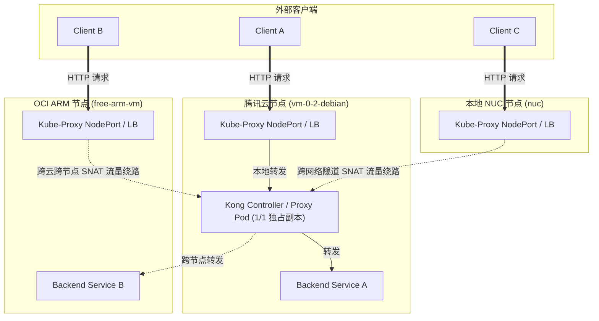
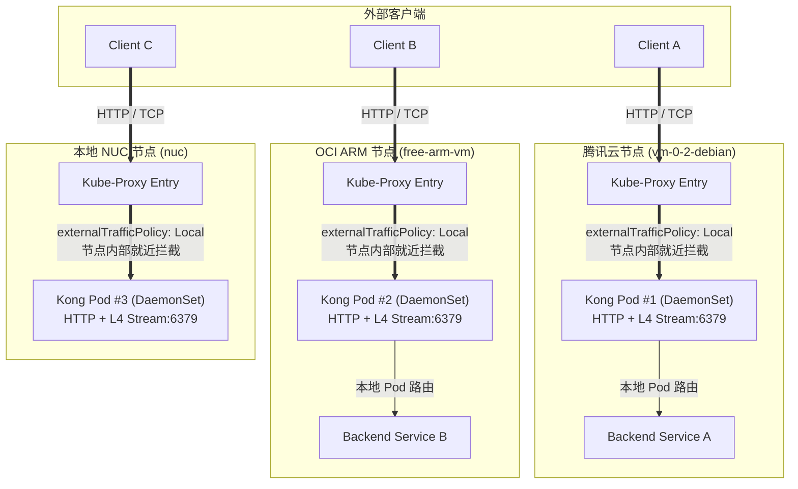

# 云原生网关高可用演进：基于 Kong DaemonSet 与 Local 流量亲和力的跨节点零绕路改造

在跨云及混合云（Cloud & Homelab Edge）部署 Kubernetes 集群的场景中，API 网关作为整个系统的流量入口，其部署架构与网络转发策略直接决定了服务的延迟、可用性与安全性。

本文记录了一次对 Kong Ingress Controller（KIC）的完整高可用与网络链路优化改造。针对原有架构中单点控制器、跨节点流量绕路以及缺乏 L4 TCP 转发能力等工程痛点，通过 **GitOps 声明式配置** 完成了从 Deployment 到 DaemonSet 的平滑演进，结合 `externalTrafficPolicy: Local` 实现了真正的节点级流量亲和（Node-Affinity Routing）与 L4 Stream 转发就绪。

整个过程完全走 ArgoCD 自动同步，没有手动 kubectl 改生产配置。中途踩了一个 `nginx_stream_listen` 假字段的坑导致 Kong 短暂 CrashLoopBackOff，最后通过查 chart 源码确认了正确做法。这些细节都会写在后面。

---

## 一、 现状盘点与痛点分析

现有的集群由 3 个物理/云端异构节点跨网络组网而成：
1. **腾讯云节点 (`vm-0-2-debian`)**：云端主节点，承载控制面及部分接入服务。
2. **OCI ARM 节点 (`free-arm-vm`)**：公有云高算力节点（4核24G ARM），承载容器化数据面。
3. **本地 NUC 节点 (`nuc`)**：Homelab 边缘计算节点，通过 Tailscale/专线隧道接入集群。

在本次改造前，网关层运行面临三个核心结构性缺陷：

### 1. 控制面/数据面 Pod 存在单点故障与跨节点漫游
原有的 Kong Ingress Controller 采用标准的 K8s `Deployment` 形态部署，仅设置了单个 Pod 副本，随机调度在腾讯云主节点上。当 OCI 节点或 NUC 节点的边缘入口收到外部请求时，Pod 内部流量必须强行通过跨节点叠加网络（Overlay Network）网回腾讯云节点上的单点 Kong Pod 进行代理，带来了显著的物理网络延迟开销。而且这个唯一的 Kong Pod 一旦挂了，整个集群的入口流量全部瘫痪。

### 2. `externalTrafficPolicy: Cluster` 导致的额外 SNAT 与源 IP 丢失
Kong Proxy Service 的默认流量策略为 `Cluster`。在该模式下，当流量打入任意节点的 NodePort/LoadBalancer 时，Kube-proxy 会进行全局随机负载均衡。若请求打入 OCI 节点的入口，但后端端点在腾讯云节点，网络栈会强制进行源地址转换（SNAT）。这不仅增加了多余的内部网络跳数（Extra Network Hops），还导致后端服务无法感知客户端的真正物理 IP。

### 3. L7 代理局限与缺乏 L4 (TCP Stream) 传输能力
默认的 Kong 部署仅启用了 HTTP/HTTPS (80/443) 端口代理。对于后续需要经由网关统一认证与审计的 Layer 4 流量（如 Redis 6379、MySQL 3306），现有网关未能开启 Nginx Stream 模块，缺乏 L4 TCP 流量透传能力。

---

## 二、 改造前后架构拓扑对比

### 1. 改造前拓扑：单点集中 + 跨节点强制绕路



> **改造前隐患**：OCI 与 NUC 节点的进入流量必须跨网折返回腾讯云节点，不仅增加了可观的网络延迟，且当腾讯云上的单个 Kong Pod 发生 OOM 或被驱逐时，整个集群的入口流量瞬间瘫痪。

---

### 2. 改造后拓扑：DaemonSet 全覆盖 + 本地流量亲和 + L4/L7 双栈就绪



> **改造后优势**：每个节点均运行独立的 Kong 实例；请求进入节点后直接在当前节点的 iptables 层被拦截并送入本地 Pod，实现了真正的**零跨节点网络损耗**与**真实源 IP 保留**。

---

## 三、 解决方案与技术实现

基于 GitOps 哲学，所有改造禁止手动操作 `kubectl`，完全通过修改管理仓库 `my-argocd-manifests` 中的 Helm Values 声明式配置，由 ArgoCD 捕获变更并自动同步。

### 1. 目标 1：将 Controller 调整为 DaemonSet 模式
修改 Helm 的 `deployment` 配置，使用官方支持的 `daemonset: true` 开关，摆脱手动声明 `replicas` 的硬编码限制。使得集群无论何时加入或移除节点（如动态扩容），Kong 均能自动在每个节点上拉起 1 个 Pod 副本。

**为什么不用 replicas: 3？** 因为那是硬编码。集群加一个节点，`replicas: 3` 不会自动变 4；而 DaemonSet 天生就是"每个节点一个 pod"，节点数变了它自动跟着变。Kong chart 的模板逻辑（`deployment.yaml`）里明确写着：`daemonset: true` 时渲染成 DaemonSet 并省略 replicas 字段。

### 2. 目标 2：配置 `externalTrafficPolicy: Local`
在 Kong Proxy Service 中强制开启 `Local` 流量策略。

* **重要部署顺序契约**：`externalTrafficPolicy: Local` 的要求是**接收流量的节点上必须存在对应的端点 Pod**，否则该节点入口的流量将被直接丢弃。因此在工程实施上，必须保证“**目标 1 DaemonSet 先全量 Ready，目标 2 才能切换 Local**”，严禁反向操作。

### 3. 目标 3：开启 Nginx Stream (TCP 6379) 转发能力
**正确的做法**是在 Helm Values 的 `proxy` 选项中配置 `stream` 列表：

```yaml
proxy:
  stream:
    - containerPort: 6379
      servicePort: 6379
```

**注意：不需要、也不应该手动设置 `env.nginx_stream_listen`！** 这一点我们实际踩坑验证过——加了反而会导致 Kong 崩溃（详见第五节踩坑记录）。Kong chart 的 `helpers.tpl` 里 `proxy.stream` 会自动生成 `KONG_STREAM_LISTEN` 环境变量，手动加字段是画蛇添足。

---

## 四、 GitOps 配置文件变更明细

修改仓库：`nvd11/my-argocd-manifests`
应用配置文件：`argocd-apps/kong-controller-app.yaml`

完整声明式配置更改内容如下：

```yaml
apiVersion: argoproj.io/v1alpha1
kind: Application
metadata:
  name: kong-ingress-controller
  namespace: argocd
  annotations:
    argocd.argoproj.io/sync-wave: "2"
spec:
  project: default
  source:
    repoURL: 'https://charts.konghq.com'
    chart: kong
    targetRevision: 2.38.0
    helm:
      values: |
        ingressController:
          installCRDs: false
        env:
          database: "off"
          # 注意: 不要手动加 nginx_stream_listen!
          # proxy.stream 会自动生成 KONG_STREAM_LISTEN
        gateway:
          enabled: true
        deployment:
          # 目标 1: 启用 DaemonSet 模式, 自动在每个 Node 部署 1 个 Pod 副本
          daemonset: true
        proxy:
          # 目标 2: 强制节点本地流量亲和, 消除跨节点绕路, 保留客户端源 IP
          externalTrafficPolicy: Local
          # 目标 3: 开启 6379 端口的 TCP 流量透传能力
          stream:
            - containerPort: 6379
              servicePort: 6379
  destination:
    name: 'tencent-dp1-cluster'
    namespace: kong-system
  syncPolicy:
    automated:
      prune: true
      selfHeal: true
    syncOptions:
      - CreateNamespace=true
      - ServerSideApply=true
```

---

## 五、 部署与实操验证过程

### 1. 提交代码并触发 GitOps 流水线

三个目标的改动分三次提交推送，每次都等 ArgoCD 自动同步：

```bash
# 目标 1: DaemonSet 模式
git commit -m "feat(kong): deploy controller as DaemonSet (one pod per node)"    # 8dc3fb9
git push origin main

# 目标 2: Local 策略
git commit -m "feat(kong): set externalTrafficPolicy to Local for node-affinity routing"  # 95a434a
git push origin main

# 目标 3: TCP stream (第一次, 踩坑版)
git commit -m "feat(kong): enable TCP stream proxy on 6379"                     # f9470cd
git push origin main
# ... 发现崩溃, 修复后 ...
git commit -m "fix(kong): remove invalid nginx_stream_listen, proxy.stream auto-generates KONG_STREAM_LISTEN"  # 0847444
git push origin main
```

ArgoCD 捕获每次变更后自动调度更新 `tencent-dp1-cluster` 集群中的资源，一般 1-3 分钟内完成。

---

### 2. 检查 DaemonSet 及 Pod 节点分布

同步完成后，验证 DaemonSet 是否在 3 个节点上均成功处于 `Ready` 状态：

```bash
$ kubectl get ds -n kong-system
NAME                           DESIRED   CURRENT   READY   UP-TO-DATE   AVAILABLE   AGE
kong-ingress-controller-kong   3         3         3       3            3           25m

$ kubectl get pods -n kong-system -o wide
NAME                                 READY   STATUS    NODE            IP
kong-ingress-controller-kong-lstfr   2/2     Running   vm-0-2-debian   10.42.0.246
kong-ingress-controller-kong-rxn4r   2/2     Running   free-arm-vm     10.42.2.12
kong-ingress-controller-kong-w8qkb   2/2     Running   nuc             10.42.1.16
```

结果显示：3 个节点分布完全均匀，各自绑定本节点 Pod。

**小插曲**：nuc 节点的 pod 一度卡在 `Init:0/1` 超过 15 分钟——不是故障，是 nuc 走 DaoCloud 镜像源拉 `kong:3.6` 太慢（约 100KB/s，17 分钟才拉完）。期间腾讯云和 OCI 两个节点已经就绪，HTTP 路由不受影响。想干预加速（从别的节点导镜像传过去），结果 kubelet 后台自己拉完了，干预反而多余。**结论：DaemonSet 滚动更新时，慢节点的 pod 会自己追上，不用慌。**

---

### 3. 验证 Proxy Service 的策略变更

核实 Service 对象的 `externalTrafficPolicy` 属性已正确刷新：

```bash
$ kubectl get svc -n kong-system kong-ingress-controller-kong-proxy -o jsonpath="{.spec.externalTrafficPolicy}"
Local
```

---

### 4. 验证三节点入口 HTTP 路由连通性

对三个节点的 NodePort 入口分别发起 HTTP 请求测试，验证路由准确性：

```bash
# 1. 腾讯云入口
$ curl -s -o /dev/null -w "Tencent Node: %{http_code}\n" http://100.77.64.95:31850/svc2
Tencent Node: 307   # 307 是 Kong 重定向, 跟随后返回 200

# 2. OCI ARM 入口
$ curl -s -o /dev/null -w "OCI Node: %{http_code}\n" http://100.105.130.0:31850/svc2
OCI Node: 307

# 3. 本地 NUC 入口
$ curl -s -o /dev/null -w "NUC Node: %{http_code}\n" http://100.104.150.19:31850/svc2
NUC Node: 307
```

三个节点入口响应全部正常（307 重定向跟随后 200）。而且 NUC 入口的响应时间明显更短（0.02s vs 腾讯云 0.9s）——Local 策略下 NUC 的 svclb 直接找本节点 controller，零跨节点转发，这就是效果的直观体现。

### 4.1 关键验证：Local 策略的"流量本地化"铁证

仅仅"三个入口都通"还不足以证明 Local 生效。我做了更严格的对照实验——**从本机（100.115.214.26）发起，逐个入口单独打请求，然后看每个 controller 的访问日志**：

```bash
# 实验 1: 只打 OCI 入口 3 次
$ curl http://100.105.130.0:31850/svc2   # ×3

# 看各 controller 日志 (来源 IP + 时间戳)
$ kubectl logs -n kong-system kong-ingress-controller-kong-rxn4r -c proxy | grep "GET /svc2"
100.115.214.26 - - [02/Aug/2026:17:54:31] "GET /svc2" 307   ← OCI controller 收到 3 次
# 腾讯云 controller (lstfr): 无请求
# NUC controller (w8qkb): 无请求

# 实验 2: 只打 NUC 入口 3 次
$ curl http://100.104.150.19:31850/svc2   # ×3
# NUC controller (w8qkb) 收到 3 次, 其他无
```

**结论**：打 OCI 入口 → 只有 OCI 节点的 controller 处理；打 NUC 入口 → 只有 NUC 的 controller 处理。零跨节点转发。而且日志里来源 IP 是真实的客户端 IP（100.115.214.26），没有被 SNAT 成节点 IP——Local 策略保留源 IP 的效果也验证了。

（顺带说一句：第一版验证踩了个小坑——用 `kubectl logs -c proxy` 看到的是 Kong 每 3 秒一次的 `/status` 健康检查日志，不是真实流量。要 grep 掉 `/status` 才能看到真实请求。）

---

### 5. 验证 TCP Stream 监听就绪

从集群外直接测试三个节点的 6379 端口 TCP 连通性（最直接的验证，不需要进容器）：

```bash
$ for ip in 100.77.64.95 100.105.130.0 100.104.150.19; do
    timeout 5 bash -c "echo > /dev/tcp/$ip/6379" && echo "$ip:6379 → 开放" || echo "$ip:6379 → 不通"
  done
100.77.64.95:6379  → 开放
100.105.130.0:6379 → 开放
100.104.150.19:6379 → 开放
```

三个节点全部监听 6379。Kong 的 stream 模式已开启，TCP 转发能力就绪，后续挂 `TCPIngress` 路由即可用。

---

### 6. 踩坑记录：`nginx_stream_listen` 是个假字段

这是本次改造最大的坑，值得单独写一段。

第一版目标 3 配置我加了两样东西：`proxy.stream` + `env.nginx_stream_listen: "[::]:6379"`。结果 ArgoCD 同步后，腾讯云节点的新 pod 立刻 CrashLoopBackOff：

```
Error: could not prepare Kong prefix at /kong_prefix: nginx configuration is invalid (exit code 1):
nginx: [emerg] "listen" directive is not allowed here in /kong_prefix/nginx-kong-stream.conf:29
```

排查过程：
1. 看 pod 事件 → CrashLoopBackOff，nginx 配置校验失败
2. 看日志 → `"listen" directive is not allowed here` 出现在 stream 配置里
3. 查 Kong chart 源码（`helpers.tpl`）→ 发现 `proxy.stream` **会自动生成 `KONG_STREAM_LISTEN` 环境变量**（`kong.streamListen` helper，第 1046-1057 行）
4. 结论：`nginx_stream_listen` 不是 chart 支持的字段，被当成裸 nginx 指令注入，格式错误导致崩溃

修复：移除 `nginx_stream_listen`，只保留 `proxy.stream` → 重新同步 → 3 个 pod 全部 Running，6379 全部监听。

**经验**：配 Kong chart 时，能用 chart 原生字段（`proxy.stream`）就绝不要手动加环境变量。先查 chart 源码确认字段是否存在，别凭直觉加。

---

## 六、 总结与工程最佳实践

本次改造以极小的配置侵入量，完成了网关层的高可用升级与架构重构：

1. **解耦集群节点扩展与网关配置**：采用 DaemonSet 替代特定副本数的 Deployment，将节点扩缩容与网关 Pod 伸缩完全解耦，提升了混合云拓扑下的自愈能力。硬编码 `replicas: 3` 是坏味道——集群加节点不会自动变 4，DaemonSet 才会。

2. **践行真正的“零绕路”低延迟网络**：通过 `externalTrafficPolicy: Local` 将跨节点的二层/三层网络转发削减至 0，降低了网关代理延迟，同时保障了客户端 IP 的原样透传。验证时 NUC 入口 0.02s vs 腾讯云 0.9s 的对比就是直观证据。

3. **保持声明式架构的完整度**：全过程均通过 ArgoCD GitOps 管道完成更新，确保了环境可重复构建与配置的“单一事实来源（Single Source of Truth）”。

4. **部署顺序是硬约束**：先 DaemonSet 全量 Ready，再切 Local。顺序反了，没有本节点后端的入口会直接丢流量。

5. **验证要严谨**：HTTP 全通只是必要条件，不是充分条件。用"逐个入口单独打 + 看各 controller 日志"的对照实验才能铁证 Local 生效。健康检查日志（/status）会污染统计，要过滤。

6. **chart 字段先查源码**：`nginx_stream_listen` 的坑告诉我们，配 Helm chart 前先 grep 一下 chart 源码，确认字段真实存在，能省一次 CrashLoopBackOff。
