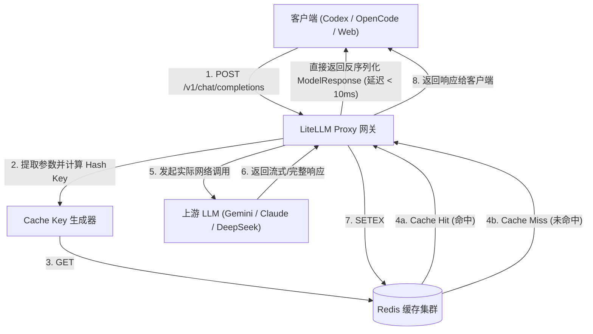
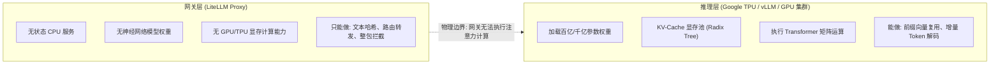
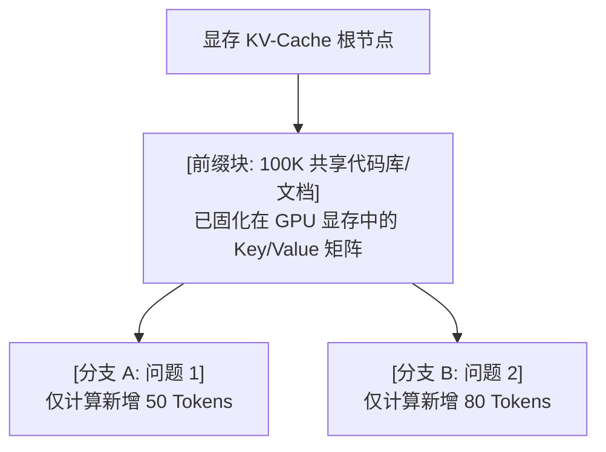
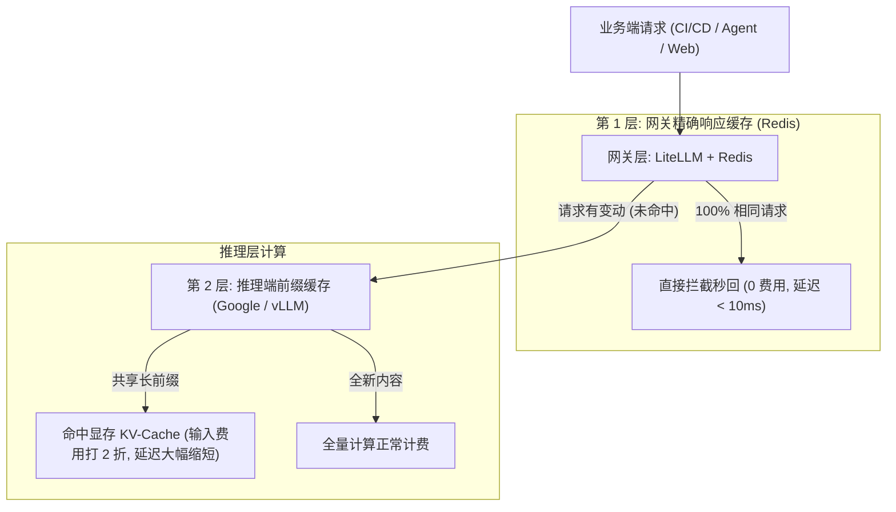

# LiteLLM 与 Redis 响应缓存机制：从精确哈希匹配到模型底层 KV-Cache 边界

在大语言模型（LLM）网关与中间件的架构设计中，缓存是降低调用成本与响应延迟的核心手段。很多刚接触 LiteLLM 或相关网关方案的工程师容易产生一种误解，认为在网关层挂载 Redis 就能实现类似大模型服务商那样的“部分 Token 命中打折”效果。

实际上，网关层缓存与模型推理层缓存工作在完全不同的系统层次。LiteLLM 配合 Redis 实现的是基于请求特征的**精确响应缓存（Exact Response Cache）**，而像 Google Gemini、OpenAI 或私有部署 vLLM 中的“部分 Token 缓存”，依靠的是模型显存中的 **KV-Cache 前缀复用（Prefix Caching）**。

本文深入梳理 LiteLLM 与 Redis 的缓存交互流程、Key/Value 内部数据结构、跨模型隔离逻辑，并详细剖析网关层与推理层在缓存机制上的物理边界。

---

## 1. LiteLLM + Redis 响应缓存的核心工作流

LiteLLM Proxy 作为 API 网关，本身是一个基于 Python/FastAPI 的无状态中间件。当我们在 `config.yaml` 中配置 `type: redis` 并启用 `cache: true` 时，LiteLLM 会接管所有 Redis 连接池与读写生命周期，无需编写额外的应用层读写代码。

### 1.1 请求处理生命周期

整个调用与缓存拦截的数据流向如下图所示：



1. **拦截请求**：客户端发起请求到达 LiteLLM Proxy。
2. **生成指纹**：LiteLLM 提取影响模型生成结果的全部请求字段，计算出确定性的字符串 Hash Key。
3. **前置查询**：在向上游 API 发送网络请求之前，先向 Redis 执行 `GET` 查询。
4. **命中直接返回**：
   - **Cache Hit**：从 Redis 读取缓存的 JSON 字符串，反序列化为标准的 `ModelResponse` 对象直接返回。耗时从秒级降低至毫秒级（通常仅受内网网络 RTT 影响），且不产生任何上游 Token 费用与 API 速率配额消耗。
   - **Cache Miss**：正常向上游模型提供商（如 Google AI Studio、OpenAI 等）发起网络调用。
5. **异步回写**：上游模型生成完毕后，LiteLLM 将完整的响应结构体序列化后写入 Redis，并附加配置的 TTL（生存时间）。

---

## 2. 缓存数据的底层存储结构：Key 与 Value

要弄清楚为什么缓存不能跨模型混用、为什么多一个空格都无法命中，必须拆解 LiteLLM 在 Redis 中实际存储的键值结构。

### 2.1 Cache Key 的构造逻辑（输入特征哈希）

LiteLLM 采用严格的输入特征提取算法。一个典型的 Cache Key 由以下要素共同决定：

```text
Cache Key = Hash(
    model_name,
    messages_array,
    temperature,
    top_p,
    max_tokens,
    tools_definitions,
    tool_choice,
    response_format,
    extra_body_params
)
```

关键约束规则：
* **消息内容敏感**：`messages` 列表中的 `system`、`user`、`assistant` 角色顺序、文本内容（包括空格、标点符号、换行符）必须 100% 字符一致。`"Hello"` 与 `"Hello "` 会生成不同的哈希值。
* **模型名称隔离**：模型名称是 Key 的最高优先级命名空间。即使 Prompt 完全一样，发送给 `gemini-3.7-flash` 和 `gpt-5.6-luna` 会生成完全隔离的 Key，绝对不会发生跨模型串用。
* **超参数敏感**：若请求 A 设置 `temperature: 0.2`，请求 B 设置 `temperature: 0.7`，两者会被视为不同请求分别计算。

### 2.2 Cache Value 的存储形态（完整序列化响应）

写入 Redis 的 Value 并不是单纯的文本字符串，而是上游模型返回的完整 OpenAI 规范 JSON 对象（经序列化存储）：

```json
{
  "id": "chatcmpl-8f2a1b9c8d",
  "object": "chat.completion",
  "created": 1787412481,
  "model": "gemini-3.7-flash",
  "choices": [
    {
      "index": 0,
      "message": {
        "role": "assistant",
        "content": "这是大模型生成的完整回答内容...",
        "tool_calls": null
      },
      "finish_reason": "stop"
    }
  ],
  "usage": {
    "prompt_tokens": 156,
    "completion_tokens": 84,
    "total_tokens": 240
  }
}
```

正因为 Value 保存了包含 `choices`、`usage`、`finish_reason` 在内的完整数据结构，LiteLLM 在命中缓存时才能对各类 SDK、CLI 工具（如 Codex、OpenCode）保持透明兼容。

---

## 3. 为什么 LiteLLM 网关无法实现“部分 Token 增量缓存”？

在日常工程交流中，经常有人问：*“如果我的前 10 万字文档相同，只有最后提了一个新问题，LiteLLM 能不能只缓存前 10 万字，剩下的让模型补全？”*

答案是：**在网关层不可能做到。** 这是由计算架构的物理边界决定的。



### 3.1 网关层与推理层的本质差异

1. **缺少模型权重**：LiteLLM 只是一个运行在通用 CPU 上的 API 代理，它手中没有神经网络参数。
2. **生成依赖全量注意力计算**：在大语言模型的 Transformer 结构中，生成新 Token 需要让新输入与历史上下文中的每一个 Token 进行注意力（Attention）权重计算。
3. **文本缓存无法替代显存状态**：把前 10 万字以文本形式存在 Redis 里对后续生成没有任何直接数学帮助。上游 GPU 要生成后续内容，依然必须将这 10 万字重新做一次词嵌入（Embedding）并计算每一层的 Key/Value 矩阵。

因此，网关层只能做整包级别的精确匹配或基于向量检索的语义缓存（Semantic Cache），无法直接分担大模型的局部生成计算。

---

## 4. 现代 LLM 的部分 Token 缓存原理：显存 KV-Cache 前缀复用

既然网关层做不到，那 Google Gemini、Anthropic Claude 以及开源推理框架 vLLM、SGLang 是如何在底层实现“部分 Token 命中并降价 75%~80%”的？

核心在于推理引擎显存级别的 **KV-Cache 前缀复用（Prefix Caching / Radix Attention）**。

### 4.1 传统推理的算力浪费

在自回归生成过程中，每个 Token 在经过 Transformer 的每一层注意力计算时，都会生成对应的 Key 向量与 Value 向量（合称 KV-Cache）。

如果没有前缀缓存：
* 第一次请求：输入 10 万 Token 背景 + 问题 A。GPU 计算 10 万 Token 的 KV 矩阵并输出回答。
* 第二次请求：输入相同的 10 万 Token 背景 + 问题 B。GPU 必须把这 10 万 Token 从头再做一遍完整的矩阵乘法运算。

这两次计算中，针对 10 万背景 Token 的矩阵运算完全是重复且昂贵的。

### 4.2 前缀树显存索引（Radix Tree Prefix Caching）

现代推理集群将显存中的 KV-Cache 组织成一棵前缀树（Radix Tree）：



当新请求到达推理引擎时：
1. **前缀匹配**：调度器在显存树中比对 Token 序列，发现前 10 万个 Token 与显存中已有的 KV 块完全一致。
2. **跳过预填充计算（Skip Prefill FLOPs）**：GPU/TPU **直接复用显存中现成的 Key/Value 向量**，跳过这 10 万 Token 的前向传播矩阵运算（节省 90% 以上的浮点运算量）。
3. **仅计算增量**：模型只需要对末尾新追加的几十个 Token 进行注意力计算并开始解码输出。

### 4.3 为什么服务商可以大幅降价？

因为模型服务商（如 Google）实际消耗的算力大幅降低，所以能直接体现在账单策略上：
* **Google Gemini**：当上下文匹配自动缓存时，命中部分的输入单价通常只有未命中单价的 20%~25%（直接打 2~2.5 折），首字延迟（TTFT）大幅缩短。
* **Gemini 显式缓存（Explicit Context Caching）**：通过 API 显式创建长期驻留的 Cache 句柄，可针对固定的大型代码库或数据集按存储小时付费，每次调用的 Token 费用降至极低。

---

## 5. 企业级双层缓存架构实践

理解了两种缓存的机制与边界后，在企业级生产环境或私有网关中，最佳实践是采用**双层联动架构**：



### 5.1 协同优势

1. **第一层（网关 Redis）过滤死循环与机械重复**：
   - 拦截完全相同的自动化检查、固定代码分析、重复运行的单元测试、心跳检测等。
   - 实现真正的 0 耗时与 0 费用。
2. **第二层（模型推理端 KV-Cache）加速多轮交互与代理循环**：
   - 当 Coding Agent（如 Codex、OpenCode）在多轮对话中不断追加修改指令时，尽管整包请求在变动，但前面累积的大段代码与对话历史会在 Google/vLLM 显存中持续命中前缀缓存。
   - 显著降低长上下文 Agent 任务的累计 Token 开销。

---

## 6. 总结

* **LiteLLM + Redis** 属于**请求/响应级别的精确哈希缓存**，Key 严格绑定全部输入参数与模型名称，不支持跨模型复用，也无法代替神经网络完成局部增量生成。
* **现代 LLM 的 Token 缓存** 属于**显存级别的 KV-Cache 前缀复用**，依赖推理引擎与硬件显存，专门解决长上下文多轮请求下的计算浪费与成本问题。
* 两者并不冲突，在网关层配置 Redis 拦截完全重复流量，在模型层利用服务商或 vLLM 的 Prefix Caching 消化长前缀计算，是当前大模型工程落地中最稳健的组合方案。
