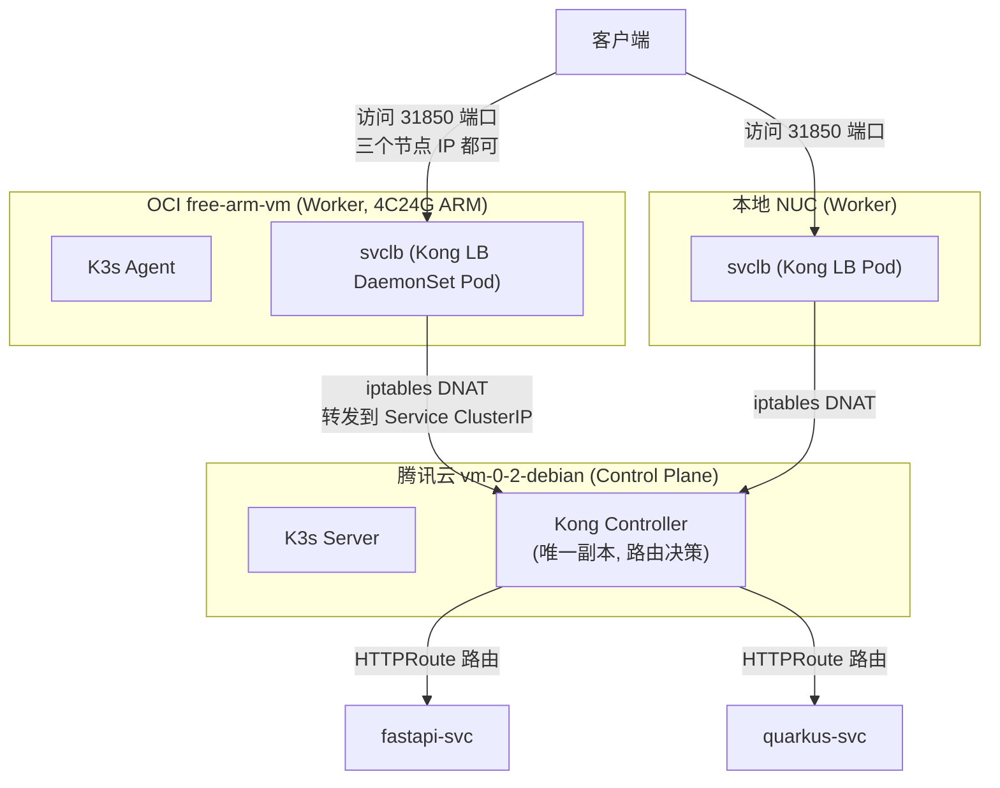

# 跨云 K3s 集群踩坑实录：新加入的 OCI 节点，Kong LB 流量为什么全挂

## 背景

我在维护一个跨云 K3s 集群：控制面在腾讯云（`vm-0-2-debian`），后来陆续加入了本地 NUC 和一台 OCI 的 ARM 机器（`free-arm-vm`，4C24G）。集群里跑着 Kong 作为 API 网关，管着 fastapi-svc 和 quarkus-svc 两个服务的路由。

架构大概是这样的：



K3s 的 LoadBalancer（svclb）是 DaemonSet 实现的，每个节点上都会有一个 pod 监听 80/443，收到流量后转发给 Kong Controller 做真正的路由。所以理论上，从三个节点任何一个的 31850 端口进去，都应该能访问到这两个服务。

那天我正好在检查这个集群的连通性，就顺手测了一下。

## 问题是怎么发现的

测试方法很简单，从本机分别用腾讯云节点和 OCI 节点的 Tailscale IP 访问 Kong 入口：

```bash
# 腾讯云节点入口
curl http://100.77.64.95:31850/svc2        # fastapi-svc
curl http://100.77.64.95:31850/svc1        # quarkus-svc

# OCI 节点入口
curl http://100.105.130.0:31850/svc2       # fastapi-svc
curl http://100.105.130.0:31850/svc1       # quarkus-svc
```

结果：

```
腾讯云入口:  fastapi HTTP 200 / quarkus HTTP 200   ✅
OCI 入口:    fastapi HTTP 502 / quarkus HTTP 502   ❌
```

腾讯云入口完全正常，但新加入的 OCI 节点入口全部 502。这很明确：**问题出在 OCI 节点本身，而不是 Kong 或者后端服务**。Kong Controller 是好的（腾讯云入口能通），后端服务也是好的（能响应请求），那 502 只能说明流量从 OCI 节点的 svclb 转发不到 Kong Controller。

## 排查过程

### 第一步：确认 svclb pod 是活的

先看三个节点的 svclb pod 状态，排除"OCI 节点上根本没有 pod"这种低级问题：

```bash
kubectl get pods -n kube-system -o wide | grep svclb-kong
```

```
svclb-kong-ingress-controller-kong-proxy-ef456906-894ws   2/2  Running  free-arm-vm
svclb-kong-ingress-controller-kong-proxy-ef456906-jxgzb   2/2  Running  nuc
svclb-kong-ingress-controller-kong-proxy-ef456906-w8jc4   2/2  Running  vm-0-2-debian
```

三个节点都有 pod，都是 Running。不是 pod 的问题。

### 第二步：缩小范围——直接在 OCI 节点上测

从 OCI 节点内部直接 curl Kong 的 Service ClusterIP 和 Pod IP，绕开外部网络：

```bash
# 在 free-arm-vm 上
curl http://10.43.193.202:80/svc2      # Kong Service ClusterIP
curl http://10.42.0.224:8000/svc2      # Kong Controller Pod IP（在腾讯云节点上）
```

结果全是 `HTTP 000`（连接超时）。

这一步信息量很大：**OCI 节点连 Kong 的 ClusterIP 都不通**。ClusterIP 是集群内的虚拟 IP，kube-proxy 规则在的话，本地节点就能转发。连这个都不通，说明要么 iptables 规则有问题，要么底层跨节点网络（flannel VXLAN）是断的。

### 第三步：对照实验——NUC 节点能不能通？

为了区分"所有跨节点流量都断"还是"只有 OCI 节点有问题"，从 NUC 节点测同一个 Kong Pod IP：

```bash
# 在 nuc 上
curl http://10.42.0.224:8000/svc2      # 结果 HTTP 307（重定向，说明通了）
```

NUC 能通！这说明 flannel 隧道本身是好的，**问题特定于 OCI 节点**。

### 第四步：查 iptables——发现可疑的 REJECT

在 OCI 节点上翻 FORWARD 链：

```bash
iptables -L FORWARD -n --line-numbers
```

```
1  KUBE-ROUTER-FORWARD
2  KUBE-PROXY-FIREWALL
3  KUBE-FORWARD
4  KUBE-SERVICES
5  KUBE-EXTERNAL-SERVICES
6  ACCEPT   (mark match 0x20000)
7  ts-forward
8  REJECT   reject-with icmp-host-prohibited   ← 这个很可疑
9  FLANNEL-FWD
```

第 8 条 `REJECT reject-with icmp-host-prohibited` 躺在 FORWARD 链中间，而且**在 FLANNEL-FWD 之前**。`icmp-host-prohibited` 是 firewalld/iptables 服务残留的典型特征。当时第一反应是"找到了，就是它挡住了转发"。

而且 `ts-forward` 链是 Tailscale 的，里面还有 `DROP 100.64.0.0/10`（Tailscale CGNAT 网段）的规则。

我试着在 REJECT 之前插入放行规则：

```bash
iptables -I FORWARD 8 -s 10.42.0.0/16 -j ACCEPT
iptables -I FORWARD 8 -d 10.42.0.0/16 -j ACCEPT
```

结果：**还是不通**。FLANNEL-FWD 链的包计数是 0，说明流量根本没走到 flannel 转发那一步。

到这里我开始怀疑：iptables 规则可能只是表象，真正的问题在网络底层。

### 第五步：对比 flannel 配置——发现 MTU 差异

对比三个节点的 flannel.1 接口：

```bash
ip link show flannel.1
```

```
腾讯云 vm-0-2-debian:  mtu 1230
本地 NUC:              mtu 1230
OCI free-arm-vm:       mtu 8950   ← 异常！
```

OCI 节点的 flannel MTU 是 8950，其他两个是 1230。为什么？

因为 OCI 的内网默认支持巨型帧（jumbo frame，物理网卡 MTU 9000），free-arm-vm 加入集群时，flannel 自动探测到本机物理网卡是 9000，于是把 flannel.1 设成了 8950（9000 - 50 字节 VXLAN 头）。而腾讯云和 NUC 的物理网卡是标准 MTU 1500，flannel 自动算成 1230。

VXLAN 封装后的大包（超过对端 1230 MTU）在链路上会被静默丢弃，TCP 连接直接挂起。当时觉得这就是根因了。

### 第六步：改 MTU——没用，还发现了更根本的问题

尝试在 flannel 配置里强制指定 MTU：

```bash
# 修改 /var/lib/rancher/k3s/agent/etc/flannel/net-conf.json
{
  "Network": "10.42.0.0/16",
  "Backend": {"Type": "vxlan"},
  "MTU": 1230
}
```

重启 k3s-agent 后，**MTU 还是 8950**——K3s 的 flannel 不读这个文件，MTU 是 agent 启动时自动探测物理网卡算出来的。

继续挖，翻 k3s-agent 的启动日志，发现了真正的问题：

```
The interface enp0s6 with ipv4 address 10.0.0.234 will be used by flannel
```

**flannel 用的是 `10.0.0.234`（OCI 内网 IP）作为 VXLAN 隧道端点**！

这就是核心矛盾：

- OCI 节点声明自己的 VXLAN 端点是 `10.0.0.234`（OCI VCN 内网地址）
- 但腾讯云节点和 NUC **根本到不了这个地址**——它们不在 OCI 的 VCN 里
- 三个节点之间真正可达的网络是 Tailscale（100.x.x.x），FDB 表里也确实是这么配的（VTEP MAC 指向 `100.77.64.95` / `100.104.150.19`）
- 但 OCI 节点自己的 `public-ip` 却是 `10.0.0.234`，发往它的 VXLAN 包根本没有正确的目的地

也就是说：**flannel 选错了隧道端点接口**。它选了物理网卡（enp0s6 / OCI 内网 IP），而这个地址对集群其他节点不可达。NUC 之前能正常加入，是因为它当时配置了 `--flannel-iface tailscale0`，隧道走的是 Tailscale；而 OCI 节点加入时没做这个指定，flannel 就自作主张选了物理网卡。

验证一下这个判断：腾讯云节点到 `10.0.0.234:8472`（VXLAN 端口）不可达，到 `100.105.130.0:8472`（Tailscale）可达。实锤。

## 真正的根因

两个问题叠加，但核心只有一个：

**OCI 节点的 flannel 把 VXLAN 隧道端点绑在了 OCI 内网 IP（10.0.0.234）上，而集群其他节点（腾讯云 / NUC）根本路由不到这个地址。** 跨云节点之间唯一可达的网络是 Tailscale，但 flannel 没有用它。

顺带还有一个 MTU 问题：OCI 物理网卡是巨型帧（MTU 9000），flannel 自动算出 8950，与其他节点的 1230 不一致，即使隧道端点修对了，大包也会被静默丢弃。

两个问题都是"OCI 节点加入集群时没有像 NUC 那样显式指定 flannel 走 Tailscale"造成的。之前 NUC 加入的时候配置过 `--flannel-iface tailscale0`，所以 NUC 一直好好的；OCI 节点加入时漏了这一步。

## 修复

### 修复方案：让 flannel 走 Tailscale 接口

修改 OCI 节点的 k3s-agent 服务，加上 `--flannel-iface tailscale0`：

```bash
# /etc/systemd/system/k3s-agent.service
ExecStart=/usr/local/bin/k3s agent --flannel-iface tailscale0 --node-name free-arm-vm
```

```bash
systemctl daemon-reload
systemctl restart k3s-agent
```

### 验证

重启后看日志：

```
The interface tailscale0 with ipv4 address 100.105.130.0 will be used by flannel
```

flannel 改用 Tailscale 接口了。而且因为 tailscale0 的 MTU 是 1280，flannel 自动算出 flannel.1 的 MTU 变成 1230——**和集群其他节点一致了**。两个问题一次解决。

再测连通性：

```bash
# OCI 节点 → Kong Pod
curl http://10.42.0.224:8000/svc2        # HTTP 307 ✅

# 腾讯云节点 → OCI 节点 pod
timeout 4 bash -c "echo > /dev/tcp/10.42.2.2/80"   # 通 ✅

# 通过 OCI 节点入口访问服务
curl http://100.105.130.0:31850/svc2     # HTTP 200 {"status":"up"} ✅
curl http://100.105.130.0:31850/svc1     # HTTP 200 ok ✅
```

四个方向全部恢复。Kong 从 OCI 节点入口也能正常路由到后端了。

## 复盘

这个问题的排查走了一些弯路，值得记住的几点：

1. **502 是表象，跨节点网络才是根因**。Kong、后端服务、svclb pod 全是好的，问题出在"流量怎么从 OCI 节点到腾讯云上的 Kong Controller"这一段。

2. **ClusterIP 不通是最强的信号**。ClusterIP 依赖本地 kube-proxy + 底层网络，连它都不通，基本可以直接锁定"跨节点网络断了"，不用在外围猜。

3. **对照实验很有用**。NUC 能通、OCI 不通，立刻把问题范围从"全局网络问题"缩小到"OCI 节点特有配置问题"。

4. **iptables 的 REJECT 是陷阱**。那条 `icmp-host-prohibited` 看着像凶手，插了放行规则也没用，白白绕了一圈。真正的凶手在更底层——flannel 隧道端点选错了。iptables 规则再对，包到不了对端也是白搭。

5. **跨云 K3s 集群，flannel 一定要显式指定走 Tailscale**。这是 NUC 当初配置过、OCI 漏掉的同一个参数：`--flannel-iface tailscale0`。跨云场景下物理网卡的 IP 对别的云不可达，flannel 默认选物理网卡的行为必然踩坑。**每个新节点加入时都要带这个参数**，否则就会出现"节点 Ready 但流量全挂"的诡异现象。

6. **OCI 的巨型帧是个隐藏坑**。物理网卡 MTU 9000 会让 flannel 算出和其他节点不一致的 MTU。修好隧道端点后 MTU 会自动跟着 tailscale0（1280）变成 1230，但如果走物理网卡，这个坑会一直在。
