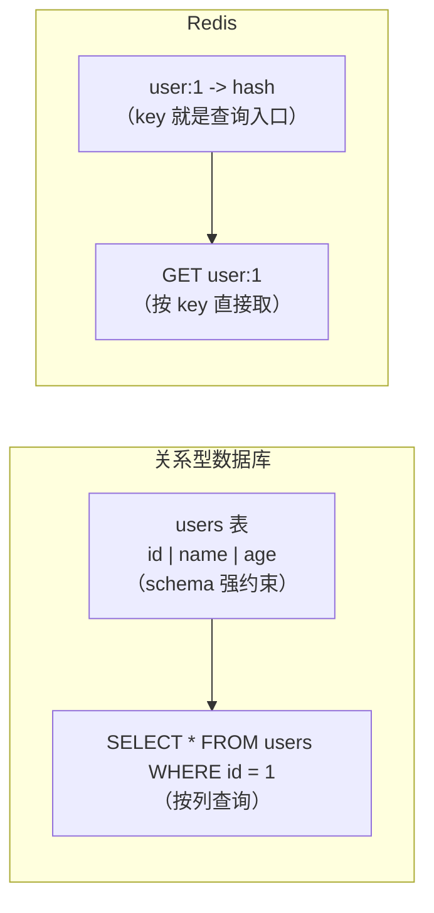
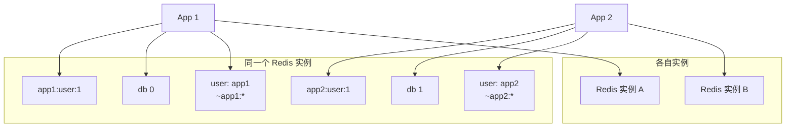
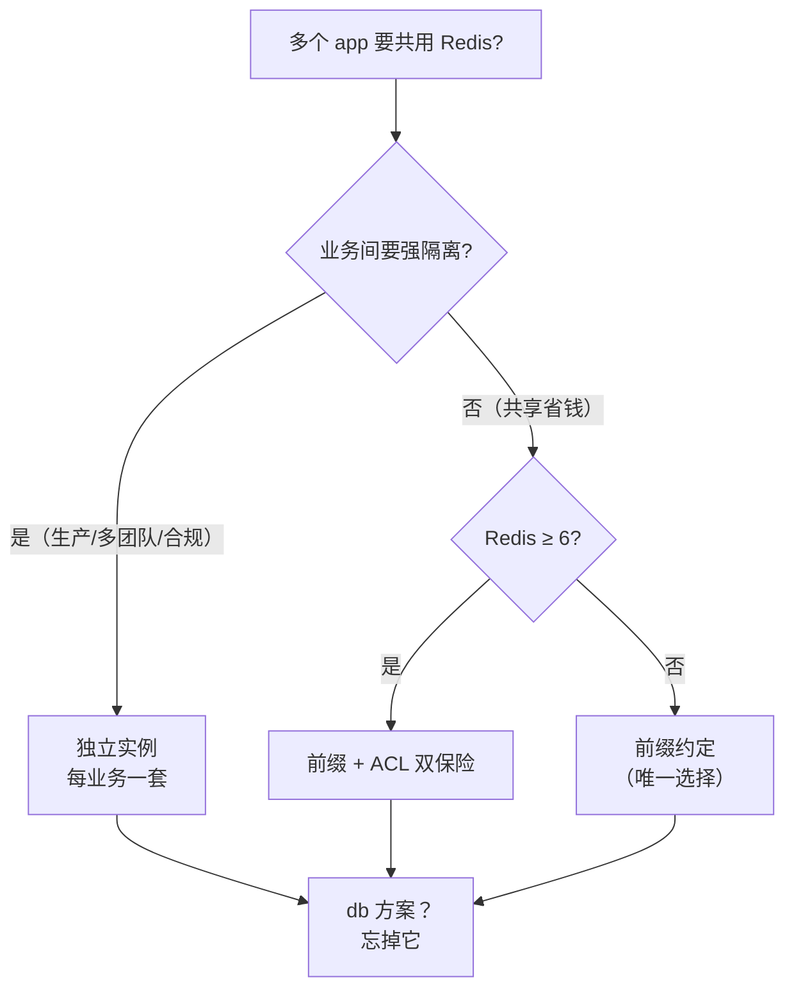

# Redis 业务隔离方案拆解：没有表的世界里，两个 app 怎么共用

给 K3s 上的 Redis 做 GitOps 规范化的时候，我把 `redis-deployment` 仓库推上去，Redis 稳稳跑在 free-arm-vm 上，Kong 的 6379 Stream 也通了。然后问题来了：这套 Redis 后面是要给多个业务共用的。第一个 app 用得很爽，第二个 app 接进来的时候，隔离怎么做？

我先问了自己一个很基础的问题：Redis 到底有没有"表"？这一问，牵出一整条问题链——没有表的话，那"业务 A 的数据"和"业务 B 的数据"靠什么分开？这篇文章就是这条问题链的完整记录：从数据模型聊到四种隔离方案，从 requirepass 聊到 ACL，最后把我自己踩的一个认知坑（跨 db 原子性）也摊开来讲。

---

## 一、 先回答最基础的问题：Redis 没有表，那它有什么

没有。Redis 是最典型的 NoSQL 键值库，没有 schema、没有表、没有行/列、没有 SQL。数据模型就一句话：`key -> value`，key 永远是字符串，value 有类型——string、hash、list、set、zset、stream，还有 bitmap、HyperLogLog 这些边角料。

关系型数据库和 Redis 的差别，本质是"你用什么去找数据"：



关系型是"表 + 主键 + SQL 查询"的心智模型，Redis 是"key 命名 + 数据结构"的心智模型。**"没有表"不是 Redis 的缺陷，是它的设计**——把查询路径砍到最短，换来 O(1) 级别的读写。

但"没有表"直接带出一个问题：表都没了，业务之间的数据怎么划地盘？这就引出了第二个问题。

---

## 二、 两个 app 共用 Redis：业界就这四种玩法

把能想到的方案全列出来，就四种，按隔离强度从弱到强：

| 方案 | 隔离手段 | 本质 |
|---|---|---|
| 1. key 前缀命名空间 | `app1:xxx` / `app2:xxx` | 纯约定 |
| 2. 逻辑 database | `SELECT 0~15` | 键空间分开 |
| 3. ACL 用户隔离 | Redis 6+ 用户 + key pattern | 权限强制 |
| 4. 独立实例 | 各自进程/端口/持久化 | 物理隔离 |



下面逐个拆，优缺点都摆出来。

### 方案一：key 前缀命名空间

最简单，零成本：`app1:user:123`、`app2:user:123`，靠 key 名前缀做逻辑分区。`SCAN app1:*` 就能扫出某个业务的所有 key。

- 优点：实现零成本，不需要任何配置；**Cluster 模式下唯一的选择**（后面会解释为什么）
- 缺点：**纯靠约定，没有强制力**。任何人写 key 忘了带前缀，数据就串了。代码 review 拦不住所有手滑，文档约定挡不住新同学。

### 方案二：逻辑 database（SELECT 0~15）

一个实例默认 16 个 db（`databases 16` 配置），每个 db 是独立键空间：`FLUSHDB` 只清当前库，TTL 过期互不干扰。看起来"表"的意思有了——把每个 db 当成一张表，业务 A 用 db 1，业务 B 用 db 2。

- 优点：配置一行搞定，天然把键空间分开
- 缺点：一堆，而且都很致命，见第五章专门拆

### 方案三：ACL 用户隔离（Redis 6+）

Redis 6 引入真正的 ACL。给每个业务建一个用户，带自己的密码和 key 权限：

```
ACL SETUSER app1 on >pass1 ~app1:* +@all -@dangerous
ACL SETUSER app2 on >pass2 ~app2:* +@all -@dangerous
```

app1 只能碰 `app1:*` 前缀的 key，碰 `app2:*` 直接 `NOPERM`。这是**权限层面的强制隔离**，不是约定。

- 优点：真正"摸不到"的隔离，还能顺带限制危险命令（`-@dangerous` 禁掉 FLUSHALL/KEYS 之类）
- 缺点：Redis 6 以下没有；配置比前缀麻烦一点

### 方案四：独立实例

各起各的进程、端口、持久化，物理隔离。

- 优点：彻底干净，故障域、容量、安全边界全部分开
- 缺点：多一套资源、多一份运维。但这是大公司的最终答案，见第六章

---

## 三、 requirepass 的真相：一个密码 = 一个身份

在聊方案三之前，先澄清一个常见误解。很多人还在用老式认证：

```
# redis.conf
requirepass  my-secret-password
```

这玩意儿**没有用户概念**——全局一个密码，所有客户端 `AUTH` 上来都是同一个身份（default 用户），权限一模一样，没有粒度可言。技术上它其实是 ACL 的兼容简写，等价于：

```
ACL SETUSER default on >my-secret-password ~* +@all
```

也就是说：`requirepass` = "给 default 用户设了个密码，且给了全部权限"。所以 requirepass 模式下谈业务隔离，**只有前缀约定一条路**，因为大家都是一个身份、全权限。要真正的多用户隔离，只能上 ACL。

---

## 四、 多 db 为什么是坑：五个硬伤 + 一个认知反转

方案二看起来最像"表"，但它其实是四种方案里最不该用的。逐条拆，每条都有实测或源码证据。

### 4.1 它不是安全边界

db index 没有权限概念。只要客户端能连上（过了认证），`SELECT 3` 随便切，没有任何机制能限制"app1 只能碰 db 1"。

ACL 也救不了。ACL 的 key pattern 是**跨 db 生效**的——我实测了一把。建一个用户只给 `~app1:*`：

```
redis-cli ACL SETUSER app1 on '>pass1' '~app1:*' +@all

# db0 里
redis-cli --user app1 --pass pass1 -n 0 SET app1:x v
# (OK)
redis-cli --user app1 --pass pass1 -n 0 SET app2:x v
# (NOPERM this user has no permissions to access one of the keys used as arguments)

# 切到 db1 再试
redis-cli --user app1 --pass pass1 -n 1 SET app1:y v
# (OK)
redis-cli --user app1 --pass pass1 -n 1 SET app2:y v
# (NOPERM ...)
```

看到了吗：db1 里同样被 `~app1:*` 约束。ACL 的 key pattern 不区分 db，所以"db1 给 app1、db2 给 app2"这种 per-db 授权**根本做不出来**。ACL 里顶多禁掉 `select` 命令，但那是"谁都不能切"，不是"每个人只能切到自己的 db"。

结论：多租户共享时，db 隔离纯属心理安慰。

### 4.2 Cluster 模式直接把这条路堵死

Redis Cluster **只有 db 0**，`SELECT` 直接报错。这意味着：上了多 db，将来想从单实例平滑扩容到 Cluster，就得先把所有 key 迁回 db 0、改造应用、加前缀——等于推倒重来。

db 方案把将来的架构路线堵死了，这是它最大的原罪。官方在 Cluster 里直接砍掉 db 0 以外的东西，等于官方表态：这玩意儿就是历史遗留。

### 4.3 资源完全不隔离，键空间隔离是假象

键空间分开了，但底层全是共享的。最隐蔽的坑是内存：

- **maxmemory 是实例级的**。db 1 写爆触发 eviction 时，**LRU 淘汰是全局的**——可能把 db 2 里最近没访问的 key 干掉。db 2 的数据被 db 1 的流量间接淘汰，出事故的时候根本想不到是这个原因
- **AOF rewrite、RDB 快照、大 key 删除、慢命令**——全是实例级的动静，一个 db 的折腾所有 db 一起扛
- **阻塞操作**：有人对 db 3 跑 `KEYS *`，整个实例所有 db 全部卡住

### 4.4 连接池串库：经典事故

`SELECT` 是**连接级状态**。很多客户端库（尤其懒加载/异步连接池）复用时不会重置 db index：请求 A 选了 db 1，连接归还池子，请求 B 复用同一连接、以为是 db 0，结果读写到 db 1。这种 bug 随机复现，极难排查。

### 4.5 运维粒度太粗

- 监控：INFO 按实例粒度，看不出哪个 db 内存爆了、哪个 db 有热点
- 备份恢复：RDB/AOF 是整实例的，没法只备份 db 2；恢复也是整库覆盖
- 复制：slave 复制全部 db，db 0 的数据量拖慢所有 db 的同步
- 误操作：`FLUSHALL` 一条命令把 16 个 db 全清了，db 隔离在这种事故面前等于零

### 4.6 认知反转：跨 db 原子操作，其实可以做

写到这里必须承认一个我自己的错误。我一开始笃定地跟人说："`SELECT` 不能进 `MULTI/EXEC`，所以跨 db 的更新做不了原子操作。"

然后我去翻了 Redis 7.2 的源码，`src/commands/select.json`：

```json
"command_flags": [
    "LOADING",
    "STALE",
    "FAST"
]
```

没有 `NO_MULTI` 标志。也就是说 SELECT 允许进事务。为了确认，我直接在本机装了个 Redis 7.0.15 实测：

```
127.0.0.1:6379> MULTI
OK
127.0.0.1:6379> SELECT 1
QUEUED
127.0.0.1:6379> SET mykey 1
QUEUED
127.0.0.1:6379> EXEC
1) OK
2) OK
```

能跑。跨 db 的原子操作在 MULTI 里是可行的。再测一脚，Lua 脚本里 SELECT 居然也允许，而且真的切换了 db：

```
redis-cli EVAL 'redis.call("SELECT", 1); redis.call("SET", "scriptkey", "v"); return "done"' 0
# done

redis-cli -n 0 EXISTS scriptkey   # (integer) 0
redis-cli -n 1 EXISTS scriptkey   # (integer) 1
```

这跟我记忆里的"SELECT is not allowed in script"完全相反——至少在 Redis 7.x 上，脚本里 SELECT 是合法的，执行后连接还停在切过去的 db。所以"跨 db 做不了原子操作"这条**不成立**，我之前的说法是错的。多 db 的坑很多，但这条不算。

顺带再补一个查证：网上有传言说 Redis 8 引入了类似"表/字典"的命名空间特性，我特意翻了 redis/redis 仓库 8.0 分支的 `00-RELEASENOTES`——8.0 的新特性是搜索索引、vector sets、I/O 多线程这些，没有任何表/字典命名空间的东西。**"没有表"这个心智模型，在最新版里依然成立。**

---

## 五、 大公司生产环境里，到底怎么选

答案其实很干脆：**独立实例（按业务拆分实例/集群）是大公司的主流**，共享场景用前缀 + ACL，多 db 基本被禁用。

大公司要的是这四样，只有独立实例能全部满足：

- **故障域隔离**：一个业务的 Redis OOM、主从切换、大 key，不能把别的业务一起拖死
- **容量隔离**：每个业务独立规划内存、独立扩容，互不抢资源
- **安全合规**：支付数据和缓存不是一个安全等级，一个实例一个安全边界才好审计
- **运维自治**：各自升级、各自持久化策略、各自监控告警

云上的形态就是"每业务一个云 Redis 实例/集群"（阿里云、AWS ElastiCache、GCP Memorystore 都是这个玩法），大厂内部往往还做 Redis 平台，按业务自助申请开实例。

共享实例的场景（小团队、成本敏感期）里，主流组合是 **key 前缀 + ACL**：前缀做逻辑组织，ACL 做强约束，双保险。

完整的选择逻辑：



一句话总结：**业务间隔离靠实例，实例内多租户靠前缀 + ACL，db 基本不存在。**

---

## 六、 复盘

1. **"没有表"是 Redis 设计的一部分，不是缺陷**。关系型按列查，Redis 按 key 取，业务隔离的手段也完全不同：关系型靠 schema/表，Redis 靠命名空间。
2. **四种隔离方案，按强度排：前缀 < db < ACL < 独立实例**，但强度不等于正确性——db 看似隔离键空间，实则既不安全也不隔离资源，还是唯一堵死 Cluster 扩容路的方案。
3. **requirepass 没有用户概念**，本质是给 default 用户设密码 + 全权限。要真隔离，Redis 6+ 上 ACL 是必须的。
4. **能实测就不要靠记忆**。我信誓旦旦说"SELECT 不能进事务"，源码 + 实测双重打脸。Redis 这种可以本地秒起的软件，一个 `redis-server` 加几条 `redis-cli` 就能把结论钉死，比翻文档靠谱。
5. **选型跟着规模走**：一个实例自用，前缀够了；多业务共享，前缀 + ACL；多团队/合规，独立实例。别一上来就上重方案，也别在 db index 上抠。
