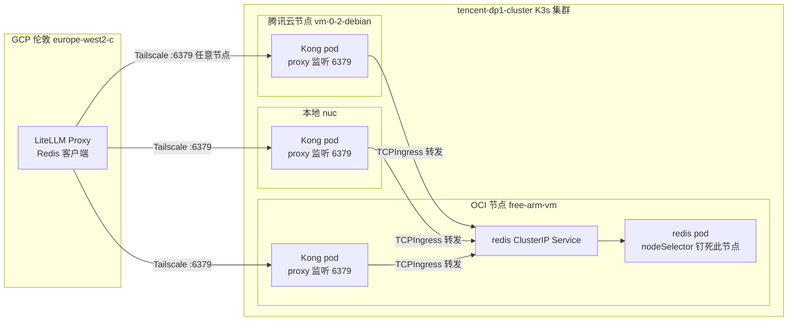
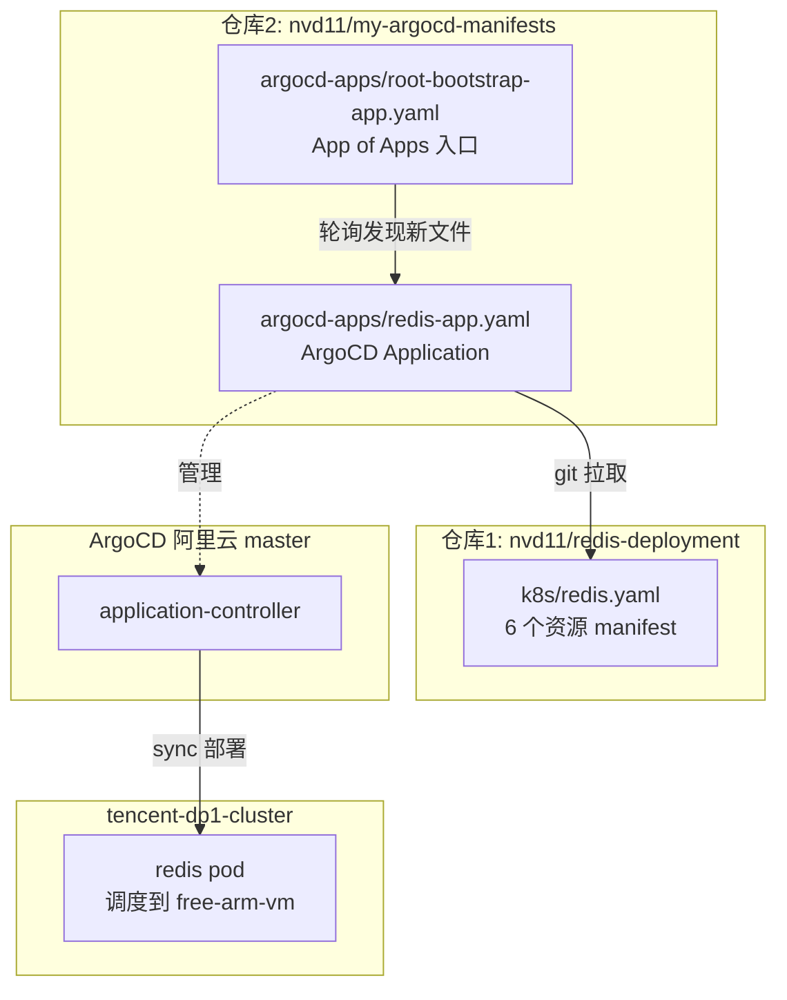

# Redis 上 K3s 全记录：从方案演进到钉死 OCI 节点的 GitOps 部署

## 背景

我的 Redis 部署需求很简单：给 GCP 上的 LiteLLM 实验应用提供一个带密码的 Redis，做 prompt 缓存和限流。但"简单"的 Redis 在我这套跨云环境里折腾了三轮方案才定稿。这篇博客记录完整的规划和部署过程，重点是**为什么指定 OCI 节点**、**配置代码是怎么分布的**。

## 一、方案演进：为什么最终上了 K3s

Redis 的部署方案我前后换了三次，不是闲的，是每次都有具体的痛点。

### 第一轮：apt 直装

最初的想法是直接在 OCI 的 free-arm-vm 上用 apt 装 redis-server。仓库里留了这套方案的痕迹：`install.sh`（规范化安装脚本）、`config/redis.conf`（持久化 + 安全配置）、`scripts/backup.sh` 和 `scripts/healthcheck.sh`（运维脚本）。

痛点：机器是裸的，装完要自己管 systemd、配置、备份、健康检查。而且 free-arm-vm 已经是 K3s 的 worker 节点，我既然整个集群都在 GitOps 化，单独留一台机器用 apt 管 Redis，属于开倒车。

### 第二轮：Docker Compose

仓库里有 `docker-compose.yml` 和 `docker-up.sh`，镜像用 `redis:7.2-alpine`，配置走环境变量和挂载。

痛点：还是"一台机器上的一个容器"，没有声明式管理，没有自愈，机器挂了 Redis 跟着挂，没人拉它起来。

### 第三轮：K3s + ArgoCD GitOps（最终方案）

**既然是 K3s 集群，Redis 就该作为集群里的一个 workload 跑，用 ArgoCD 做 GitOps 自动发布**——和集群里其他应用（fastapi-svc、quarkus-svc、Kong）同一套玩法：

- manifest 进 Git，ArgoCD 轮询，集群自动收敛到 Git 声明
- 节点挂了，pod 自动重新调度（虽然我们钉死了节点，但进程级自愈是有的）
- 探针、资源限制、Secret 注入这些能力白拿

## 二、为什么指定 OCI free-arm-vm

这是这篇博客的核心问题之一。Redis 作为**有状态服务**，节点选择不是随意的，我的原则是：

### 1. 数据必须落在稳定区

我有条硬性原则：**GCP 项目随时可能被回收（学习用途），有状态数据绝不部署在 GCP**。而 Redis 的持久化数据（local-path PVC 落盘）属于典型有状态。

OCI 的 free-arm-vm 是 Always Free 的常驻资源，不在"随时可能回收"的名单里，是稳定的落盘区。所以 Redis 从一开始就锁定 OCI。

### 2. 节点是 ARM 架构，但 Redis 没这顾虑

free-arm-vm 是 ARM 节点（4C24G）。Redis 镜像 `redis:7.2-alpine` 有多架构支持，ARM 上跑毫无问题——Redis 是纯数据面，没有 x86 专属指令依赖。

但这里有个隐形的坑：如果**不指定节点**，K3s 的调度器可能把 Redis pod 调度到 x86 节点（腾讯云 vm-0-2-debian 或本地 nuc）上，而 local-path 的 PV 是绑定节点磁盘的——pod 漂到别的节点，数据就"看不见"了（local-path 的 PV 只认创建它的节点）。所以必须用 nodeSelector 钉死。

### 3. 钉节点的机制

K8s 的 nodeSelector 在 Deployment 的 pod template 里：

```yaml
spec:
  template:
    spec:
      nodeSelector:
        kubernetes.io/hostname: free-arm-vm
```

调度器（kube-scheduler）看到这个 selector，就只会在带 `kubernetes.io/hostname=free-arm-vm` 标签的节点上调度这个 pod。这是 K8s 原生的节点亲和，不是 Redis 或 ArgoCD 特有的东西。

## 三、整体架构：Kong Gateway L4 连接

### 从 hostNetwork 直连到 Kong 透传

我最初的设计是 Redis 用 `hostNetwork: true` 直接绑 free-arm-vm 的 6379，客户端（LiteLLM @ GCP）经 Tailscale 直连 `100.105.130.0:6379`。这个方案简单，但有个致命冲突：**Kong 的 DaemonSet 也监听 6379（L4 Stream），Redis 和 Kong 会在 free-arm-vm 上抢同一个端口，Redis pod 根本起不来**。

所以新架构改成：Redis 只暴露 ClusterIP Service，Kong 的 L4 Stream 监听 6379 做入口，经 TCPIngress 转发到 Redis Service。



### 新旧方案对比

| 对比项 | hostNetwork 直连（旧） | Kong Gateway L4（当前） |
|---|---|---|
| 端口暴露 | Redis 直绑节点 6379 | 统一由 Kong 管理，Redis 只暴露 ClusterIP |
| 冲突风险 | 和 Kong 抢 6379，起不来 | 无冲突 |
| 安全 | Redis 裸奔节点端口 | 网关层统一收口 |
| 高可用 | 单节点，挂了就断 | 3 节点 Kong DaemonSet 都能转发 |

### 直连 OCI VM 的安装思路（被放弃的方案）

在定稿 Kong 方案之前，我认真想过**直连 OCI VM** 这条路：Redis 不进 K8s，直接在 free-arm-vm 上用 apt 或 Docker 装，监听节点 6379，客户端（LiteLLM）经 Tailscale 直连 `100.105.130.0:6379`。仓库里这套方案的痕迹现在还在：

```
redis-deployment/
├── install.sh              ← apt 直装：装 redis-server + 应用规范化配置
├── config/redis.conf       ← 持久化（appendonly）+ 安全配置
├── docker-compose.yml      ← Docker 方案：redis:7.2-alpine + 挂载 + 密码 env
├── docker-up.sh            ← Docker 方案启动脚本
└── scripts/
    ├── backup.sh           ← RDB/AOF 备份
    ├── healthcheck.sh      ← redis-cli ping 健康检查
    └── redisinsight.sh     ← 可视化工具部署
```

两种直装方式的形态：

```
【apt 直装】
free-arm-vm 上 apt install redis-server
  → systemd 管 redis 进程
  → config/redis.conf 覆盖默认配置
  → 监听 0.0.0.0:6379（Tailscale 网内可达）
  → 客户端直连 100.105.130.0:6379

【Docker Compose】
free-arm-vm 上 docker compose up
  → docker-compose.yml 定义 redis:7.2-alpine
  → 端口映射 6379:6379（绑 Tailscale IP）
  → 数据卷挂载本地磁盘
  → 客户端同样直连 100.105.130.0:6379
```

**为什么最后放弃了这条路**：

1. **和 K3s 抢占节点资源**：free-arm-vm 已经是 K3s worker，apt/docker 直装的 Redis 是"集群外的野进程"，不归 K8s 管，节点资源分配、重启策略都失控
2. **没有自愈和探针**：Redis 挂了不会自动拉起来，没有 liveness/readiness
3. **和 Kong 的端口冲突**：即使直装成功，Kong DaemonSet 的 6379 Stream 监听会和它抢端口（这是 K3s 方案也踩过的坑，直装方案同样躲不开）
4. **GitOps 一致性**：整个集群都在 ArgoCD 管，单独留一台机器用脚本管 Redis 是开倒车

但直连方案有个**无法否认的优点：网络路径最短**。客户端到 Redis 只有一跳（GCP → free-arm-vm 的 Tailscale 直连），而 K3s 方案里同节点也要过 Kong 那一层。这个差异到底有多大，值得实测——见后面"延迟对比测试"一节。

## 四、配置代码分布（重点）

这套部署的配置分散在两个 Git 仓库里，职责划分很清晰，这是 GitOps 的典型形态。先看总览：



### 仓库 1：`nvd11/redis-deployment` —— 放"要部署什么"

这个仓库只回答一个问题：**Redis 这个 workload 长什么样**。三层方案并存，`k8s/` 是当前生产方案：

```
redis-deployment/
├── k8s/redis.yaml          ← 当前生产方案：K3s manifest（6 个资源）
├── docker-compose.yml      ← 备选方案 1：Docker Compose
├── docker-up.sh            ← 备选方案 1 的启动脚本
├── install.sh              ← 备选方案 2：apt 直装脚本
├── config/redis.conf       ← 备选方案 2 的 Redis 配置
├── scripts/backup.sh       ← 备份脚本（跨方案通用）
├── scripts/healthcheck.sh  ← 健康检查脚本
├── scripts/redisinsight.sh ← RedisInsight 部署脚本
└── README.md               ← 架构说明 + 部署流程 + 连接验证
```

`k8s/redis.yaml` 一个文件里塞了 6 个资源（用 `---` 分隔），全部围绕"钉死 free-arm-vm + 经 Kong 连接"设计：

| # | 资源 | 关键配置 | 职责 |
|---|---|---|---|
| 1 | Namespace `redis` | - | 隔离命名空间 |
| 2 | Secret `redis-secret` | `redis-password: CHANGE_ME` | 密码注入（占位符，上线前必改） |
| 3 | PVC `redis-data` | `local-path`, 10Gi, RWO | 数据落 free-arm-vm 本地磁盘 |
| 4 | Deployment `redis` | **nodeSelector 钉 free-arm-vm**、redis:7.2-alpine、appendonly、探针、Secret 注入 | 核心 workload |
| 5 | Service `redis` | ClusterIP 6379 | 集群内访问入口 |
| 6 | TCPIngress `redis-tcp` | Kong :6379 → redis Service | Kong L4 转发规则 |

Deployment 里几个值得注意的点：

```yaml
# k8s/redis.yaml (Deployment 部分)
spec:
  replicas: 1
  template:
    spec:
      nodeSelector:
        kubernetes.io/hostname: free-arm-vm   # 钉死 OCI 节点
      containers:
        - name: redis
          image: redis:7.2-alpine
          command: ["redis-server", "--appendonly", "yes",
                    "--appendfsync", "everysec",
                    "--requirepass", "$(REDIS_PASSWORD)"]
          env:
            - name: REDIS_PASSWORD
              valueFrom:
                secretKeyRef:
                  name: redis-secret
                  key: redis-password
          livenessProbe:   # redis-cli ping 探针
          readinessProbe:
```

- `--appendonly yes`：开启 AOF 持久化，配合 local-path PVC 落盘
- `--requirepass` 从 Secret 注入，密码不写死在 manifest 里
- 探针用 `redis-cli -a $REDIS_PASSWORD ping` 验证真实可用性（带密码的 Redis 用 ping 探针必须带 auth，不然永远不 ready）

### 仓库 2：`nvd11/my-argocd-manifests` —— 放"部署到哪、怎么管"

这个仓库回答：**Redis 部署到哪个集群、哪个命名空间、如何被 ArgoCD 管理**。只加一个文件就完成注册：

```
my-argocd-manifests/
└── argocd-apps/
    ├── root-bootstrap-app.yaml   ← App of Apps 入口（已存在）
    ├── redis-app.yaml            ← 本次新增
    ├── kong-controller-app.yaml  ← Kong（已存在，配置了 6379 stream）
    └── ... 其他子应用
```

`redis-app.yaml` 是 ArgoCD 的 Application 对象，它自己不包含任何 Redis 配置，只做"接线"：

```yaml
apiVersion: argoproj.io/v1alpha1
kind: Application
metadata:
  name: redis
  namespace: argocd
  annotations:
    argocd.argoproj.io/sync-wave: "3"   # 在 Kong（波次 2）之后部署
spec:
  project: default
  source:
    repoURL: 'https://github.com/nvd11/redis-deployment.git'  # 指向仓库 1
    path: k8s                                                # 只盯 k8s 目录
    targetRevision: HEAD
  destination:
    name: 'tencent-dp1-cluster'   # 目标集群
    namespace: redis
  syncPolicy:
    automated:
      prune: true
      selfHeal: true
    syncOptions:
      - CreateNamespace=true
```

### 两层职责分离（这是理解整套配置分布的关键）

```
ArgoCD Application (redis-app.yaml) 只指定：
  → 部署到哪个集群 (destination.name: tencent-dp1-cluster)
  → 哪个命名空间 (namespace: redis)
  → 从哪个 repo 拉 manifest (source.repoURL: redis-deployment.git)

K8s Manifest (k8s/redis.yaml) 指定：
  → pod 落到哪个节点 (nodeSelector: free-arm-vm)
  → 运行参数 (镜像、AOF、密码、探针)

节点调度是 kube-scheduler 的职责，ArgoCD 不干预
```

**"指定 OCI 节点"这件事，发生在 manifest 层，不在 Application 层**。Application 只负责"把这堆 manifest 同步到 tencent-dp1-cluster 的 redis 命名空间"，至于 pod 长在哪台机器上，是 manifest 里的 nodeSelector + scheduler 说了算。这个分离很容易搞混，我一开始也被绕进去过。

## 五、部署步骤（实操）

整个部署分三步，全部通过 Git 触发，没有手动 kubectl 改生产配置：

### 第一步：确认 Kong 的 6379 Stream 就绪

Kong 的 `kong-controller-app.yaml` 里已经配了 `proxy.stream`：

```yaml
proxy:
  externalTrafficPolicy: Local
  stream:
    - containerPort: 6379
      servicePort: 6379
```

确认 proxy Service 已经监听：

```
kubectl -n kong-system get svc kong-ingress-controller-kong-proxy
# 6379:30745/TCP 出现在 PORT(S) 里
```

### 第二步：改造 manifest（hostNetwork → ClusterIP + TCPIngress）

`k8s/redis.yaml` 从旧的 hostNetwork 直连模式改成 ClusterIP + TCPIngress 模式，改动三处：

```
去掉 hostNetwork: true          ← 避免和 Kong 抢节点 6379
新增 redis ClusterIP Service    ← 集群内访问入口
新增 TCPIngress redis-tcp       ← Kong 6379 → redis Service
```

改动后在集群侧做 dry-run 验证（本地 kubectl 没连集群，用集群上的）：

```
namespace/redis created (dry run)
secret/redis-secret created (dry run)
persistentvolumeclaim/redis-data created (dry run)
deployment.apps/redis created (dry run)
service/redis created (dry run)
tcpingress.configuration.konghq.com/redis-tcp created (dry run)
```

6 个资源全部通过，提交推送（commit `242fcff`）。

### 第三步：注册 ArgoCD 应用

在 `my-argocd-manifests/argocd-apps/` 新增 `redis-app.yaml`（上面那段），提交推送（commit `0a81896`）。

然后什么都不用做——**ArgoCD 的 App of Apps 模式自动接手**：

```
root-bootstrap 轮询 my-argocd-manifests (默认 180s)
  → 发现 argocd-apps/ 目录多了 redis-app.yaml
  → 在集群里创建 redis Application 对象
  → redis Application 按 automated 策略自动同步
  → 从 redis-deployment.git 拉 k8s/ 目录
  → 部署 6 个资源到 tencent-dp1-cluster
```

轮询等不及的话可以手动触发一次硬刷新（实战里我就是这么干的）：

```
kubectl patch app root-bootstrap -n argocd --type merge \
  -p '{"metadata":{"annotations":{"argocd.argoproj.io/refresh":"hard"}}}'
```

## 六、验证与踩坑

### 验证：nodeSelector 是否真的钉死了

```
kubectl -n redis get pod -o wide
# NAME                     READY  STATUS   NODE
# redis-648bcf8788-mhmwh   1/1    Running  free-arm-vm   ← 钉死成功
```

### 验证：端到端连通

经 Kong 从集群外连（任意节点 Tailscale IP 的 6379）：

```
100.77.64.95:6379   AUTH: +OK   PING: +PONG
100.105.130.0:6379  AUTH: +OK   PING: +PONG
```

### 踩坑一：CHANGE_ME 占位符

Secret 里的密码是 `CHANGE_ME` 占位符，测试可以用，上线必须换。换密码的方式：

```
kubectl create secret generic redis-secret \
  --from-literal=redis-password='你的强密码' -n redis
```

然后滚动重启 pod 让新的 Secret 生效。这个坑不大，但容易忘——尤其是 ArgoCD 的 selfHeal 会把 Secret 改回去（manifest 里写死的是 CHANGE_ME），所以**上线前应该先把 manifest 里的占位符也一起改掉**，否则改了 Secret 又被 selfHeal 覆盖。

### 踩坑二：svclb 端口失同步

部署完成后 6379 连接被 reset，最后定位到 svclb DaemonSet 没跟上 svc 的端口变更（详见另一篇《Redis 经 Kong Gateway 的流量路径与 svclb 端口失同步排障记》）。修复方式一句话：删掉 svclb DaemonSet 让它重建。

## 七、延迟对比测试：直连 vs 经 Kong

既然直连 OCI VM 的方案当初纠结过，那就用数据说话。测试环境：客户端在 GCP 伦敦的 VM（LiteLLM 所在，`tf-vpc0-subnet0-openclaw`），Redis 在 free-arm-vm。两个维度的测量：

**测量一：经 3 个 Kong 入口的应用层延迟**（同连接连续发 100 次 `PING`，统计 RTT）

```
入口                   节点               min      avg      max      p50      p95
─────────────────────────────────────────────────────────────────────────────
100.105.130.0:6379   OCI free-arm-vm    165.82   166.03   166.57   166.03   166.16
100.104.150.19:6379  nuc (本地)          278.89   287.24   541.13   281.04   287.03
100.77.64.95:6379    腾讯云 vm-0-2      476.26   477.47   481.28   477.02   479.85
```

**测量二：ICMP 网络地板**（ping 3 个节点各 10 次）

```
100.105.130.0 (free-arm-vm)  min=165.40  avg=182.52  max=334.26
100.104.150.19 (nuc)         min=226.06  avg=245.10  max=409.20
100.77.64.95 (腾讯云)         min=247.39  avg=273.07  max=496.65
```

### 数据解读

**1. 直连 ≈ 经 Kong（同节点入口），Kong 层的开销可以忽略**

直连 OCI VM 的路径是 GCP → free-arm-vm 的 Tailscale 直连，理论上只有网络地板。而经 Kong 走 `100.105.130.0` 入口时，Redis pod 就在这个节点，流量是"同节点 svclb → 同节点 Kong → 同节点 redis"，Kong 透传的开销在微秒级。

实测：经 Kong 的 `avg 166.03ms` 和 ICMP 的 `min 165.40ms` 几乎一样（甚至更稳）——**Kong 这一层没有带来可感知的延迟**。所以"直连 OCI VM 更快"的直觉在 free-arm-vm 入口上不成立，两种方式差距 <1ms。

**2. 延迟差异全部来自"客户端到哪个入口节点"，不是架构选择**

```
free-arm-vm 入口: GCP → 新加坡直达                              ≈ 166ms
nuc 入口:        GCP → 本地 + nuc → free-arm-vm (flannel 跨节点) ≈ 287ms
腾讯云入口:      GCP → 大陆 + 腾讯云 → free-arm-vm (flannel)     ≈ 477ms
```

nuc 和腾讯云入口都叠加了第二段 WAN（入口节点 → free-arm-vm 的 flannel 隧道），腾讯云入口甚至接近两倍延迟。

**3. 对客户端配置的结论**

```
最优: 100.105.130.0 (free-arm-vm)   ≈ 166ms  同节点直达，和直连无差别
备选: 100.104.150.19 (nuc)          ≈ 287ms
保底: 100.77.64.95 (腾讯云)         ≈ 477ms  仅当其他节点全挂
```

LiteLLM 配 `100.105.130.0` 就拿到了直连方案的延迟，同时还白赚了 K3s 的自愈、探针和 GitOps——**Kong 网关方案在延迟上无损，在运维上有增益**，这笔账是划算的。

## 八、经验总结

1. **有状态服务先定节点，再谈部署**：local-path 的 PV 绑定节点磁盘，pod 漂移等于数据丢失，nodeSelector 钉死是必须的。
2. **配置分布的两层模型**：Application（部署到哪）和 Manifest（长什么样）分离，改节点调度只动 manifest，改目标集群只动 Application。
3. **GitOps 的"最后一公里"是注册**：manifest 写好了不代表部署了，要让 App of Apps 发现它（加一个 Application 文件 + 推送）。
4. **端口冲突提前算**：hostNetwork 直绑端口前，先确认集群里有没有别的组件占了同一端口（Kong 的 6379 就是个例子）。
5. **Secret 占位符和 selfHeal 的配合坑**：manifest 里的占位符不一起改，改了 Secret 也会被 ArgoCD 拉回去。
6. **网关层延迟焦虑要实测**：直连和经网关的差距往往在毫秒级甚至可忽略（同节点入口实测 <1ms），真正的延迟大头是客户端到入口节点的网络路径——先测再选，别靠直觉。
