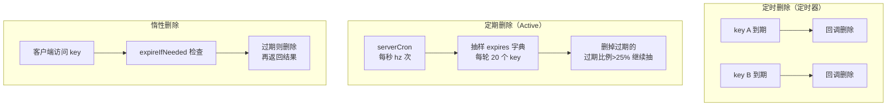
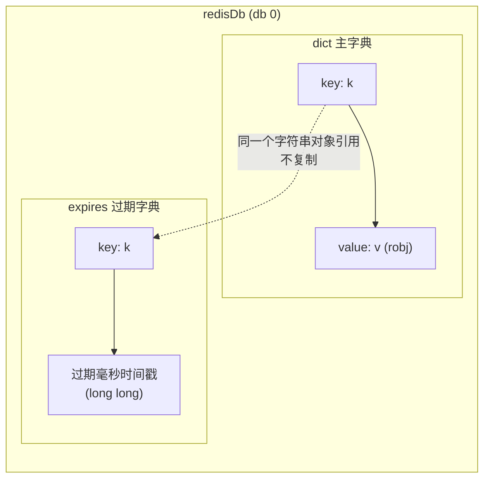
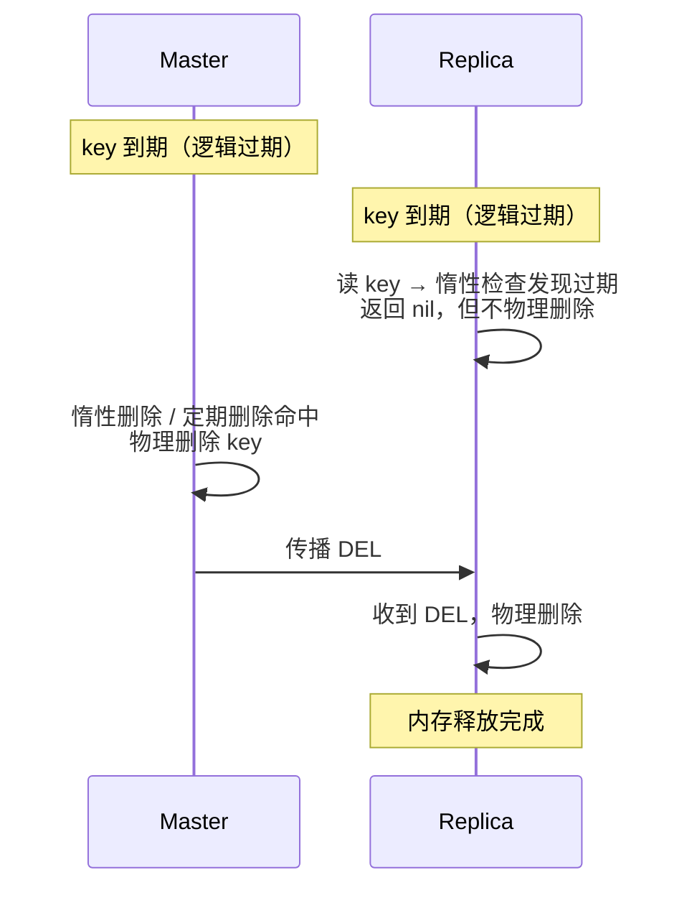

# Redis Key 过期机制拆到底：expires 字典、抽样清理与主从传播

准备 Redis 面试题的时候，我从"过期机制是什么"这个问题开始，一路被自己的追问带进了源码里。问题是这样的：

- 面试第一问：Redis 怎么删过期 key？
- 追问一：过期时间到底存在哪？在 value 里吗？
- 追问二：EXPIRE / PEXPIRE / EXPIREAT 什么区别？
- 追问三：TTL 是不是一个命令？
- 追问四：定期删除和定时删除有什么区别？
- 追问五：主从复制下过期怎么处理？
- 追问六：业务代码需要自己写删除逻辑吗？

这篇是这条问题链的完整记录。为了保证每个答案不是"听说的"，我在本机装了 Redis 7.0.15 实测，还翻了 7.0 的源码（`expire.c` / `db.c` / `server.h`）。文里所有命令输出都是真实跑出来的，包括我在主从实验里踩的一个认知坑。

---

## 一、 面试第一问：Redis 怎么删过期 key？——三种策略

业界关于"过期删除"有且只有三种策略：

| 策略 | 触发方式 | 精度 | 开销 | Redis 是否采用 |
|---|---|---|---|---|
| 定时删除 | 每个 key 挂一个定时器，到点回调 | 精确，过期瞬间删 | 每 key 一个 timer，海量 key 线性膨胀 | ❌ 不用 |
| 惰性删除 | 访问 key 时才检查 | 不保证，没人访问就一直躺着 | 只删被访问的，CPU 最省 | ✅ 用 |
| 定期删除 | serverCron 周期轮询抽样 | 有延迟，下一轮抽样才删 | 固定开销，与 key 总数无关 | ✅ 用 |



面试答这题的标准姿势：**Redis 采用"惰性删除 + 定期删除"双剑合璧**——惰性保证"访问到的必删"，定期保证"没人访问的也会被清理"，在 CPU 和内存之间做折中。

## 二、 为什么不用定时删除：单线程模型的工程取舍

定时删除看似最完美（到点即删，内存零残留），但 Redis 不用的原因就两条：

1. **开销不可控**：`EXPIRE` 一个 key 就挂一个 timer，百万 key 就是百万个 timer。内存、调度成本线性膨胀，跟 Redis 高性能的定位直接冲突。定期删除的开销是**固定的**——每轮就抽 20 个 key，跟你总共有多少 key 没关系。
2. **单线程模型怕突发**：一万个 key 同一秒到期，就有一万个回调在同一秒排队执行，主线程直接卡死。定期删除有 CPU 时间预算，超时就退出——**延迟清理可以接受，阻塞不可接受**。

## 三、 定期删除的细节：serverCron 抽样循环

定期删除不是全量扫描，是"抽样 + 概率"。`serverCron`（Redis 的主循环周期任务）每秒跑 `hz` 次（默认 10），调用 `activeExpireCycle()`（`expire.c`）：

- 从每个 db 的 expires 字典**随机抽样**（默认每轮 20 个 key），删掉已过期的
- 如果过期比例 > 25%，继续循环抽样
- 有 CPU 时间预算：slow 模式最多占 25% CPU 时间，fast 模式 1ms，超时就退出
- 力度可调：`active-expire-effort`（默认 1，范围 1-10），调大 = 更激进清理，更费 CPU

实测一把——写 10000 个 1 秒过期的 key，不访问，观察后台自动清理：

```
EVAL 'for i=1,10000 do redis.call("SET", "bulk:"..i, "v", "EX", 1) end return 10000' 0
# 10000

sleep 2
DBSIZE   # 0
```

2 秒内全清完了。抽样命中率 100%（key 全过期），几轮循环就删光——这就是"过期比例高时持续循环"的机制在起作用。

注意：**没有命令可以手动触发一轮定期删除**。我查过 `COMMAND INFO activeexpirecycle`，返回空——它根本不是命令，是内部机制。你能控制的只有 `hz`（频率）和 `active-expire-effort`（力度）两个配置。

## 四、 惰性删除的细节：expireIfNeeded

所有读写命令的入口都会调 `expireIfNeeded()`（`db.c`）：先检查 key 是否过期（查 expires 字典 + 比较当前毫秒时间），过期就删除，再继续执行命令。

实测——惰性删除只在访问时触发：

```
SET lazy-key v EX 2
# OK

sleep 3
GET lazy-key    # (nil)   ← 这次 GET 触发了惰性删除
EXISTS lazy-key # 0       ← key 已经没了
```

## 五、 过期时间到底存哪：独立的 expires 字典

这是我最开始搞混的地方。我第一反应是"过期时间应该在 value 里吧，不然怎么知道这个 key 什么时候死？"——**错，完全不在 value 里**。

每个 db 里是**两张并行的哈希表**（`server.h` 的 `redisDb` 结构）：

```c
typedef struct redisDb {
    dict *dict;        /* The keyspace for this DB —— 主字典：key -> value */
    dict *expires;     /* Timeout of keys with a timeout set —— 过期字典 */
    ...
} redisDb;
```

而 value 对象本身（`redisObject`）长这样：

```c
typedef struct redisObject {
    unsigned type:4;      /* 类型 */
    unsigned encoding:4;  /* 编码 */
    unsigned lru:LRU_BITS;/* 最近访问时间（LRU/LFU 用，跟过期无关） */
    int refcount;
    void *ptr;
} robj;
```

**五个字段，没有一个存过期时间。** 那个 `lru` 是"最近访问时间"，不是"过期时间"，名字有"时间"但别被骗。

内存布局是这样的：



注意两张表的 key 是**同一个字符串对象的引用**（共享指针），过期字典每个条目额外开销就是 8 字节时间戳 + dict entry 头。

实测证明 TTL 独立于 value：

```
SET k v EX 100
TTL k        # 100        ← 从 expires 字典读

SET k v2                  ← 覆盖 value，不带 EX
TTL k        # -1         ← expires 条目被清掉，跟 value 无关

SET k v EX 100
PERSIST k    # 1          ← 只删 expires 条目
TTL k        # -1         ← value 完好
```

如果过期时间真是 value 的一个属性，覆盖 value 后 TTL 应该还在——结果它没了。行为完全符合"独立字典"模型。

反例再补一刀：有人把过期时间塞进 value（比如 JSON 里带个 `expire` 字段），实测：

```
SET k3 '{"data":"v3","expire":60}'
GET k3   # {"data":"v3","expire":60}   ← 就是个普通字符串
TTL k3   # -1                          ← Redis 不认识这个字段，key 永不过期
```

Redis 的惰性/定期删除机制**完全不看 value 内容**。塞进去的 `expire` 字段只是业务字符串的一部分，除非你业务代码自己读它做"逻辑过期"（那是另一套玩法，见后文）。

## 六、 设置过期时间的命令：相对 vs 绝对

设置过期一共四个命令，核心区别是"从现在起多久"还是"到哪个时刻"：

| 命令 | 粒度 | 相对/绝对 | 含义 |
|---|---|---|---|
| `EXPIRE key seconds` | 秒 | 相对 | 从现在起 N 秒后过期 |
| `PEXPIRE key ms` | 毫秒 | 相对 | 从现在起 N 毫秒后过期 |
| `EXPIREAT key ts` | 秒 | 绝对 | 到时间戳 ts 那一刻过期 |
| `PEXPIREAT key ts_ms` | 毫秒 | 绝对 | 到时间戳 ts_ms 那一刻过期 |

实测：

```
SET e1 v
EXPIRE e1 100          # 1
TTL e1                 # 100     ← 相对：100 秒后

PEXPIRE e1 5000        # 1
PTTL e1                # 4984    ← 相对：5 秒后

EXPIREAT e1 1786041023 # 1       ← 绝对：到点就过期
TTL e1                 # 300

EXPIREAT e1 1786040713 # 1       ← 时间戳在过去
EXISTS e1              # 0       ← 立即删除，等价于 DEL
```

两个关键认知：

1. **内部存储统一为"绝对毫秒时间戳"**。`EXPIRE e1 100` 只是命令层帮你算了 `当前毫秒 + 100000`，真正写进 expires 字典的是那个绝对时间戳。相对命令是语法糖，底层只有一种存法。
2. **相对 vs 绝对的场景**：相对是日常缓存 TTL、会话超时；绝对是定点失效——"明天零点清空"、"秒杀结束时刻"，好处是不受设置时刻影响。

Redis 7.0 还有加分项：`EXPIRE key 100 NX`（仅在无 TTL 时设）、`XX`（仅在已有 TTL 时设）、`GT`/`LT`（仅在更晚/更早时设），用于"续期不缩短"这类精细控制。

## 七、 TTL / PTTL：怎么读剩余时间

`TTL` 就是原生命令，代码里调客户端库同名方法。返回值三种情况，**必须背下来**：

```
TTL tk           # 30    ← 正数：剩余秒数
TTL tk2          # -1    ← key 存在，但没设过期时间（永不过期）
TTL no_such_key  # -2    ← key 不存在
PTTL tk          # 29923 ← 毫秒精度
```

-1 和 -2 的区分是高频考点：很多人只记得"负数"，忘了 -1 是"在但永不过期"、-2 是"根本不在"。
- `TTL` 是秒级向下取整（内部存毫秒），要精确用 `PTTL`
- 典型用途：分布式锁轮询剩余时间（Redisson 就是靠 `PTTL` 判断）、热点 key 快过期时 `EXPIRE` 续命、雪崩防护

## 八、 主从复制下的过期：master 主导，DEL 传播

这是面试最容易被问倒的部分。规则一句话：**过期删除由 master 主导，slave 不自作主张**。

源码证据（`server.c`）：

```c
/* serverCron 里：只有 master 才跑定期删除 */
if (server.active_expire_enabled) {
    if (iAmMaster()) {
        activeExpireCycle(ACTIVE_EXPIRE_CYCLE_SLOW);
    }
}

/* beforeSleep 里：slave 被直接挡掉 */
if (server.active_expire_enabled && server.masterhost == NULL)
    activeExpireCycle(ACTIVE_EXPIRE_CYCLE_FAST);
```

slave 被双重挡掉，自己不跑主动过期。它的过期完全等 master：**master 删了过期 key → 传播 DEL → slave 收到后物理删除**。

完整时序：



我在本机起了 master:16379 + slave:16380，用 `DEBUG SET-ACTIVE-EXPIRE 0` 禁用 master 的主动过期，完整复现了这套流程：

```
SET k v EX 5     # master 上
# 等 6 秒，key 已逻辑过期

[1] slave GET k   → (nil)   ← 逻辑过期，读不到（slave 惰性检查）
[2] slave DBSIZE  → 1       ← 物理还在！等 master 的 DEL
[3] master DBSIZE → 1       ← 主动过期禁用，没人访问就不删
[4] master GET k  → (nil)   ← 惰性删除触发
[5] master DBSIZE → 0       ← 物理删了
[6] slave DBSIZE  → 0       ← 收到 DEL，跟着删
```

[2] 和 [6] 就是面试官想听的：**slave 上 key 逻辑过期（读返回 nil）但物理占着内存，直到 master 的 DEL 到达才释放**。slave 的 `expireIfNeeded` 对过期 key 只返回"不存在"的结果，不执行删除——物理删除是 master 的活。

### 插一段：我踩的认知坑（EXISTS 会触发惰性删除）

主从实验第一次做的时候，我用 `EXISTS` 检查 key 是否还在，结果 `EXISTS k` 返回 0，我以为 `DEBUG SET-ACTIVE-EXPIRE 0` 没生效，白折腾了一轮。

后来才反应过来：**`EXISTS` 本身是读命令，会走 `lookupKeyRead` 触发惰性删除**！你查它的那一刻，它就被删了——你看到的 0 是"这次查询删的"，不是"早没了"。

正确的物理存在性检查是 `DBSIZE`（只数 dict 大小，不 lookup 具体 key，不触发惰性删除）。改用 DBSIZE 之后，真相立刻出来了：禁用主动过期后，master 的 key 确实还在。

这个坑的教训：**在 Redis 里想观察"key 物理上是否还在"，不要用 EXISTS/GET，用 DBSIZE**。你访问它的行为本身就改变它的状态。

另外两个主从细节：

- **EXPIRE 的传播会转成 PEXPIREAT 绝对时间戳 + 延迟补偿**。如果直接传播相对秒数，slave 晚收到 200ms 就晚过期 200ms，主从数据不一致。转成绝对时间戳后，两边到点各自判断，天然同步。
- **slave 提升为 master 后**，自己开始正常跑过期处理，之前等 DEL 的残留 key 会由自己的惰性/定期机制接管。

## 九、 业务代码的职责：零删除逻辑

聊到这里可以收口了：**业务代码唯一要做的就是把 TTL 声明出来，剩下的 Redis 全包**。

| 谁 | 干什么 |
|---|---|
| 业务代码 | `SET key value EX 60` 或 `EXPIRE key 60` |
| Redis 内置 | 惰性删除（访问时检查）+ 定期删除（serverCron 抽样）+ 主从 DEL 传播 |

- **不需要**：手动 DEL 过期 key、写定时 job 扫库、自己实现 timer
- 严格说 Redis 内部也没有"每 key 定时器"，是"轮询抽样 + 访问检查"，都是进程内置的

两个例外场景：

1. **想在被删时收到通知** → 用 keyspace notification，不用自己轮询：
   ```
   CONFIG SET notify-keyspace-events Ex
   PSUBSCRIBE __keyevent@0__:expired
   ```
   注意坑：**惰性删除的 key 只有被访问触发删除时才发事件**，事件可能延迟——它是"删除事件"，不是"到期闹钟"。
2. **业务主动删缓存**（更新数据库后 `DEL` 让缓存失效）——这是缓存一致性语义，不是过期机制，该写还得写。

## 十、 别混了：过期 vs 淘汰

面试官爱问"key 一直不删会不会内存爆？"——会，但那是另一套机制：

- **过期（expire）**：显式 TTL，到点删除。计划内的，业务说了算
- **淘汰（eviction）**：`maxmemory` 满了，按 `maxmemory-policy` 驱逐 key 腾空间。`allkeys-lru` 不管你设没设 TTL 都能逐；`volatile-lru` 只逐带 TTL 的。这是**被迫的**，不是计划内的

别指望用淘汰策略当 TTL 用——淘汰的时机由内存压力决定，不可预测。

## 十一、 实战坑：雪崩、逻辑过期

**缓存雪崩**：大量 key 同一时间过期，Redis 忙着删 + 后端被穿透请求打爆。根源就在定期删除的机制上——过期比例高时它持续循环抽样删除，短时间 CPU 尖峰。解法不是调机制，是**TTL 加随机抖动**，把过期时间分散。

**逻辑过期模式**：真有"永不过期但业务上会失效"的数据（比如登录态），可以 value 里存业务过期时间、读取时自己判断 + 懒刷新。但这是主动选择的另一套玩法，**默认场景别搞**——它放弃了 Redis 的惰性/定期删除，所有检查都得业务自己写，还占内存（key 永不过期）。

**加分点**：Redis 7.4 起支持 hash 字段级过期（`HEXPIRE`），对"一个 key 里多个字段不同生命周期"的场景有用，面试提一句显得跟得上版本。

## 十二、 复盘

1. **三种删除策略，Redis 选惰性 + 定期**，不选定时器——不是没想到，是单线程模型下定时器开销不可控。
2. **过期时间不在 value 里**，在独立的 expires 字典。value 是纯业务数据，判断过期 O(1) 查另一张表。
3. **设置过期 = 命令参数**（`SET EX` / `EXPIRE`），内部统一存绝对毫秒时间戳；相对/绝对的差别只在命令层算一下。
4. **TTL 的 -1 / -2 必须分清**：-1 是"在但永不过期"，-2 是"不存在"。写缓存健康检查时这两个判断错，逻辑全错。
5. **主从下过期是 master 的活**：slave 逻辑过期但物理保留，等 master 的 DEL。读写分离场景要注意：slave 上"读不到"不等于"内存释放了"。
6. **检查物理存在性用 DBSIZE，别用 EXISTS/GET**——后者会触发惰性删除，你的观察行为本身在改变系统状态。这个坑我实实在在踩了一轮。
7. **业务零删除代码**：你定死期，Redis 办葬礼。从检测到删除到传播，全程不需要你动手。
