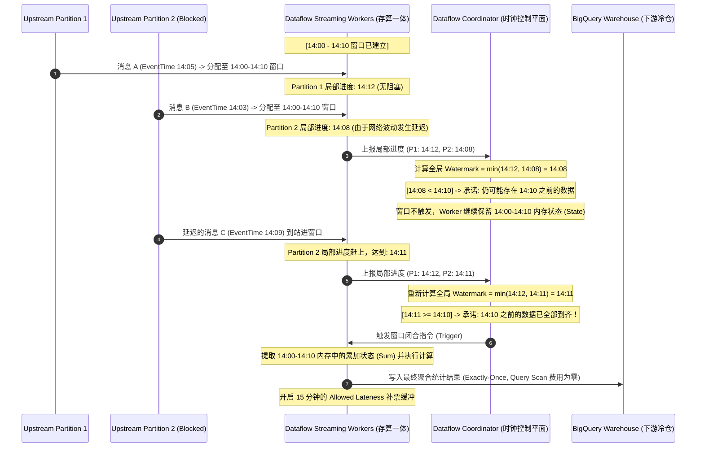

# 从无状态摄取到有状态流计算：深入剖析 Streaming ETL 中的 Window、Watermark 与流式聚合

在高并发与海量数据的实时数据工程中，如何处理“时间”与“状态”是现代数据平台架构设计的核心命题。

分布式计算的演进史，本质上是一部**“如何在物理限制（内存成本、网络带宽、磁盘 I/O）下做权衡与妥协”**的历史。本文将从底层架构视角，深度剖析 **Hadoop MapReduce** 与 **Spark RDD** 的基本概念、核心差异、容错哲学以及它们在内存管理上的物理底座。

---

## 1. 企业合规数据平台 实时流式计算架构（推模式的物理图谱）

在监管合规数据平台（企业合规数据平台）中，我们设计了**“以事件驱动、松耦合”**为原则的流式数据链路。

```
  [ Upstream App / Rapid2 ] (持续数据流)
               │
               ▼ (Avro/JSON 消息包)
    [ GCP Pub/Sub Ingestion ] (高可用解耦消息总线 ── At-Least-Once 投递)
               │
               ▼ (流式拉取 / PULL)
  [ GCP Cloud Dataflow (Apache Beam) ] (有状态流计算 ── 存算一体 Worker 节点)
        │                      │
        │ (正常流 ── 毫秒级)    │ (格式损坏/异常脏数据 ── 旁路 Side Output)
        ▼                      ▼
  [ BigQuery DW ]       [ GCS / Pub/Sub DLQ ] (死信队列 ── 完美的审计物理铁证)
```

*   **Ingestion（消息摄取）**：上游系统持续产生交易或合规风险事件，推入高可用的 Pub/Sub Topics。
*   **Transformation（计算引擎）**：Cloud Dataflow 作为完全托管的、Serverless 的流式引擎，实时消费 Pub/Sub 消息，在内存中进行清洗、状态累加（Stateful Processing）、双流关联、去重等操作。
*   **Storage/Sink（数据数仓）**：BigQuery 只负责极低开销的单向 Append 写入，作为分析底座。

---

## 2. 世纪对决：无状态流处理 vs. 有状态流处理（业务本质的分水岭）

在架构师眼中，流计算绝对没有银弹。很多初学者经常对“窗口和水位线”产生崇拜并盲目套用，但这在真实的生产中其实是非常危险的。

我们必须首先从业务的**“起算时机”**这一源头，划分出两条完全不同的技术分流：

### 2.1 场景 A：无状态流处理 / 单条数据摄取（Row-by-Row Ingestion）
*   **业务画像**：来一笔交易 ➡️ 做个格式 Mapping ➡️ 直接写进 BigQuery（例如 企业合规数据平台 绝大多数的报表、供给和传统对账场景）。
*   **物理本质**：数据像流水过河，过水即干。Dataflow Worker 的 JVM 内存中不需要保留任何数据上下文，也不需要对多条数据进行拼表或累加。
*   **架构权衡**：在这种场景下，**完全不需要 Window，也完全不需要 Watermark！** 
    *   **拉模式/按需查询的降维打击**：下游报表（Reporting）在查看数据时，才按需发起一次 BQ 聚合查询。因为查询频次极低（如每天几次），BigQuery 的列存扫描开销极低、且开发简单，这才是最优雅、最省钱的设计。

### 2.2 场景 B：有状态流处理 / 流式聚合与关联（Stateful Streaming）
一旦业务部门（如实时风控拦截、秒级欺诈检测、MLOps 实时警报）提出了以下需求：
1.  **流式聚合计算**：*“同一个交易账号，在最近 1 小时内，累计交易总额是否超过了 5 万元？”*
2.  **流流双流关联（Stream-to-Stream Join）**：*“在 10 分钟的时间窗口内，将交易流（Topic A）与审计流（Topic B）就地进行实时 Join 关联对账。”*

此时，我们**被迫必须引入 Window 和 Watermark 连招**！

#### 为什么在这个场景下，“先无状态写入 BQ，再用微服务高频轮询查询 BQ 算累加”的方案会彻底崩溃？
*   **死穴 1：成本爆炸（BigQuery 扫描费用直接破产）**：BigQuery 是列式存储（OLAP 数仓），按查询扫描的数据量收费。高并发（如每秒 10,000 笔交易）下，如果为了实时判断是否超限，每来一条交易就由服务对 BQ 发起一次 `SELECT SUM` 查询，其产生的光速消耗能让 GCP 账单在一天内直接面临几十万美元的财务崩溃。
*   **死穴 2：延迟崩溃（OLAP 无法满足毫秒级风控）**：BigQuery SQL 执行通常需要 1 到 3 秒。对于要求在小于 100 毫秒内完成授权拦截的实时风控，根本无法使用。
*   **死穴 3：读写冲突**：BigQuery 物理上不适合承载每秒数万次高频、并发点查询的联机事务（OLTP）读写压力。

---

## 3. 空间切片：深入剖析 Window（窗口）的物理内涵

Window 并不是一个静止的参数，它是流计算对无限数据流进行物理或逻辑切片的**“数据容器”**。它定义了数据的**空间计算边界（即决定哪些数据该算在一起）**。

### 3.1 时间窗口（Time Window）
最常用，如固定（Fixed）、滑动（Sliding）或会话（Session）窗口。其核心参数是 **时间区间（Duration）**。它定义了某个时间段内（Event Time）产生的数据应该被划分到同一个物理容器里。

### 3.2 数量窗口（Count Window）
其核心参数是 **元素个数（Record Count）**。
*   **生产禁忌**：**在大型金融风控中，Count Window 几乎是严禁使用的**。因为数量窗口在物理上是**没有时间边界**的。如果遇到半夜或者上游维护、数据流量骤降，这个窗口可能要等上好几天才能攒满 100 条。这会导致内存状态被长期占满、数据无法按时输出，造成**严重的延迟和 OOM 风险**。

### 3.3 概念辨析：Watermark 是窗口的属性吗？
*   **答案**：**绝对不是！水位线（Watermark）是全局系统级属性，窗口是局部临时的数据容器。**
*   **大白话比喻 ──【大堂钟表与候车室门禁】**：
    *   **Watermark 是火车站大厅中央挂的大钟**。它是一个单调递增的逻辑时钟变量，对整个大厅的所有角落（所有的 Task 和算子）唯一且全局可见。
    *   **Window 是候车室（比如 14:00 - 14:10 候车室）**。它是临时的，只要旅客（数据）手里的车票时间（Event Time）在 14:00 到 14:10 之间，他就必须进这个候车室。候车室包含一个确定的物理属性叫 **窗口截止时间（`WindowEndTime = 14:10`）**。
    *   **协同工作**：候车室的检票口门禁（Trigger 触发器）一直在时刻盯着火车站的“中央大钟”（Watermark）看。当且仅当满足 `Watermark >= WindowEndTime (14:10)` 时，门禁关闭，候车室彻底闭合，里面积攒的所有旅客（数据）开始检票上车（触发计算，一次性输出到 BigQuery）！

---

## 4. 时间进程：为什么分布式流计算中必须有 Watermark？

我们为什么不能简单地用“系统墙上时间（Processing Time）”或者“接收到了 14:10 的数据”来作为大厅的大钟，进而关闭 14:10 的窗口呢？

### 4.1 瓶颈一：系统物理时间（Processing Time）不可用
因为分布式网络存在物理延迟，上游在 `14:08:00` 产生的交易，可能在网络里堵了 5 秒，直到 `14:10:02` 才到达 Dataflow。如果 Dataflow 按照服务器系统时间 `14:10:00` 触发窗口闭合，那么这批在 `14:10:02` 到达、但实际属于上一个窗口的 `14:08:00` 交易，就会被永远漏掉，导致统计结果失真。

### 4.2 瓶颈二：单通道数据时间触发不可用（多通道进度不一致）
在分布式流式计算中，数据是**并行、多分区（Partitions）**消费的：
*   **分区 A（无阻塞）**：消费极快，已经拿到了 `14:10:02` 的消息。
*   **分区 B（严重阻塞）**：由于数据积压，目前才刚刚消费到 `14:07:00` 的消息。
如果一看到有任何消息 $\ge$ `14:10:00` 就触发窗口关闭，那么分区 A 的 `14:10:02` 消息会强行关闭全局的 `14:00 - 14:10` 窗口，导致**分区 B 正在源源不断流过来的 `14:07` 到 `14:09` 的海量数据，被无情地关在门外，造成大面积数据丢失**。

### 4.3 终极解法：全局 `min()` 约束算法
为了解决多分区数据对齐问题，Watermark 被设计为了一个基于所有活跃分区的**全局 `min()` 函数追踪器**：

$$\text{Global Watermark} = \min(\text{Local Watermark}_{\text{Partition}_1}, \text{Local Watermark}_{\text{Partition}_2}, \dots, \text{Local Watermark}_{\text{Partition}_N}) - L$$

*(其中 $L$ 为我们配置的容忍乱序的最大时延偏置)*

因为有这个 `min()` 聚合算法，只要最慢的分区 B 还停留在 `14:08`，全局 Watermark 就永远停留在 `14:08`。即便分区 A 已经跑到了 `14:12`，`14:10` 的窗口也绝不闭合，宁可产生一定的**系统延迟（System Lag）**，也要死死等候慢分区的数据。只有当最慢的分区 B 越过 `14:10` 时，全局 Watermark 才会推进到 `14:10` 并在数学上确认：“我们保证 14:10 之前的数据在整个分布式网络中已全部到齐了！”窗口此时才安全触发计算，从而实现了数据的 100% 绝对准确与强一致。

---

## 5. 容忍度参数的终极对决：延迟偏置 $L$ 还是 允许迟到（Allowed Lateness）？

在流式有状态计算中，有两个容易被混淆的“容忍度/等候”参数。区分它们的职责是检测资深开发与普通新手的关键分水岭。

```
                              【 数据的事件轴 (Event Time Line) 】
   ───────────────────┬──────────────────────┬───────────────────────►
                      │                      │
         [ 14:00 - 14:10 窗口 ]              │
                      │                      │
                      ├──────────────────────┤ ◄─── 1. 延迟偏置 L (首发等候)
                      │                      │      (控制第一次发车前的耐心)
                      │                      │
                      └──────────────────────┴───────────────────────┐
                                                                     ▼
                                                    2. 允许迟到 Allowed Lateness
                                                       (控制发车后内存状态保留的时限)
```

### 5.1 水位线延迟偏置（Watermark Delay / Latency Offset - $L$）
*   **物理本质**：它是**【网络延迟容忍度参数】**。
*   **计算公式**：`Watermark = Max_Seen_EventTime - L`
*   **物理职责**：它是**“首发耐心（Patience before First Firing）”**。它规定了在数据源源不断流过来时，我们的流控系统在第一次关闭并计算 `14:00 - 14:10` 窗口前，**愿意在原地等乱序和在途数据多久**。
*   **效果**：如果 $L = 5$ 分钟，意味着我们要等到见到的最大事件时间戳达到 `14:15`（即 Watermark 推进到 `14:10`）时，才触发第一次发车计算并输出给 BigQuery。

### 5.2 允许迟到时间（Allowed Lateness）
*   **物理本质**：它是**“撤回/重算宽限期（Grace Period after First Firing）”**。
*   **物理职责**：当 Watermark 越过 `14:10` 时，班车（第一次计算）已经发出。但是，调度员并不会把该窗口在内存里的状态（State）销毁。
*   如果设置了 `Allowed Lateness = 15分钟`：代表在未来的 15 分钟内，如果有被 Watermark 吹哨判定为“迟到”（其事件时间 $t \le 14:10$）的漏网之鱼进站，**系统在内存中仍保留了该窗口的累计状态，会允许它进站补票，并再次触发该窗口的重算，将最新的人数累加覆盖更新（Merge）写入 BigQuery**。
*   只有当 Watermark 彻底推进到 `14:25`（`14:10 + 15分钟`）后，该窗口的状态在内存中才会真正被垃圾回收（GC）物理抹杀。此后再到来的数据，只能走旁路输出（Side Output）发往特定的 GCS/DLQ 进行审计与重放。

---

## 6. 存算一体的自省：流式有状态聚合真的是“存算分离”吗？

现在大数据界非常推崇“存算分离”的概念（如 BigQuery 分离计算槽和 Colossus 存储）。但是，我们需要深刻自省：**流式状态计算（Stateful Streaming）真的是存算分离吗？**

**答案是：恰恰相反！流式状态计算的底层设计，是绝对、纯粹的【本地化存算一体 / 存算就近（Colocated Compute and State）】！**

*   **为什么必须是存算一体**：为了在毫秒级内完成单条事件的计算并判断它是否触发风控超限警报，Worker 节点绝对不可能在每来一笔数据时，去通过网络 I/O 读写外部的关系型数据库（那就会退化为昂贵的拉模式）。
*   **物理实现**：Apache Beam/Dataflow 强制将 **CPU 计算核心** 与 **状态存储介质** 物理上部署在同一个 Worker VM 上。
    *   **内存**：对于高速访问，临时状态直接保存在 JVM 堆内存或堆外内存（Off-Heap）中。
    *   **本地磁盘**：对于海量状态，通过 Worker 本地极速 NVMe SSD 上的 RocksDB 状态后端进行 KV 存储，绕过 JVM 的 GC 暂停。
*   **结论**：Dataflow Worker 节点**“既负责算（CPU 跑聚合逻辑），又负责存（内存/本地磁盘保存中间状态）”**，在流式引擎内部达成了极致的存算就近。只有当计算彻底闭合并输出时，才会把最终结果写回 BigQuery 这个下游冷存储。这种存算就近，是有状态流处理实现超低延迟的唯一硬核保证！

---

## 7. 实战演练：Apache Beam 高阶流式聚合代码

以下分别提供生产级、带有详尽中文架构注释的 Apache Beam Java 版与 Python 版代码示例。

### 7.1 Apache Beam (Java) 生产级流式代码
```java
package com.enterprise.dataplatform.streaming;

import org.apache.beam.sdk.Pipeline;
import org.apache.beam.sdk.io.gcp.pubsub.PubsubIO;
import org.apache.beam.sdk.io.gcp.pubsub.PubsubMessage;
import org.apache.beam.sdk.options.PipelineOptions;
import org.apache.beam.sdk.options.PipelineOptionsFactory;
import org.apache.beam.sdk.transforms.DoFn;
import org.apache.beam.sdk.transforms.ParDo;
import org.apache.beam.sdk.transforms.windowing.*;
import org.apache.beam.sdk.values.KV;
import org.apache.beam.sdk.values.PCollection;
import org.joda.time.Duration;

public class ComplianceStreamingPipeline {

    public static void main(String[] args) {
        PipelineOptions options = PipelineOptionsFactory.fromArgs(args).create();
        Pipeline pipeline = Pipeline.create(options);

        // 1. 从 Pub/Sub 摄取数据 ── 指定消息属性中的 "timestamp" 作为全局 Event Time (水位线推进依据)
        PCollection<PubsubMessage> rawMessages = pipeline.apply("ReadFromPubSub",
            PubsubIO.readMessagesWithAttributes()
                .fromTopic("projects/enterprise-data-platform/topics/transaction-events")
                .withTimestampAttribute("timestamp") // 🌟 核心：绑定该时间戳字段控制 Watermark 推进
        );

        // [中间解析步骤：将 PubsubMessage 转化为 KV<account_id, tx_amount> 结构]
        PCollection<KV<String, Double>> txStream = rawMessages.apply("ParseJSONToKV", 
            ParDo.of(new ParseMessageToKVFn())
        );

        // 2. 核心架构层：应用窗口、水位线触发器与允许迟到参数
        PCollection<KV<String, Double>> windowedStream = txStream.apply("ApplyStatefulWindow",
            Window.<KV<String, Double>>into(FixedWindows.of(Duration.standardMinutes(10))) // 🌟 空间切片：10分钟固定窗口
                
                // 3. 触发机制（Trigger）：控制发车条件
                .triggering(
                    AfterWatermark.pastEndOfWindow() // 🌟 1) 首发条件：当全局 Watermark 越过该窗口结束时间（14:10）时触发计算输出
                        .withLateFirings(
                            AfterProcessingTime.pastFirstElementInPane() // 🌟 2) 补票重算：在首发开走后，如果又有迟到乘客到站
                                .plusDelayOf(Duration.standardMinutes(1)) // 攒够 1 分钟开一趟“追加追加班车”，覆盖更新数仓
                        )
                )
                
                // 4. 允许迟到（Allowed Lateness）：控制内存状态（State）生命周期
                .withAllowedLateness(Duration.standardMinutes(15)) // 🌟 补票宽限时限：发车后，状态在 Worker 本地继续保留 15 分钟
                
                // 5. 状态累加模式：
                .accumulatingFiredPanes() // 🌟 累加重算：将补票迟到数据和之前已到达的数据合并重算，覆盖写（Merge）BigQuery
        );

        // [此处承接下游的 Sum.perKey() 聚合计算并写入 BigQuery ...]

        pipeline.run();
    }

    private static class ParseMessageToKVFn extends DoFn<PubsubMessage, KV<String, Double>> {
        @ProcessElement
        public void processElement(ProcessContext c) {
            // 解析 JSON 为 KV 键值对
        }
    }
}
```

### 7.2 Apache Beam (Python) 代码示例
```python
import apache_beam as beam
from apache_beam.transforms import window
from apache_beam.transforms import trigger

# 1. 应用窗口与触发机制
windowed_pc = (
    tx_pc
    | "ApplyStreamingWindow" >> beam.WindowInto(
        window.FixedWindows(600),  # 🌟 10分钟固定窗口（600秒）
        
        # 🌟 触发器与发车机制
        trigger=trigger.AfterWatermark(
            late=trigger.AfterProcessingTime(60)  # 🌟 迟到数据在 1 分钟后触发追加计算
        ),
        
        allowed_lateness=900,  # 🌟 允许迟到：15分钟（900秒）
        accumulation_mode=trigger.AccumulationMode.ACCUMULATING  # 🌟 累加重算模式
    )
)
```

---

## 8. 物理世界的可视化：多分区 Watermark 对齐数据流图

以下展示了分布式多分区环境下，局部水位线如何通过 `min()` 汇总为全局水位线，并物理对齐控制 Window 触发的 Mermaid 流程图：


